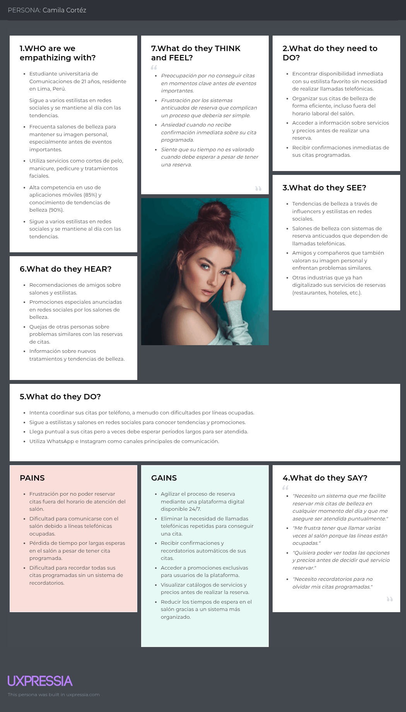

# Informe del Trabajo Final

**Universidad Peruana de Ciencias Aplicadas**

**Ingeniería de software**

**1ASI0729 Desarrollo de Aplicaciones Open Source**

**Sección:** 4304

**Profesor:** Bautista Ubillús, Efraín Ricardo

**Nombre del StartUp:** PaxTech

**Nombre del Producto:** uTime

| Nombre                              | Código    |
| ----------------------------------- | ---------- |
| Chi Cruzatt, Kevin Jorge            | U202313655 |
| Rivera Sosa, Eduardo Gael           | U202312222 |
| Varela Bustinza, Marcelo Alessandro | U202319668 |
| Yalán Zhang, Angie Christina       | U202312504 |
| Yum Gonzales, Jorge Suin            | U202210838 |

**Ciclo 2025-01**

# Registro de Versiones del Informe

| Version | Fecha      | Autor                            | Descripción de modificación                          |
| ------- | ---------- | -------------------------------- | ------------------------------------------------------ |
| 1.0     | 01/04/2025 | Chi, Rivera, Varela, Yalán, Yum | Creación del documento de trabajo en formato markdown |
| 1.1     |            | Chi, Rivera, Varela, Yalán, Yum |                                                        |
| 1.2     |            | Chi, Rivera, Varela, Yalán, Yum |                                                        |
| 1.3     |            | Chi, Rivera, Varela, Yalán, Yum |                                                        |
| 1.4     |            | Chi, Rivera, Varela, Yalán, Yum |                                                        |
| 1.5     |            | Chi, Rivera, Varela, Yalán, Yum |                                                        |
| 1.6     |            | Chi, Rivera, Varela, Yalán, Yum |                                                        |
| 1.7     |            | Chi, Rivera, Varela, Yalán, Yum |                                                        |
| 1.8     |            | Chi, Rivera, Varela, Yalán, Yum |                                                        |

# Project Report Collaboration Insights

URL del repositorio para el proyecto: https://github.com/UPC-PaxTech/uTime/

**TB1**

Para el desarrollo del informe perteneciente a la entrega TB1, se dividió la implementación de secciones de la siguiente forma
para cada integrante del equipo:

| Integrantes    | Tareas Asignadas |
| -------------- | ---------------- |
| Kevin Chi      |                  |
| Gael Rivera    |                  |
| Marcelo Varela |                  |
| Angie Yalán   |                  |
| Jorge Yum      |                  |

**Github Collaboration Insights**

Github también presenta un timeline de las ramas principales y los procesos de merge a los que se han sometido. Todas las
ramas se crearon tomando en cuenta el diseño de GitFlow para una buena organización cuando se usa un software de control
de versiones.

Los integrantes son:

- Kevin Chi (Krillsom)
- Gael Rivera (gael-rs)
- Marcelo Varela (VarBus)
- Angie Yalán (aaaaangie)
- Jorge Yum (myussu)

Se explican las ramas más prominentes:

**main:** Es representada por el color negro. Se trata de la rama principal del proyecto y se actualiza para cada entregable. 
**develop:** Es representada por el color azul. Se trata de la rama principal para el proceso del desarrollo del proyecto. 
**feature/Nombre-del-integrante**:  

# Contenido

1. [Capítulo I: Introducción](#capítulo-i-introducción) 
    1.1. [Startup Profile](#11-startup-profile) 
    1.1.1. [Descripción de la Startup](#111-descripción-de-la-startup) 
    1.1.2. [Perfiles de integrantes del equipo](#112-perfiles-de-integrantes-del-equipo) 
    1.2. [Solution Profile](#12-solution-profile) 
    1.2.1 [Antecedentes y problemática](#121-antecedentes-y-problemática) 
    1.2.2 [Lean UX Process](#122-lean-ux-process) 
    1.2.2.1. [Lean UX Problem Statements](#1221-lean-ux-problem-statements) 
    1.2.2.2. [Lean UX Assumptions](#1222-lean-ux-assumptions) 
    1.2.2.3. [Lean UX Hypothesis Statements](#1223-lean-ux-hypothesis-statements) 
    1.2.2.4. [Lean UX Canvas](#1224-lean-ux-canvas) 
    1.3. [Segmentos objetivo](#13-segmentos-objetivo) 
2. [Capítulo II: Requirements Elicitation & Analysis](#capítulo-ii-requirements-elicitation--analysis) 
   2.1. [Competidores](#21-competidores) 
   2.1.1. [Análisis competitivo](#211-análisis-competitivo) 
   2.1.2. [Estrategias y tácticas frente a competidores](#212-estrategias-y-tácticas-frente-a-competidores) 
   2.2. [Entrevistas](#22-entrevistas) 
   2.2.1. [Diseño de entrevistas](#221-diseño-de-entrevistas) 
   2.2.2. [Registro de entrevistas](#222-registro-de-entrevistas) 
   2.2.3. [Análisis de entrevistas](#223-análisis-de-entrevistas) 
   2.3. [Needfinding](#23-needfinding) 
   2.3.1. [User Personas](#231-user-personas) 
   2.3.2. [User Task Matrix](#232-user-task-matrix) 
   2.3.3. [User Journey Mapping](#232-user-task-matrix) 
   2.3.4. [Empathy Mapping](#234-empathy-mapping) 
   2.3.5. [As-is Scenario Mapping](#235-as-is-scenario-mapping) 
   2.4. [Ubiquitous Language](#24-ubiquitous-language) 
3. [Capítulo III: Requirements Specification](#capítulo-iii-requirements-specification) 
   3.1. [To-Be Scenario Mapping](#31-to-be-scenario-mapping) 
   3.2. [User Stories](#32-user-stories) 
   3.3. [Impact Mapping](#33-impact-mapping) 
   3.4. [Product Backlog](#34-product-backlog) 
4. [Capítulo IV: Product Design](#capítulo-iv-product-design) 
   4.1. [Style Guidelines](#41-style-guidelines) 
   4.1.1. [General Style Guidelines](#411-general-style-guidelines) 
   4.1.2. [Web Style Guidelines](#412-web-style-guidelines) 
   4.2. [Information Architecture](#42-information-architecture) 
   4.2.1. [Organization Systems](#421-organization-systems) 
   4.2.2. [Labeling Systems](#422-labeling-systems) 
   4.2.3. [SEO Tags and Meta Tags](#423-seo-tags-and-meta-tags) 
   4.2.4. [Searching Systems](#424-searching-systems) 
   4.2.5. [Navigation Systems](#425-navigation-systems) 
   4.3. [Landing Page UI Design](#43-landing-page-ui-design) 
   4.3.1. [Landing Page Wireframe](#431-landing-page-wireframe) 
   4.3.2. [Landing Page Mock-up](#432-landing-page-mock-up) 
   4.4. [Web Applications UX/UI Design](#44-web-applications-uxui-design) 
   4.4.1. [Web Applications Wireframes](#441-web-applications-wireframes) 
   4.4.2. [Web Applications Wireflow Diagrams](#442-web-applications-wireflow-diagrams) 
   4.4.2. [Web Applications Mock-ups](#442-web-applications-mock-ups) 
   4.4.3. [Web Applications User Flow Diagrams](#443-web-applications-user-flow-diagrams) 
   4.5. [Web Applications Prototyping](#45-web-applications-prototyping) 
   4.6. [Domain-Driven Software Architecture](#46-domain-driven-software-architecture) 
   4.6.1. [Software Architecture Context Diagram](#461-software-architecture-context-diagram) 
   4.6.2. [Software Architecture Container Diagrams](#462-software-architecture-container-diagrams) 
   4.6.3. [Software Architecture Components Diagrams](#463-software-architecture-components-diagrams) 
   4.7. [Software Object-Oriented Design](#47-software-object-oriented-design) 
   4.7.1. [Class Diagrams](#471-class-diagrams) 
   4.7.2. [Class Dictionary](#472-class-dictionary) 
   4.8. [Database Design](#48-database-design) 
   4.8.1. [Database Diagram](#481-database-diagram) 
5. [Capítulo V: Product Implementation, Validation & Deployment](#capítulo-v-product-implementation-validation--deployment) 
   5.1. [Software Configuration Management](#51-software-configuration-management) 
   5.1.1. [Software Development Environment Configuration](#511-software-development-environment-configuration) 
   5.1.2. [Source Code Management](#512-source-code-management) 
   5.1.3. [Source Code Style Guide & Conventions](#513-source-code-style-guide--conventions) 
   5.1.4. [Software Deployment Configuration](#514-software-deployment-configuration) 
   5.2. [Landing Page, Services & Applications Implementation](#52-landing-page-services--applications-implementation) 
   5.2.1. [Sprint 1](#521-sprint-1) 
   5.2.1.1. [Sprint Planning 1](#5211-sprint-planning-1) 
   5.2.1.2. [Aspect Leaders and Collaborators](#5212-aspect-leaders-and-collaborators) 
   5.2.1.3. [Sprint Backlog 1](#5213-sprint-backlog-1) 
   5.2.1.4. [Development Evidence for Sprint Review](#5214-development-evidence-for-sprint-review) 
   5.2.1.5. [Execution Evidence for Sprint Review](#5215-execution-evidence-for-sprint-review) 
   5.2.1.6. [Services Documentation Evidence for Sprint Review](#5216-services-documentation-evidence-for-sprint-review) 
   5.2.1.7. [Software Deployment Evidence for Sprint Review](#5217-software-deployment-evidence-for-sprint-review) 
   5.2.1.8. [Team Collaboration Insights during Sprint](#5218-team-collaboration-insights-during-sprint) 

6. [Conclusiones](#conclusiones) 
   6.1 [Conclusiones y recomendaciones](#61-conclusiones-y-recomendaciones) 
7. [Bibliografía](#bibliografía) 
8. [Anexos](#anexos) 

# Student Outcomes

# Capítulo I: Introducción

## 1.1. Startup Profile

### 1.1.1. Descripción de la Startup

PaxTech es una startup liderada por estudiantes de la Universidad Peruana de Ciencias Aplicadas, dedicada al desarrollo de soluciones tecnológicas innovadoras. Nuestro enfoque se centra en facilitar la gestión de citas para el sector de la belleza y el bienestar; es decir, estilistas, barberos, maquilladores y otros profesionales independientes, permitiéndoles optimizar su tiempo y ampliar su clientela de manera eficiente.

En un mundo donde la digitalización es clave para el éxito, PaxTech empodera a los profesionales de la belleza con una plataforma intuitiva y automatizada que mejora la experiencia tanto para ellos como para sus clientes. A través de nuestra solución, buscamos revolucionar la manera en que los estilistas organizan su agenda, reduciendo la pérdida de tiempo y aumentando su visibilidad en el mercado.

Misión: Desarrollar y ofrecer una plataforma digital avanzada que simplifique la gestión de citas para estilistas y profesionales de la belleza, mejorando su productividad y facilitando el acceso de los clientes a servicios de alta calidad. Nuestro objetivo es optimizar el tiempo, reducir los inconvenientes de la administración manual y potenciar el crecimiento del negocio de cada profesional.

Visión: Convertirnos en la plataforma líder en gestión de citas para el sector de la belleza, proporcionando herramientas tecnológicas innovadoras que permitan a los profesionales independientes expandir su negocio, fidelizar clientes y mejorar la experiencia del usuario en la industria de la estética.

### 1.1.2. Perfiles de integrantes del equipo

Mi nombre es Angie Yalán. Soy estudiante de la carrera Ingeniería de Software y tengo 19 años. Me considero una persona proactiva que le gustan nuevas experiencias y aprender cosas diferentes. Sigo en el proceso de mejora en cuanto a la programación y cuento con toda la iniciativa para ser cada día mejor en ello.

Mi nombre es Kevin Chi. Tengo 19 años y actualmente estoy cursando el 5° ciclo de ingeniería de software. Me considero una persona con capacidades de liderazgo y capaz de trabajar bajo presión.

Mi nombre es Jorge Suin Yum Gonzales, tengo 20 años y estúdio la carrera de Ingeniería de Software. Me considero una persona responsable y puntual, cualidades que también aplico al trabajar de manera colaborativa con mis compañeros. Tengo interés en la programación de aplicaciones open source, así como curiosidad e iniciativa para comprender y participar en sus procesos de desarrollo.

Yo soy Gael Rivera. Soy un estudiante de Ingeniería de Software comprometido con la responsabilidad en cada tarea que asumo. Poseo habilidades de liderazgo que facilitan la comunicación y el trabajo colaborativo. Siempre estoy dispuesto a abordar desafíos y encontrar soluciones en equipo.

Mi nombre es Marcelo Varela. Soy un estudiante de la carrera de Ingeniería De Software, tengo 20 años y actualmente me encuentro cursando el quinto ciclo de la carrera. Me caracterizo por ser una persona responsable, resiliente y proactiva, al cual le gusta aprender sobre tecnología y el desarrollo de software. Mi compromiso como miembro de este equipo es brindar mi apoyo y participación para enfrentar lo desafíos así como dar lo mejor de mí para el éxito de este proyecto.

## 1.2. Solution Profile

uTime es una solución integral diseñada para optimizar la gestión de citas en el sector de la belleza mediante una plataforma digital conectada en tiempo real con clientes y profesionales. Esta innovadora herramienta permite a los estilistas gestionar su disponibilidad de manera eficiente, reducir cancelaciones y olvidos, y atraer nuevos clientes sin depender exclusivamente del boca a boca o la comunicación manual.

### 1.2.1 Antecedentes y problemática

Según Lean Construction México, la técnica de las 5W's y 2H's facilita la creación y desarrollo de un plan de acción o estrategia detallada (Alvarez, 2020). A raíz de esto, resultará útil para nuestro contexto dado que nos permitirá entender y analizar a mayor profundidad las necesidades de los usuarios. Por ende, se recopiló información mediante esta técnica, la cual se presentará a continuación.

**What (Qué)**

##### ¿Cuál es el problema?

El problema principal es la falta de una herramienta eficiente para gestionar citas en tiempo real para estilistas y otros profesionales de la belleza. La mayoría de ellos aún dependen de WhatsApp, redes sociales o llamadas telefónicas, lo que genera desorden en la agenda, cancelaciones inesperadas y pérdida de tiempo administrativo. Según un informe de Araya et al. (2025), el 70% de las pymes en América Latina maneja el uso de datos y analítica en un nivel básico. Es decir, los profesionales independientes en América Latina prefieren gestionar sus citas manualmente, lo que puede derivar en errores, pérdidas económicas y dificultades para expandir su clientela.

##### ¿Cuál es la relación con la persona en cuestión?

uTime busca resolver este problema proporcionando una plataforma digital que permita a los estilistas gestionar su disponibilidad, recibir pagos y fidelizar clientes. Al facilitar la organización y automatizar procesos clave, se mejora la eficiencia operativa y la experiencia del cliente. Según un estudio de Telefónica (2022), las pequeñas empresas que implementan soluciones digitales para la gestión de clientes aumentan su productividad hasta en un 25%.

**Who (Quién)**

##### ¿Quiénes están involucrados?

Los principales involucrados son los estilistas y profesionales de la belleza, ya sea barberos, maquilladores, manicuristas, etc., que están en búsqueda de una plataforma que les permite automatizar y digitalizar la gestión de citas. Asimismo, están los clientes, que son las personas que buscan servicios de belleza y bienestar.

##### ¿A quiénes le sucede el problema?

El problema afecta a todos los usuarios involucrados. En América Latina, se estima que más del 60% de los profesionales de este sector son trabajadores autónomos (Expo Belleza Fest, 2016). Por ende, los profesionales independientes del sector de la belleza trabajan sin el respaldo de un sistema de gestión digital, por lo que, se ven perjudicados al no poder separar sus agendas de manera eficaz y simplificada. Esto también afecta a los clientes, ya que, la desorganización o la demora para verificar la disponibilidad de los estilistas puede ser un aspecto desalentador.

**Where (Dónde)**

##### ¿En dónde ocurre el problema?

El problema ocurre en áreas urbanas del peru donde estilistas y barberos aun gestionan su tiempo de manera informal como de manera física, mensajes de texto o redes sociales generando una desorden y posibles errores debido a la cantidad de entradas.

##### ¿En dónde nos enfocaremos?

Nos enfocaremos en zonas urbanas del Perú con alta concentración de estilistas y barberos, especialmente en aquellas ciudades donde existe un acceso razonable a tecnología digital y conectividad, y donde los usuarios potenciales cuentan con los conocimientos básicos y los dispositivos necesarios para utilizar una aplicación web.

**When (Cuándo)**

##### ¿Cuándo sucede el problema?

Actualmente, esto ocurre cada vez que un cliente de nuestro segmento requiere de una cita, y la hora y datos de la misma son guardados de forma manual o informalmente.

##### ¿Cuándo utiliza el cliente el producto?

Nuestros segmentos utilizarían el producto en el caso de la recepción de un deseo de cita, con la cual, en primer lugar, se revisará si el tiempo en el que se desea la cita está disponible. En el caso que así sea, se registra en el calendario digital.
Este producto también se usaría en el caso de instalación de un sensor de movimiento. Esto le permite a nuestros segmentos cada vez que un cliente entre o salga de sus instalaciones, se le pueda notificar para un rápido cambio del estado presente de la cita.

**Why (Por qué)**

##### ¿Cuál es la causa del problema?

Existen varias causas al problema. En primer lugar las personas, que optan registrar de manera manual o informal las citas que reciben, sería debido a la baja alfabetización digital, confianza a sus métodos actuales o la falta de una opción que encaje con sus necesidades.
El problema también está en la falta de opciones de calendario digital en tiempo real para nuestro segmento. En el presente aplicaciones como google calendar o zoho ofrecen un servicio parecido, sin embargo, debido a su complejidad que es causado por ambos falta y exceso de características que no se centran a estilistas y barberos no lo hacen opciones atractivas lo cual causa que el usuario opte por escribir manualmente solamente la información necesaria.

**How (Cómo)**

##### ¿En qué condiciones los clientes usan nuestro producto?

A través de cualquier dispositivo con conexión a internet y capás de abrir un navegador web, nuestra aplicacion web proporcionará de manera simple y concisa las herramientas necesarias para la gestion de las citas de sus clientes y activacion de las notificaciones en un dispositivo movil. También en un caso de un local con cuartos personales, se podra usar sensores de movimiento para automatizar el proceso de gestion de las citas y facilitar la gestion de estado.

**How much (Cuánto)**

##### Estadísticas que sustentan la problemática.

Según Ochoa (2021), en una encuesta realizada en un salón de belleza llamado “Mónica Garcés”, el 80% de encuestados argumenta que no recibe una atención adecuada respecto a la reservación de citas a un salón de belleza. Asimismo, el 20% desconoce dicho proceso. Por lo general, se suelen comunicar mediante vía telefónica con la dueña del local, y no se logra llevar un control o manejo adecuado de horarios.

De acuerdo a los salones de belleza que operan en Tegucigalpa, el 53,3% de las mujeres esperan ser atendidas por orden de llegada en salones de belleza. Sin embargo, en su mayoría estos servicios no cuentan con un servicio via web que les permita administrar sus servicios de forma eficiente.

Según Giselle Spa en La Molina (2021), se realizo una encuesta a 205 cliente respecto a la calidad de servicio que ofrece el salon de belleza se identifico que el 53,4% admiten que dicha calidad se manifiesta de forma regular, debido al poco interés que se percibe respecto a los cronogramas, comunicación activa y organización laboral.

### 1.2.2 Lean UX Process

#### 1.2.2.1. Lean UX Problem Statements

#### 1.2.2.2. Lean UX Assumptions

##### 1.2.2.2.2. Business Outcomes

##### 1.2.2.2.3. User Benefits

#### 1.2.2.3. Lean UX Hypothesis Statements.

#### 1.2.2.4. Lean UX Canvas.

## 1.3. Segmentos objetivo.

Los segmentos objetivos son las personas o entidades a las cuales está destinada nuestra solución. A continuación se nombraran los que abarca nuestra propuesta.

## Segmento objetivo #1: Salones de belleza y barberías

###  Aspectos Demográficos

- Rango de edad: Mayores de 20 años
- Sexo: Masculino y femenino
- Nivel socioeconómico: clases A, B (alta y media-alta)

### Aspectos geográficos:

- Nacionalidad: Peruana o extranjera
- Zona geográfica de residencia: urbana
- Departamento: Lima Metropolitana

### Aspectos psicográficos:

- Uso frecuente de medios de comunicación, tales como WhatsApp y llamadas telefónicas, para interactuar con los clientes.
- Un día a día con la agenda apretada por las reservas de los clientes y poca flexibilidad.

## Segmento objetivo #2: Clientes de servicios de belleza

### Aspectos Demográficos

- Rango de edad: Mayores de 18 años
- Sexo: Masculino y femenino
- Nivel socioeconómico: clases A, B y C (alta, media-alta y media)

### Aspectos geográficos:

- Nacionalidad: Peruana o extranjera
- Zona geográfica de residencia: urbana
- Departamento: Lima Metropolitana

### Aspectos psicográficos:

- Van frecuentemente a salones de belleza para estar a la moda o estar presentable para un evento importante.
- Tienden a preferir tratarse con el mismo estilista o barbero debido a experiencias anteriores o por la técnica del especialista.

# Capítulo II: Requirements Elicitation & Analysis

## 2.1. Competidores.

### 2.1.1. Análisis competitivo.

El análisis competitivo es una herramienta clave para la toma de decisiones estratégicas, ya que permite identificar oportunidades, amenazas y desarrollar ventajas competitivas sostenibles en el mercado. Su importancia radica en ayudar a las empresas a adaptarse a un entorno dinámico y a tomar decisiones fundamentadas. A continuación, se presenta la aplicación de esta herramienta en el desarrollo del proyecto y el análisis de los competidores:

<table>
  <tr>
    <th colspan="6">Competitive Analysis Landscape</th>
  </tr>
  <tr>
    <td colspan="1" align="center" rowspan="2">¿Por qué llevar a cabo este análisis?</td>
    <td colspan="5" align="center">¿Cómo identificar a nuestros principales competidores?</td>
  </tr>
  <tr>
    <td colspan="5"  align="center">Gracias al análisis de la competencia en el mercado, es posible entender el entorno en el que nuestro producto operará. Esto permite identificar a los competidores directos e indirectos y desarrollar estrategias basadas en la información obtenida sobre su posicionamiento actual.</td>
  </tr>
  <tr>
    <th colspan="2" align="center">Nombre y logo</th>
    <td colspan="1" align="center">
    
<b>uTime</b>

    
    </td>
    <td colspan="1" align="center">
    
<b>Salon Pro</b>

    
    </td>
    <td colspan="1" align="center">
    
<b>Beauty Salon</b>

    
    </td>
    <td colspan="1" align="center">
    
<b>Calendly</b>

    
    </td>
  </tr>
  <tr>
    <th colspan="1" rowspan="2" align="center">Perfil</th>
    <td colspan="1" align="center" >Overview</td>
    <td colspan="1">Plataforma de gestión de citas en tiempo real, altamente personalizable, con marketplace y pagos en línea.</td>
    <td colspan="1">Software para gestión de citas en salones con recordatorios y pagos integrados.</td>
    <td colspan="1">Aplicación móvil para reservas en salones de belleza con sistema de recomendaciones.</td>
    <td colspan="1">Plataforma de programación de reuniones con integración a calendarios digitales.</td>
  </tr>
  <tr>
    <td colspan="1" align="center">Ventaja competitiva ¿Qué valor ofrece a los clientes?</td>
    <td colspan="1">
    <ul>
    <li>Alta personalización en precios, tiempos y servicios.</li>
    <li>Marketplace para generar ingresos adicionales.</li>
    <li>Asesoramiento exclusivo en el plan premium.</li>
    <li>Calendario en tiempo real, optimizado para equipos con múltiples trabajadores.</li>
    </ul>
    </td>
    <td colspan="1">
    <ul>
    <li>Automatización de citas con recordatorios.</li>
    <li>Integración con pagos para facilitar transacciones.</li>
    <li>Interfaz sencilla y amigable para salones de belleza.</li>
    </ul>
    </td>
    <td colspan="1">
    <ul>
    <li>Sistema de recomendaciones basado en preferencias del usuario.</li>
    <li>Experiencia optimizada en móvil.</li>
    <li>Ofertas y promociones exclusivas dentro de la app.</li>
    </ul>
    </td>
    <td colspan="1">
    <ul>
    <li>Integración con herramientas empresariales (Google Calendar, Outlook, Zoom).</li>
    <li>Automatización de programación para equipos y clientes.</li>
    <li>Fácil uso y amplia adopción en el mercado corporativo.</li>
    </ul>
    </td>
  </tr>
  <tr>
    <th colspan="1" align="center" rowspan="2">Perfil de marketing</th>
    <td colspan="1" align="center">Mercado objetivo</td>
    <td colspan="1">
    <ul>
    <li>Peluquerías y barberías.</li>
    <li>Clientes que buscan reservar servicios de belleza.</li>
    </ul>
    </td>
    <td colspan="1">
    <ul>
    <li>Salones de belleza y spas.</li>
    <li>Negocios que quieren digitalizar sus citas.</li>
    </ul>
    </td>
    <td colspan="1">
    <ul>
    <li>Clientes que buscan servicios de belleza.</li>
    <li>Salones de belleza y spas.</li>
    </ul>
    </td>
    <td colspan="1">
    <ul>
    <li>Empresas y freelancers que necesitan agendar reuniones.</li>
    </ul>
    </td>
  </tr>
  <tr>
    <td colspan="1" align="center">Estrategias de marketing</td>
    <td colspan="1">
    <ul>
    <li>Modelo freemium con 10 reservas mensuales gratis.</li>
    <li>Marketplace para generar ingresos extra.</li>
    <li>Publicidad en redes sociales.</li>
    </ul>
    </td>
    <td colspan="1">
    <ul>
    <li>Publicidad dirigida en redes sociales.</li>
    <li>Ofertas promocionales y descuentos.</li>
    <li>Integración con herramientas de gestión empresarial.</li>
    </ul>
    </td>
    <td colspan="1">
    <ul>
    <li>Fuerte presencia en App Store y Google Play.</li>
    <li>Alianzas con salones para promociones.</li>
    </ul>
    </td>
    <td colspan="1">
    <ul>
    <li>SEO y marketing de contenido.</li>
    <li>Integración con múltiples herramientas de productividad.</li>
    </ul>
    </td>
  </tr>
  <tr>
    <th colspan="1" align="center" rowspan="3">Perfil del producto</th>
    <td colspan="1" align="center">Productos & Servicios</td>
    <td colspan="1">
    <ul>
    <li>Gestión de citas en tiempo real.</li>
    <li>Marketplace.</li>
    <li>Pagos en línea.</li>
    <li>Asesoramiento en plan premium.</li>
    </ul>
    </td>
    <td colspan="1">
    <ul>
    <li>Software de gestión para salones.</li>
    <li>Recordatorios automáticos.</li>
    <li>Pagos integrados.</li>
    </ul>
    </td>
    <td colspan="1">
    <ul>
    <li>Aplicación para reservas.</li>
    <li>Sistema de recomendaciones.</li>
    <li>Promociones para usuarios.</li>
    </ul>
    </td>
    <td colspan="1">
    <ul>
    <li>Programación de reuniones.</li>
    <li>Integraciones con calendarios.</li>
    <li>Automatización de agendas.</li>
    </ul>
    </td>
  </tr>
  <tr>
    <td colspan="1" align="center">Precios y Costos</td>
    <td colspan="1">
    <ul>
    <li>Plan gratuito con 10 reservas/mes.</li>
    <li>Plan intermedio con más personalización.</li>
    <li>Plan premium con marketplace ilimitado y asesoramiento.</li>
    </ul>
    </td>
    <td colspan="1">
    <ul>
    <li>Suscripción mensual según el tamaño del negocio.</li>
    </ul>
    </td>
    <td colspan="1">
    <ul>
    <li>Comisiones por reservas.</li>
    <li>Posible suscripción premium.</li>
    </ul>
    </td>
    <td colspan="1">
    <ul>
    <li>Modelo freemium con suscripción mensual.</li>
    <li>Costos según el tamaño del equipo.</li>
    </ul>
    </td>
  </tr>
  <tr>
    <td colspan="1" align="center">Canales de distribución (Web y/o Móvil)</td>
    <td colspan="1">El servicio, de forma momentánea, se brindará en plataforma web</td>
    <td colspan="1">Dispone de plataforma web y aplicación móvil</td>
    <td colspan="1">Solo aplicación móvil</td>
    <td colspan="1">Plataforma web y aplicación móvil</td>
  </tr>
  <tr>
    <th colspan="1" align="center" rowspan="4">Análisis SWOT</th>
    <td colspan="1" align="center">Fortalezas</td>
    <td colspan="1">
    <ul>
    <li>Personalización avanzada.</li>
    <li>Diferenciación con marketplace.</li>
    <li>Modelo accesible y flexible.</li>
    </ul>
    </td>
    <td colspan="1">
    <ul>
    <li>Automatización de citas.</li>
    <li>Fácil de usar.</li>
    </ul>
    </td>
    <td colspan="1">
    <ul>
    <li>Interfaz atractiva.</li>
    <li>Buen enfoque en clientes finales.</li>
    </ul>
    </td>
    <td colspan="1">
    <ul>
    <li>Gran cantidad de integraciones.</li>
    <li>Posicionamiento sólido en el mercado.</li>
    </ul>
    </td>
  </tr>
  <tr>
    <td colspan="1" align="center">Debilidades</td>
    <td colspan="1">
    <ul>
    <li>Necesidad de atraer clientes masivos.</li>
    <li>Puede ser complejo para algunos usuarios.</li>
    </ul>
    </td>
    <td colspan="1">
    <ul>
    <li>Alta competencia.</li>
    <li>Funcionalidades limitadas.</li>
    </ul>
    </td>
    <td colspan="1">
    <li>Dependencia de afiliaciones con salones.</li>
    <li>Competencia con otras apps.</li>
    </td>
    <td colspan="1">
    <ul>
    <li>Costos elevados para algunas funciones.</li>
    </ul>
    </td>
  </tr>
  <tr>
    <td colspan="1" align="center">Oportunidades</td>
    <td colspan="1">
    <ul>
    <li>Expansión en Latinoamérica.</li>
    <li>Alianzas con marcas de belleza.</li>
    <li>Expansión del marketplace.</li>
    </ul>
    </td>
    <td colspan="1">
    <ul>
    <li>Crecimiento del sector digital.</li>
    <li>Mayor uso de pagos en línea.</li>
    </ul>
    </td>
    <td colspan="1">
    <ul>
    <li>Aumento de reservas digitales en belleza.</li>
    <li>Integración con plataformas de bienestar.</li>
    </ul>
    </td>
    <td colspan="1">
    <ul>
    <li>Crecimiento del trabajo remoto.</li>
    <li>Expansión en herramientas digitales.</li>
    </ul>
    </td>
  </tr>
  <tr>
    <td colspan="1" align="center">Amenazas</td>
    <td colspan="1">
    <ul>
    <li>Competencia con plataformas consolidadas.</li>
    <li>Costos de adquisición de clientes.</li>
    </ul>
    </td>
    <td colspan="1">
    <ul>
    <li>Opciones más económicas en el mercado.</li>
    <li>Cambios en tendencias de consumo.</li>
    </ul>
    </td>
    <td colspan="1">
    <ul>
    <li>Nuevos competidores en el sector.</li>
    <li>Alternativas con más funcionalidades.</li>
    </ul>
    </td>
    <td colspan="1">
    <ul>
    <li>Empresas más grandes en el sector.</li>
    <li>Alternativas gratuitas en crecimiento.</li>
    </ul>
    </td>
  </tr>
</table>

### 2.1.2. Estrategias y tácticas frente a competidores.

A partir del análisis competitivo previamente realizado, se logró determinar con precisión las principales fortalezas, oportunidades, debilidades y amenazas de los competidores. Esta información es fundamental para diseñar estrategias y tácticas que permitan posicionarse de manera efectiva frente a la competencia, especialmente durante el ingreso del servicio al mercado. A continuación, se presentan las estrategias y tácticas definidas con el objetivo de lograr un lanzamiento exitoso y rentable.

#### Afrontando las fortalezas de nuestros competidores:

- Salon Pro cuenta con una interfaz sencilla y automatización de citas, lo que facilita la experiencia del usuario.
- Beauty Salon posee una fuerte presencia en dispositivos móviles y un sistema de recomendaciones personalizado.
- Calendly domina el mercado con su integración con herramientas empresariales y automatización avanzada.

#### Comprendemos que nuestras fortalezas son:

- Personalización avanzada de precios, tiempos y servicios para cada trabajador.
- Integración de un marketplace para generar ingresos adicionales.
- Asesoramiento premium para ayudar a los negocios a optimizar su uso de la plataforma.
- Plan gratuito accesible con 10 reservas mensuales

Entonces, podemos aplicar las siguientes estrategias y tácticas:

#### Estrategias

- Destacar la personalización de uTime como una ventaja clave en nuestra comunicación y campañas de marketing.
- Enfatizar el valor del marketplace como una fuente de ingresos adicional para las peluquerías.
- Promover el plan de asesoramiento como un servicio exclusivo que nuestros competidores no ofrecen.

#### Tácticas

- Campañas en redes sociales mostrando cómo se personaliza la plataforma para distintos negocios.
- Casos de éxito de pequeñas peluquerías que optimizaron sus citas y ventas con uTime.
- Videos explicativos sobre el uso del calendario por trabajador.

#### Afrontando las debilidades de nuestros competidores:

- Salon Pro tiene funcionalidades limitadas y enfrenta alta competencia.
- Beauty Salon depende de afiliaciones con salones y tiene competencia en el sector.
- Calendly tiene costos elevados para funciones avanzadas.

Requieren configuraciones técnicas complicadas en algunos casos

#### Comprendemos que nuestras debilidades son:

- Necesidad de atraer clientes masivos rápidamente.
- Puede ser complejo para usuarios sin experiencia en plataformas digitales.

Entonces, podemos aplicar las siguientes estrategias y tácticas:

#### Estrategias

- Implementar una estrategia de adquisición de clientes con modelos freemium y pruebas gratuitas.
- Diseñar una interfaz intuitiva con tutoriales y soporte personalizado.

#### Tácticas

- Ofrecer un plan gratuito con funcionalidades limitadas para atraer usuarios y generar confianza en el producto.
- Incluir asesoría personalizada en el plan completo para ayudar a negocios grandes a configurar y personalizar la plataforma según sus necesidades, especialmente si no están familiarizados con herramientas tecnológicas.

#### Afrontando las oportunidades de nuestros competidores:

- Salon Pro y Beauty Salon se benefician del crecimiento del sector digital en el ámbito de la belleza.
- Calendly aprovecha el aumento del trabajo remoto y la digitalización de agendas.

#### Comprendemos que nuestras oportunidades son:

- Expansión del mercado digital en Latinoamérica.
- Alianzas estratégicas con marcas de belleza y distribuidores.

Entonces, podemos aplicar las siguientes estrategias y tácticas:

#### Estrategias

- Expandir la presencia de uTime en mercados emergentes y ofrecer soporte en múltiples idiomas.
- Establecer alianzas con proveedores de productos de belleza y herramientas de gestión empresarial.

#### Tácticas

- Lanzar campañas de publicidad específicas para nuevos mercados.
- Contactar con marcas y distribuidores para ofrecer descuentos exclusivos a usuarios de uTime.
- Desarrollar una función de recomendaciones de productos dentro del marketplace.

#### Afrontando las amenazas de nuestros competidores:

- Existen plataformas consolidadas con una base de clientes establecida.
- La adquisición de clientes puede ser costosa debido a la alta competencia.

#### Comprendemos que nuestras amenazas son:

- Posicionamiento de grandes marcas en el sector.
- Costos de adquisición de usuarios y retención de clientes.

Entonces, podemos aplicar las siguientes estrategias y tácticas:

#### Estrategias

- Diferenciar uTime con características únicas y servicios adicionales.
- Fidelizar clientes con programas de recompensas y beneficios exclusivos.

#### Tácticas

- Implementar un sistema de referidos con descuentos para clientes actuales y nuevos usuarios.
- Crear un programa de fidelización con beneficios progresivos según el tiempo de uso de la plataforma.

## 2.2. Entrevistas.

### 2.2.1. Diseño de entrevistas.

### 2.2.2. Registro de entrevistas.

### 2.2.3. Análisis de entrevistas.

## 2.3. Needfinding.

### 2.3.1. User Personas.

Segmento objetivo #1: Salones de belleza y barberías

Segmento objetivo #2: Clientes de servicios de belleza

### 2.3.2. User Task Matrix.

| **Tarea**                                             | **Frecuencia (Andrea)** | **Importancia (Andrea)** | **Frecuencia (Camila)** | **Importancia (Camila)** |
|-------------------------------------------------------|--------------------------|----------------------------|--------------------------|----------------------------|
| Revisar la disponibilidad de la agenda                | Alta                     | Alta                       | Alta                     | Alta                       |
| Agendar citas                                         | Alta                     | Alta                       | Media                    | Alta                       |
| Escoger tratamiento                                   | Nunca                    | Baja                       | Alta                     | Alta                       |
| Responder llamadas de los clientes                    | Alta                     | Alta                       | Nunca                    | Baja                       |
| Ajustarse al tiempo que dura el tratamiento           | Media                    | Alta                       | Media                    | Media                      |
| Alistar los utensilios de belleza de antemano         | Media                    | Media                      | Baja                     | Baja                       |
| Ajustar agenda en fechas de alta demanda              | Baja                     | Alta                       | Baja                     | Media                      |
| Gestionar cancelaciones                               | Alta                     | Alta                       | Baja                     | Baja                       |
| Revisar cambios en la agenda                          | Alta                     | Alta                       | Alta                     | Alta                       |
| Priorizar citas según fidelidad                       | Media                    | Alta                       | Nunca                    | Baja                       |
| Escoger un estilista en específico para la cita       | Media                    | Baja                       | Media                    | Media                      |
| Colocar precio a los tratamientos                     | Baja                     | Media                      | Baja                     | Media                      |
| Planificar citas por WhatsApp                         | Alta                     | Alta                       | Alta                     | Alta                       |
| Gestionar horarios de los estilistas                  | Alta                     | Alta                       | Nunca                    | Baja                       |
| Recordar a los clientes de sus citas                  | Alta                     | Alta                       | Nunca                    | Media                      |
| Llegar temprano al salón                              | Baja                     | Media                      | Alta                     | Alta                       |
| Realizar el pago por el servicio                      | Alta                     | Alta                       | Alta                     | Alta                       |
| Pagar por medios electrónicos                         | Baja                     | Baja                       | Alta                     | Alta                       |

### 2.3.3. User Journey Mapping.
Para el segmento de los salones estilistas o barberos se consideró el momento desde que el cliente se contacta con la recepcionista hasta que el cliente haya terminado su cita y haya salido de salón. En la otra mano, para el segmento de los clientes de los salones se consideró desde que descubren el salón de manera online o por otra persona hasta que haya atendido la cita deseada.

### 2.3.4. Empathy Mapping.

Segmento objetivo #1: Salones de belleza y barberías

Segmento objetivo #2: Clientes de servicios de belleza

### 2.3.5. As-is Scenario Mapping.

Segmento objetivo #1: Salones de belleza y barberías

| Phases   | Recepción de cita                                                                                                                    | Revisión de disponibilidad                                                                                                                                                                     | Negociación o aceptación de cita                                                                                                                                                                                                                   | Emisión de estado de cita                                                                                                                                   |
| -------- | ------------------------------------------------------------------------------------------------------------------------------------- | ----------------------------------------------------------------------------------------------------------------------------------------------------------------------------------------------- | ---------------------------------------------------------------------------------------------------------------------------------------------------------------------------------------------------------------------------------------------------- | ------------------------------------------------------------------------------------------------------------------------------------------------------------ |
| Doing    | -Por los medios dados por el salón (Instagram, llamada, etc), se revisa y recepciona las entradas de citas deseadas por los clientes | - Se revisa usando cuaderno u otros metodos informales si hay estilistas disponibles a la hora deseada del cliente - Se ofrece un tiempo disponible al cliente en caso no tenga uno pensado | - Si hay horario disponible para el cliente se acepta y se registre en el cuaderno manualmente. - Si no hay horario disponible, se intenta negociar con el cliente otro tiempo en el cual sea posible generar la cita y se anota respetivamente. | - Se confirma el horario y se recuerda al cliente de su proxima cita en la misma plataforma que usaron para contactarnos.                                    |
| Thinking | - "Tengo una cantidad enorme de sitios que revisar por las citas de los clientes"                                                     | - "Espero encontrar rápido un tiempo libre para la cita del cliente."                                                                                                                          | - "Es exhausto tener que hablar con cada uno de los clientes mediante diferentes plataformas."                                                                                                                                                       | -"Tengo que mandar a cada uno de los clientes la confirmacion y un recordatorio"                                                                             |
| Feeling  | - Exaustos por la cantidad de sitios a chequear. - Abrumado por la cantidad de clientes en diferentes sitios                      | - "Apurado por encontrar un tiempo adecuado para el cliente". - "Ansioso por dar una respuesta satisfactoria al cliente"                                                                    | - Exausto y aliviado por encontrar un horario disponible manualmente - Frustrado que el cliente no concuerde con los horarios disponibles y repetir varias veces lo mismo                                                                        | - Frustrado en tener que volver a mandar recordatorios y confirmaciones de todas las citas registradas por la misma plataforma en la cual fueron contactados |

Segmento objetivo #2: Clientes de servicios de belleza

| Phases   | Contactar el salon de estilista o barbero                                          | Preguntar por disponibilidad                               | Aceptar el horario ofrecido o escoger otro                                                                                | Recepcion de estado de cita                                                                                |
| -------- | ---------------------------------------------------------------------------------- | ---------------------------------------------------------- | ------------------------------------------------------------------------------------------------------------------------- | ---------------------------------------------------------------------------------------------------------- |
| Doing    | - Usan Instagram, llamada, WhatsApp u otros medios para comunicarse con el salón. | - Preguntan si hay disponibilidad en el horario que desean | - Aceptan el horario ofrecido o piden uno diferente hasta encontrar uno conveniente.                                      | - Reciben confirmación de la cita y a veces un recordatorio, por el mismo medio en el que se comunicaron. |
| Thinking | - "Espero que me respondan pronto."                                                | - "Ojalá tengan espacio a la hora que yo quiero."         | - "¿Tendrán otro horario si este no me funciona?"                                                                       | - "¿Me confirmaron bien? ¿Se acordarán de mi cita?"                                                     |
| Feeling  | - Ansioso por recibir respuesta. - Frustrado si hay demora.                    | - Impaciente por tener una respuesta clara.                | - Aliviado si se encuentra un buen horario.  - Frustrado si tiene que enviar muchos mensajes para concretar una cita. | - Tranquilo si recibe confirmación clara. - Inseguro si no hay recordatorio o claridad.               |

## 2.4. Ubiquitous Language.

| Term                                             | Definition                                                                       |
|--------------------------------------------------|----------------------------------------------------------------------------------|
| **Scheduled Appointment (Cita Agendada)**        | Una reserva previamente agendada por un cliente en un horario específio          |
| **Available Slot (Horario Disponible)**          | Un periodo de tiempo donee no hau citas agendadas.                               |
| **Frequent Client (Cliente frecuente)**          | Cliente que acude regularmente a al salon o barberia.                            |
| **Time Block (Bloque de tiempo)**                | Unidad de duración en la plataforma. Se usan para estandarizar las citas         |
| **Cancellation (Cancelcación)**                  | Cancelar una cita programada. Esto libera el bloque de tiempo que le corresponde |
| **Rescheduling (Reprogramación)**                | Cambia la fecha de una cita ya agendada.                                         |
| **Appointment Reminder (Recordatorio de Cita)**  | Notificación al usuario para confirmar su cita.                                  |
| **High-Demand Period (Periodo de alta demanda)** | Fechas en las cuales existe una mayor cantidad de clientes realiando citas.      |
| **New Client (Cliente Nuevo)**                   | Un cliente nuevo que no tiene preferencia por ningun estilista.                  |
| **Selected Service (Servicio seleccionado)**     | Un tratamiento de especifico que ha sido seleccionado para la cita.              |
| **Schedule Update (Cambio en la agenda)**        | Cualquier cambio en el horario de citas.                                         |

# Capítulo III: Requirements Specification

## 3.1. To-Be Scenario Mapping.

Segmento objetivo #1: Salones de belleza y barberías
<table>
    <tr>
        <th>Phases</th>
        <th>Recepción de cita</th>
        <th>Revisión de disponibilidad</th>
        <th>Negociación o aceptación de cita</th>
        <th>Emisión de estado de cita</th>
    </tr>
    <tr>
        <th>Doing</th>
        <th> -Se abre la aplicación web usando las credenciales y se revisa las citas generadas por los clientes.   -Cada estilista puede ver sus clientes asignados por horario</th>
         <th>-En el calendario de la aplicación web, se reviza en las secciones sin eventos para confirmar disponibilidad.</th>
         <th>-En la aplicación web, se permite añadir una cita para los clientes que aun se comunican a traves de otros medios.</th>
         <th>-Estado e información de la cita se envia a traves de e-mail automaticamente</th>
    </tr>
   <tr>
      <th>Thinking</th>
      <th>-"Todas las estilistas ya tienen sus horarios y no tengo que manualmente registrar todas las citas ya que los clientes pueden escoger!"</th>
      <th>-"Puedo revisar facilmente horarios disponibles gracias al calendario en vivo"  -"No tengo que estar en largas conversasiones con los clientes para decidir sus citas"</th>
      <th>-"Es facil insertar un evento en el calendario ya que no tengo que buscar el momento específico, solo necesito saber la hora o hacer click en el espacio en el calendario"</th>
      <th>-"Espero que el correo del estado de la cita del cliente lo haya recibido"</th>
   </tr>
   <tr>
  <th>Feeling</th>
  <td>
    - Alivio por no tener que organizar todo manualmente.  
    - Satisfacción al ver que las clientas pueden reservar por sí solas.  
    - Más confianza en el sistema.
  </td>
  <td>
    - Tranquilidad al revisar fácilmente los horarios libres.  
    - Menos estrés por no tener que escribir o llamar varias veces al cliente.  
    - Seguridad en la disponibilidad real del personal.
  </td>
  <td>
    - Comodidad al registrar citas rápidamente con pocos clics.  
    - Menos presión por encontrar huecos a mano o anotar en papeles.  
    - Confianza en que todo queda bien organizado en el sistema.
  </td>
  <td>
    - Seguridad al saber que el sistema envía el correo automáticamente.  
    - Relajación al no tener que recordar hacerlo manualmente.  
    - Ligera duda al no tener confirmación visual inmediata de la entrega.
  </td>
</tr>
</table>

Segmento objetivo #2: Clientes de servicios de belleza

<table>
    <tr>
        <th>Phases</th>
        <th>Contactar al salón de estilista o barbero</th>
        <th>Preguntar por disponibilidad</th>
        <th>Aceptar el horario ofrecido o escoger otro</th>
        <th>Recepción de estado de cita</th>
    </tr>
    <tr>
        <th>Doing</th>
        <th> -Mediante un link publicado por las redes del salón, se abre la aplicación web donde se encuentra el calendario del salón</th>
         <th>-En el calendario se puede revisar de manera organizada los horarios disponibles gracias a los sectores vacíos del calendario.</th>
         <th>-Usando email, loguear al calendario y seleccionar el espacio vacío para registrar la cita con el estilista y servicio deseado</th>
         <th>-Revisar confirmación de la cita en el e-mail</th>
    </tr>
   <tr>
  <th>Thinking</th>
  <td>
    -"Qué práctico, no necesito escribir ni esperar respuesta."  
    -"Puedo revisar los horarios cuando quiera, sin molestar a nadie."
  </td>
  <td>
    -"Es fácil entender cuándo hay disponibilidad."  
    -"No necesito preguntar, puedo verlo todo directamente."
  </td>
  <td>
    -"Puedo elegir el horario que más me conviene."  
    -"Qué cómodo que todo esté en un solo lugar y no tenga que hacer llamadas."
  </td>
  <td>
    -"Ya me llegó la confirmación, genial."  
    -"Sé exactamente cuándo y con quién tengo la cita."
  </td>
</tr>
<tr>
  <th>Feeling</th>
  <td>
    - Alivio por no tener que esperar respuestas manuales.  
    - Autonomía y control del proceso.  
    - Comodidad.
  </td>
  <td>
    - Tranquilidad al poder ver claramente la disponibilidad.  
    - Confianza en el sistema.  
    - Relajación.
  </td>
  <td>
    - Satisfacción por poder elegir sin depender de nadie.  
    - Seguridad al ver reflejada su selección en tiempo real.  
    - Confianza.
  </td>
  <td>
    - Confirmación inmediata que genera tranquilidad.  
    - Alegría por la organización.  
    - Sensación de profesionalismo.
  </td>
</tr>
</table>

| Phases   | Recepción de cita                                                                                                                    | Revisión de disponibilidad                                                                                                                                                                      | Negociación o aceptación de cita                                                                                                                                                                                                                      | Emisión de estado de cita                                                                                                                                    |
|----------|--------------------------------------------------------------------------------------------------------------------------------------|-------------------------------------------------------------------------------------------------------------------------------------------------------------------------------------------------|-------------------------------------------------------------------------------------------------------------------------------------------------------------------------------------------------------------------------------------------------------|--------------------------------------------------------------------------------------------------------------------------------------------------------------|
| Doing    | -Por los medios dados por el salón (Instagram, llamada, etc), se revisa y recepciona las entradas de citas deseadas por los clientes | - Se revisa usando cuaderno u otros metodos informales si hay estilistas disponibles a la hora deseada del cliente - Se ofrece un tiempo disponible al cliente en caso no tenga uno pensado | - Si hay horario disponible para el cliente se acepta y se registre en el cuaderno manualmente.  - Si no hay horario disponible, se intenta negociar con el cliente otro tiempo en el cual sea posible generar la cita y se anota respetivamente. | - Se confirma el horario y se recuerda al cliente de su proxima cita en la misma plataforma que usaron para contactarnos.                                    |
| Thinking | - "Tengo una cantidad enorme de sitios que revisar por las citas de los clientes"                                                    | - "Espero encontrar rápido un tiempo libre para la cita del cliente."                                                                                                                           | - "Es exhausto tener que hablar con cada uno de los clientes mediante diferentes plataformas."                                                                                                                                                        | -"Tengo que mandar a cada uno de los clientes la confirmacion y un recordatorio"                                                                             |
| Feeling  | - Exaustos por la cantidad de sitios a chequear.  - Abrumado por la cantidad de clientes en diferentes sitios                    | - "Apurado por encontrar un tiempo adecuado para el cliente". - "Ansioso por dar una respuesta satisfactoria al cliente"                                                                    | - Exausto y aliviado por encontrar un horario disponible manualmente - Frustrado que el cliente no concuerde con los horarios disponibles y repetir varias veces lo mismo                                                                         | - Frustrado en tener que volver a mandar recordatorios y confirmaciones de todas las citas registradas por la misma plataforma en la cual fueron contactados |

## 3.2. User Stories.

## 3.3. Impact Mapping.

## 3.4. Product Backlog.

# Capítulo IV: Product Design

## 4.1. Style Guidelines.

### 4.1.1. General Style Guidelines.

### 4.1.2. Web Style Guidelines.

## 4.2. Information Architecture.

### 4.2.1. Organization Systems.

### 4.2.2. Labeling Systems.

### 4.2.3. SEO Tags and Meta Tags

### 4.2.4. Searching Systems.

### 4.2.5. Navigation Systems.

## 4.3. Landing Page UI Design.

### 4.3.1. Landing Page Wireframe.

### 4.3.2. Landing Page Mock-up.

## 4.4. Web Applications UX/UI Design.

### 4.4.1. Web Applications Wireframes.

### 4.4.2. Web Applications Wireflow Diagrams.

### 4.4.2. Web Applications Mock-ups.

### 4.4.3. Web Applications User Flow Diagrams.

## 4.5. Web Applications Prototyping.

## 4.6. Domain-Driven Software Architecture.

### 4.6.1. Software Architecture Context Diagram.

### 4.6.2. Software Architecture Container Diagrams.

### 4.6.3. Software Architecture Components Diagrams.

### 4.7. Software Object-Oriented Design.

### 4.7.1. Class Diagrams.

### 4.7.2. Class Dictionary.

## 4.8. Database Design.

### 4.8.1. Database Diagram.

# Capítulo V: Product Implementation, Validation & Deployment

## 5.1. Software Configuration Management.

## 5.1.1. Software Development Environment Configuration.

### 5.1.2. Source Code Management.

### 5.1.3. Source Code Style Guide & Conventions.

### 5.1.4. Software Deployment Configuration.

## 5.2. Landing Page, Services & Applications Implementation.

### 5.2.1. Sprint 1

#### 5.2.1.1. Sprint Planning 1.

#### 5.2.1.2. Aspect Leaders and Collaborators.

#### 5.2.1.3. Sprint Backlog 1.

#### 5.2.1.4. Development Evidence for Sprint Review.

#### 5.2.1.5. Execution Evidence for Sprint Review.

#### 5.2.1.6. Services Documentation Evidence for Sprint Review.

#### 5.2.1.7. Software Deployment Evidence for Sprint Review.

#### 5.2.1.8. Team Collaboration Insights during Sprint.

# Conclusiones

## 6.1 Conclusiones y recomendaciones

# Bibliografía

Araya, F., Balestrini, M., Blandón, C., Henriquez P. & Torrico, B. (2025). El poder de los datos: Impulsando la transformación digital de las pymes de América Latina. https://blogs.iadb.org/innovacion/es/el-poder-de-los-datos-impulsando-la-transformacion-digital-de-las-pymes-de-america-latina/

Expo Belleza Fest. (2016). Más del 60% de los estilistas en México trabajan de manera independiente. https://bellezafest.blogspot.com/2016/12/mas-del-60-de-los-estilistas-en-mexico.html

Telefónica. (2022). La digitalización de las empresas repercute hasta un 25% en su productividad. https://www.telefonica.com/es/sala-comunicacion/blog/la-digitalizacion-de-las-empresas-repercute-hasta-un-25-en-su-productividad/

# Anexos
