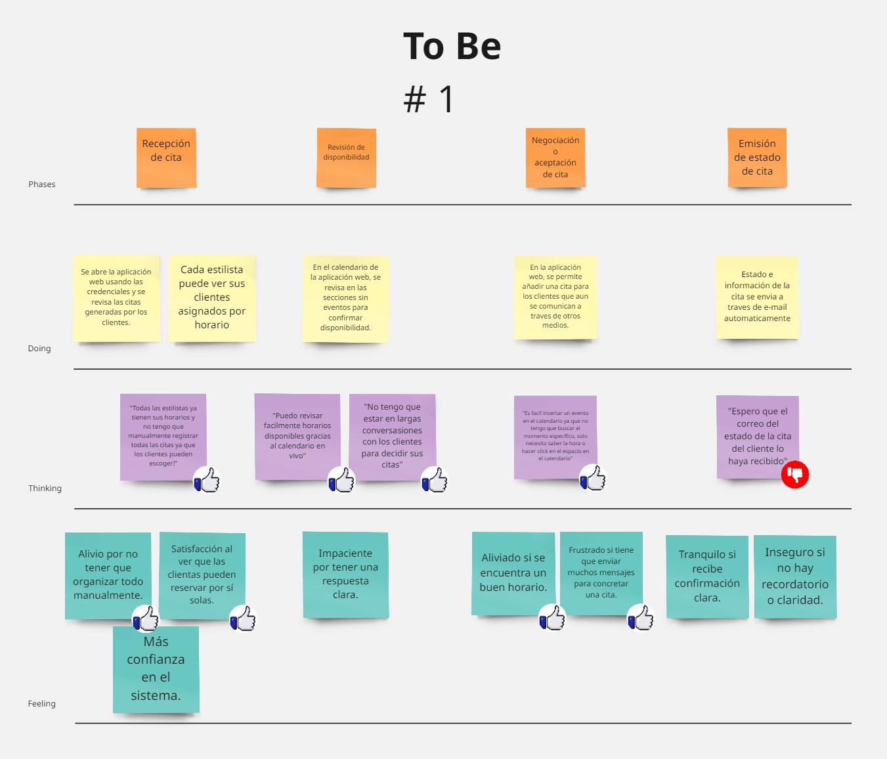
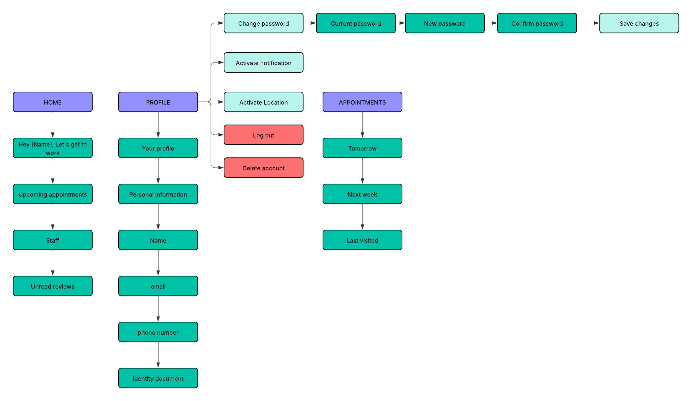
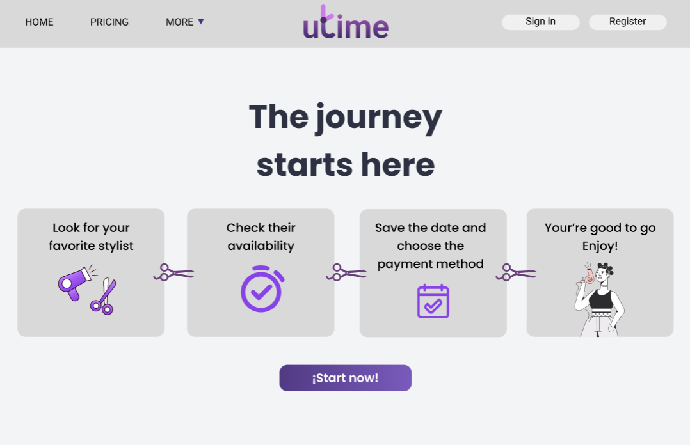
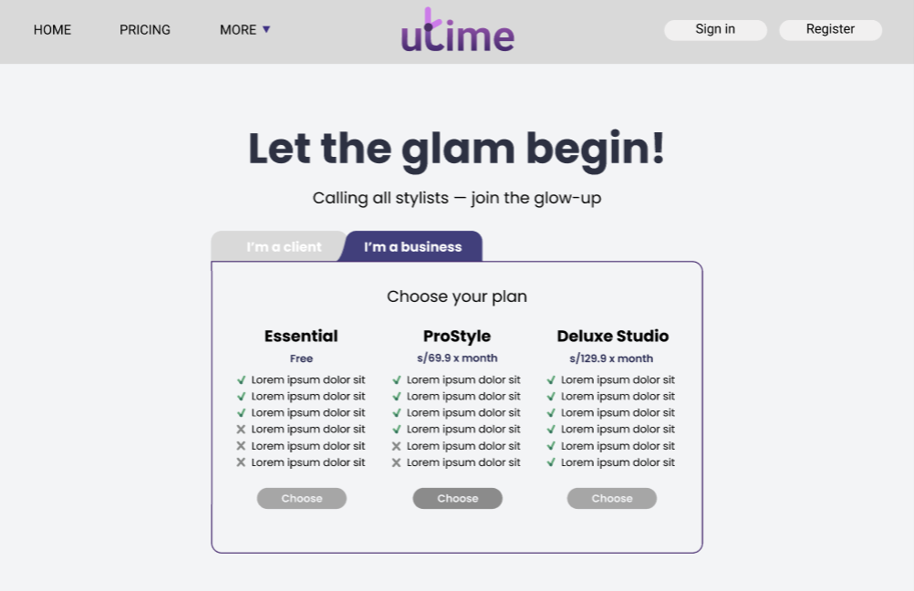
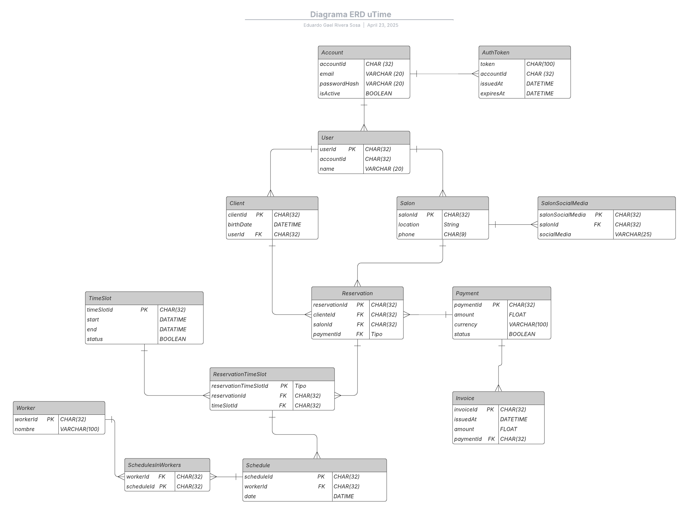
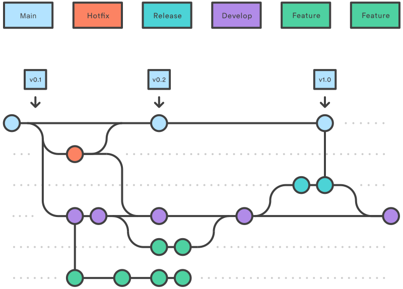

<div align="center">
   <div>

# <center>Informe del Trabajo Final</center>

   <br>

   <center>Universidad Peruana de Ciencias Aplicadas</center>

   <br>

   <center></center>

   <br>

   <center><b>Ingeniería de software</b></center>

   <br>

   <center><b>1ASI0729 Desarrollo de Aplicaciones Open Source</b></center>

   <br>

   <center><b>Sección:</b> 4304</center>

   <br>

   <center><b>Profesor:</b> Bautista Ubillús, Efraín Ricardo</center>

   <br>

   <center><b>Nombre del StartUp:</b> PaxTech</center>

   <br>


   <center><b>Nombre del Producto:</b> uTime</center>

   </div>

   <br>

   <div align="center">

   <table style="margin-left: auto; margin-right: auto;">
   <tr>
   <th>Nombre</th>
   <th>Código</th>
   </tr>
   <tr>
   <td>Chi Cruzatt, Kevin Jorge</td>
   <td>U202313655</td>
   </tr>
   <tr>
   <td>Rivera Sosa, Eduardo Gael</td>
   <td>U202312222</td>
   </tr>
   <tr>
   <td>Varela Bustinza, Marcelo Alessandro</td>
   <td>U202319668</td>
   </tr>
   <tr>
   <td>Yalán Zhang, Angie Christina</td>
   <td>U202312504</td>
   </tr>
   <tr>
   <td>Yum Gonzales, Jorge Suin </td>
   <td>U202210838</td>
   </tr>
   </table>
   </div>

   <br>

   <center><b>Ciclo 2025-01</b></center>

   <br>

</div>

# Registro de Versiones del Informe

<div>
| Version | Fecha      | Autor                            | Descripción de modificación                                                                            |
|---------|------------|----------------------------------|--------------------------------------------------------------------------------------------------------|
| 1.0     | 01/04/2025 | Chi, Rivera, Varela, Yalán, Yum  | Creación del documento de trabajo en formato markdown                                                  |
| 1.1     | 03/04/2025 | Chi, Rivera, Varela, Yalán, Yum  | Elaboración del Capitulo I                                                                             |
| 1.2     | 05/04/2025 | Chi, Rivera, Varela, Yalán, Yum  | Elaboración de Competidores y Entrevistas                                                              |
| 1.3     | 07/04/2025 | Chi, Rivera, Varela, Yalán, Yum  | Elaboración del Needfinding                                                                            |
| 1.4     | 08/04/2025 | Chi, Rivera, Varela, Yalán, Yum  | Elaboración del To-Be y Ubiquitous Language                                                            |
| 1.5     | 09/04/2025 | Chi, Rivera, Varela, Yalán, Yum  | Creación de los requisitos funcionales y no funcionales                                                |
| 1.6     | 11/04/2025 | Chi, Rivera, Varela, Yalán, Yum  | Culminación del Capitlo III                                                                            |
| 1.7     | 13/04/2025 | Chi, Rivera, Varela, Yalán, Yum  | Elaboración de Style Guidelines y Information Architecture                                             |
| 1.8     | 16/04/2025 | Chi, Rivera, Varela, Yalán, Yum  | Elaboración de Landing Page UI Design y Web Application UX/UI Design                                   |
| 1.9     | 17/04/2025 | Chi, Rivera, Varela, Yalán, Yum  | Elaboración del Web Application Prototyping                                                            |
| 1.10    | 19/04/2025 | Chi, Rivera, Varela, Yalán, Yum  | Elaboración de Domain Driven Software Architecture, Software Object Oriented Design y Database Diagram |
| 1.11    | 22/04/2025 | Chi, Rivera, Varela, Yalán, Yum  | Elaboración del Capitulo V                                                                             |
| 1.12    | 23/04/2025 | Chi, Rivera, Varela, Yalán, Yum  | Elaboración del Landing Page                                                                           |
| 2.0     | 27/04/2025 | Chi, Rivera, Varela, Yalán, Yum  | Corrección de los items mencionados en la primera entrega (TB1)                                        |
| 2.1     | 29/04/2025 | Chi, Rivera, Varela, Yalán, Yum  | Elaboración del Sprint 2                                                                               |
| 2.2     | 01/04/2025 | Chi, Rivera, Varela, Yalán, Yum  | Elaboración del Diagrama de clases                                                                     |
| 2.3     | 02/04/2025 | Chi, Rivera, Varela, Yalán, Yum  | Creación del Proyecto en el Repositorio de FrontEnd Web Application                                    |
| 2.4     | 03/04/2025 | Chi, Rivera, Varela, Yalán, Yum  | Elaboración del Sprint Planing                                                                            |
| 2.5     | 05/04/2025 | Chi, Rivera, Varela, Yalán, Yum  | Creación del Sprint Backlog                                                                            |
| 2.6     | 10/04/2025 | Chi, Rivera, Varela, Yalán, Yum  | Elaboración del Execution Evidence for Sprint Review.                                                  |
| 2.6     | 12/04/2025 | Chi, Rivera, Varela, Yalán, Yum  | Creación del Services Documentation Evidence for Sprint Review.                                        |
| 2.6     | 14/04/2025 | Chi, Rivera, Varela, Yalán, Yum  | Elaboración del Software Deployment Evidence for Sprint Review.                                           |

</div>

# Project Report Collaboration Insights

URL del repositorio para el proyecto: https://github.com/UPC-PaxTech/uTime/

**TB1**

Para el desarrollo del informe perteneciente a la entrega del TP1, se dividió la implementación de secciones de la siguiente forma
para cada integrante del equipo:


| Integrantes    | Tareas Asignadas                                                                                                                                                                  |
| -------------- |-----------------------------------------------------------------------------------------------------------------------------------------------------------------------------------|
| Kevin Chi      | Segmento Objetivo, Use Task Matrix, Ubiquitous Language, User Stories, Software Architecture diagrams (c4), Software Object-oriented Design, Class Diagrams.                      |
| Gael Rivera    | Análisis de competidores, Estrategias y tácticas frente a competidores, Entrevistas, Ubiquitous Language, User Stories, Product Backlog, Database Diagram, Landing Page, Sprint 1. |
| Marcelo Varela | Antecedentes y problemática, Registro de entrevistas, User persona, Empathy mapping, Impact mapping, User stories, Functional requirements, Organization systems, Labeling System |
| Angie Yalán   | Startup Profile, Solution Profile, Segmento Objetivo, Lean UX Process, Style Guidelines, Landing Page UI Design, Web Application UX/UI Design, Web Application Prototyping.       |
| Jorge Yum      | As-Is To-Be Scenario Mapping, Impact Mapping, User Stories, Landing Page development, Product Backlog, Information Architecture, Sprint 1                                                                   |

**TP1**

Para el desarrollo del informe perteneciente a la entrega del TP1, se dividió la implementación de secciones de la siguiente forma
para cada integrante del equipo:


| Integrantes    | Tareas Asignadas                                                                                                                                                                                                                                                 |
|----------------|------------------------------------------------------------------------------------------------------------------------------------------------------------------------------------------------------------------------------------------------------------------|
| Kevin Chi      | Correción de los diagramas, Sprint 2, Sprint Backlog, Sprint Planning, Development Evidence for Sprint Review, Execution Evidence for Sprint Review, Services Documentation Evidence for Sprint Review, Software Deployment Evidence for Sprint Review.          |
| Gael Rivera    | Correción de los US, Sprint 2, Sprint Backlog, Sprint Planning, Development Evidence for Sprint Review, Execution Evidence for Sprint Review, Services Documentation Evidence for Sprint Review, Software Deployment Evidence for Sprint Review.                 |
| Marcelo Varela | Correción del Bibliografía y Anexos, Sprint 2, Sprint Backlog, Sprint Planning, Development Evidence for Sprint Review, Execution Evidence for Sprint Review, Services Documentation Evidence for Sprint Review, Software Deployment Evidence for Sprint Review. |
| Angie Yalán    | Correción del LeanUX, Sprint 2, Sprint Backlog, Sprint Planning, Development Evidence for Sprint Review, Execution Evidence for Sprint Review, Services Documentation Evidence for Sprint Review, Software Deployment Evidence for Sprint Review.                |
| Jorge Yum      | Correcion de la Landing Page, Sprint 2, Sprint Backlog, Sprint Planning, Development Evidence for Sprint Review, Execution Evidence for Sprint Review, Services Documentation Evidence for Sprint Review, Software Deployment Evidence for Sprint Review.        |


El proceso de colaboración en el informe se realizó mediante commits constantes al repositorio de la organización PaxTech.

**Github Collaboration Insights**

Github también presenta un timeline de las ramas principales y los procesos de merge a los que se han sometido. Todas las
ramas se crearon tomando en cuenta el diseño de GitFlow para una buena organización cuando se usa un software de control
de versiones.

Los integrantes son:

- Kevin Chi (Krillsom)
- Gael Rivera (gael-rs)
- Marcelo Varela (VarBus)
- Angie Yalán (aaaaangie)
- Jorge Yum (myussu)

Se explican las ramas más prominentes:

**main:** Es representada por el color negro. Se trata de la rama principal del proyecto y se actualiza para cada entregable.<br>
**develop:** Es representada por el color azul. Se trata de la rama principal para el proceso del desarrollo del proyecto.<br>
**feature/feature-description-name:** Es una rama creada para trabajar en una nueva funcionalidad o tarea específica. Se basa en develop y, una vez terminada la tarea, se fusiona nuevamente con develop para integrar los cambios al proyecto principal.

Capturas de la participación en el informe:

**Rivera Sosa, Eduardo Gael**


**Varela Bustinza, Marcelo Alessandro**


**Yalán Zhang, Angie Christina**


**Yum Gonzales, Jorge Suin**


**Chi Cruzatt, Kevin Jorge**


# Contenido

1. [Capítulo I: Introducción](#capítulo-i-introducción)<br>
    1.1. [Startup Profile](#11-startup-profile)<br>
    1.1.1. [Descripción de la Startup](#111-descripción-de-la-startup)<br>
    1.1.2. [Perfiles de integrantes del equipo](#112-perfiles-de-integrantes-del-equipo)<br>
    1.2. [Solution Profile](#12-solution-profile)<br>
    1.2.1 [Antecedentes y problemática](#121-antecedentes-y-problemática)<br>
    1.2.2 [Lean UX Process](#122-lean-ux-process)<br>
    1.2.2.1. [Lean UX Problem Statements](#1221-lean-ux-problem-statements)<br>
    1.2.2.2. [Lean UX Assumptions](#1222-lean-ux-assumptions)<br>
    1.2.2.3. [Lean UX Hypothesis Statements](#1223-lean-ux-hypothesis-statements)<br>
    1.2.2.4. [Lean UX Canvas](#1224-lean-ux-canvas)<br>
    1.3. [Segmentos objetivo](#13-segmentos-objetivo)<br>
2. [Capítulo II: Requirements Elicitation & Analysis](#capítulo-ii-requirements-elicitation--analysis)<br>
   2.1. [Competidores](#21-competidores)<br>
   2.1.1. [Análisis competitivo](#211-análisis-competitivo)<br>
   2.1.2. [Estrategias y tácticas frente a competidores](#212-estrategias-y-tácticas-frente-a-competidores)<br>
   2.2. [Entrevistas](#22-entrevistas)<br>
   2.2.1. [Diseño de entrevistas](#221-diseño-de-entrevistas)<br>
   2.2.2. [Registro de entrevistas](#222-registro-de-entrevistas)<br>
   2.2.3. [Análisis de entrevistas](#223-análisis-de-entrevistas)<br>
   2.3. [Needfinding](#23-needfinding)<br>
   2.3.1. [User Personas](#231-user-personas)<br>
   2.3.2. [User Task Matrix](#232-user-task-matrix)<br>
   2.3.3. [User Journey Mapping](#232-user-task-matrix)<br>
   2.3.4. [Empathy Mapping](#234-empathy-mapping)<br>
   2.3.5. [As-is Scenario Mapping](#235-as-is-scenario-mapping)<br>
   2.4. [Ubiquitous Language](#24-ubiquitous-language)<br>
3. [Capítulo III: Requirements Specification](#capítulo-iii-requirements-specification)<br>
   3.1. [To-Be Scenario Mapping](#31-to-be-scenario-mapping)<br>
   3.2. [User Stories](#32-user-stories)<br>
   3.3. [Impact Mapping](#33-impact-mapping)<br>
   3.4. [Product Backlog](#34-product-backlog)<br>
4. [Capítulo IV: Product Design](#capítulo-iv-product-design)<br>
   4.1. [Style Guidelines](#41-style-guidelines)<br>
   4.1.1. [General Style Guidelines](#411-general-style-guidelines)<br>
   4.1.2. [Web Style Guidelines](#412-web-style-guidelines)<br>
   4.2. [Information Architecture](#42-information-architecture)<br>
   4.2.1. [Organization Systems](#421-organization-systems)<br>
   4.2.2. [Labeling Systems](#422-labeling-systems)<br>
   4.2.3. [SEO Tags and Meta Tags](#423-seo-tags-and-meta-tags)<br>
   4.2.4. [Searching Systems](#424-searching-systems)<br>
   4.2.5. [Navigation Systems](#425-navigation-systems)<br>
   4.3. [Landing Page UI Design](#43-landing-page-ui-design)<br>
   4.3.1. [Landing Page Wireframe](#431-landing-page-wireframe)<br>
   4.3.2. [Landing Page Mock-up](#432-landing-page-mock-up)<br>
   4.4. [Web Applications UX/UI Design](#44-web-applications-uxui-design)<br>
   4.4.1. [Web Applications Wireframes](#441-web-applications-wireframes)<br>
   4.4.2. [Web Applications Wireflow Diagrams](#442-web-applications-wireflow-diagrams)<br>
   4.4.2. [Web Applications Mock-ups](#442-web-applications-mock-ups)<br>
   4.4.3. [Web Applications User Flow Diagrams](#443-web-applications-user-flow-diagrams)<br>
   4.5. [Web Applications Prototyping](#45-web-applications-prototyping)<br>
   4.6. [Domain-Driven Software Architecture](#46-domain-driven-software-architecture)<br>
   4.6.1. [Software Architecture Context Diagram](#461-software-architecture-context-diagram)<br>
   4.6.2. [Software Architecture Container Diagrams](#462-software-architecture-container-diagrams)<br>
   4.6.3. [Software Architecture Components Diagrams](#463-software-architecture-components-diagrams)<br>
   4.7. [Software Object-Oriented Design](#47-software-object-oriented-design)<br>
   4.7.1. [Class Diagrams](#471-class-diagrams)<br>
   4.7.2. [Class Dictionary](#472-class-dictionary)<br>
   4.8. [Database Design](#48-database-design)<br>
   4.8.1. [Database Diagram](#481-database-diagram)<br>
5. [Capítulo V: Product Implementation, Validation & Deployment](#capítulo-v-product-implementation-validation--deployment)<br>
   5.1. [Software Configuration Management](#51-software-configuration-management)<br>
   5.1.1. [Software Development Environment Configuration](#511-software-development-environment-configuration)<br>
   5.1.2. [Source Code Management](#512-source-code-management)<br>
   5.1.3. [Source Code Style Guide & Conventions](#513-source-code-style-guide--conventions)<br>
   5.1.4. [Software Deployment Configuration](#514-software-deployment-configuration)<br>
   5.2. [Landing Page, Services & Applications Implementation](#52-landing-page-services--applications-implementation)<br>
   5.2.1. [Sprint 1](#521-sprint-1)<br>
   5.2.1.1. [Sprint Planning 1](#5211-sprint-planning-1)<br>
   5.2.1.2. [Aspect Leaders and Collaborators](#5212-aspect-leaders-and-collaborators)<br>
   5.2.1.3. [Sprint Backlog 1](#5213-sprint-backlog-1)<br>
   5.2.1.4. [Development Evidence for Sprint Review](#5214-development-evidence-for-sprint-review)<br>
   5.2.1.5. [Execution Evidence for Sprint Review](#5215-execution-evidence-for-sprint-review)<br>
   5.2.1.6. [Services Documentation Evidence for Sprint Review](#5216-services-documentation-evidence-for-sprint-review)<br>
   5.2.1.7. [Software Deployment Evidence for Sprint Review](#5217-software-deployment-evidence-for-sprint-review)<br>
   5.2.1.8. [Team Collaboration Insights during Sprint](#5218-team-collaboration-insights-during-sprint)<br>

6. [Conclusiones](#conclusiones)<br>
   6.1 [Conclusiones y recomendaciones](#61-conclusiones-y-recomendaciones)<br>
7. [Bibliografía](#bibliografía)<br>
8. [Anexos](#anexos)<br>

# Student Outcomes
   **Student Outcome 3**


| Criterio específico                                                   | Acciones realizadas                                                                                                                                                                                                                                                                                                                                                                                                                                                                                                                                                                                                                                                                                                                                                                                                                                                                                                                                                                                                                                                                                                                                                                                                                                                                                                                                                                                                                                                                                                                                                                                                                                                                                                                                                                                                                                                                                                                                                                                                                                                                                                                                                                                                                                                                                                                                                                                                                                                                                                                                                                                                                                                                                                                                                                                                                                                                                                                                                                                                                                                                                                                                                                                                                                                                                                                                                                                                                                                                                                                                                                                                                                                                                                                                                                                                                                                                                                                                                                                                                                                                                                                                                        | Conclusiones                                                                                                                                                                                                                                                                                                                                                                                                                                                                                                                                                                                      |
|-----------------------------------------------------------------------|----------------------------------------------------------------------------------------------------------------------------------------------------------------------------------------------------------------------------------------------------------------------------------------------------------------------------------------------------------------------------------------------------------------------------------------------------------------------------------------------------------------------------------------------------------------------------------------------------------------------------------------------------------------------------------------------------------------------------------------------------------------------------------------------------------------------------------------------------------------------------------------------------------------------------------------------------------------------------------------------------------------------------------------------------------------------------------------------------------------------------------------------------------------------------------------------------------------------------------------------------------------------------------------------------------------------------------------------------------------------------------------------------------------------------------------------------------------------------------------------------------------------------------------------------------------------------------------------------------------------------------------------------------------------------------------------------------------------------------------------------------------------------------------------------------------------------------------------------------------------------------------------------------------------------------------------------------------------------------------------------------------------------------------------------------------------------------------------------------------------------------------------------------------------------------------------------------------------------------------------------------------------------------------------------------------------------------------------------------------------------------------------------------------------------------------------------------------------------------------------------------------------------------------------------------------------------------------------------------------------------------------------------------------------------------------------------------------------------------------------------------------------------------------------------------------------------------------------------------------------------------------------------------------------------------------------------------------------------------------------------------------------------------------------------------------------------------------------------------------------------------------------------------------------------------------------------------------------------------------------------------------------------------------------------------------------------------------------------------------------------------------------------------------------------------------------------------------------------------------------------------------------------------------------------------------------------------------------------------------------------------------------------------------------------------------------------------------------------------------------------------------------------------------------------------------------------------------------------------------------------------------------------------------------------------------------------------------------------------------------------------------------------------------------------------------------------------------------------------------------------------------------------------------------------|---------------------------------------------------------------------------------------------------------------------------------------------------------------------------------------------------------------------------------------------------------------------------------------------------------------------------------------------------------------------------------------------------------------------------------------------------------------------------------------------------------------------------------------------------------------------------------------------------|
| Comunica oralmente con efectividad a diferentes rangos de audiencia.  | **Kevin Chi**:<br>TB1: Participé en un video colaborativo, donde expliqué de forma detallada y clara la arquitectura de software, el diagrama de clases y el diagrama de la base de datos, utilizando un modelo basado en domain driven design y buenas prácticas de diseño. <br>TP:Contribuí a la correción de las observaciones levantadas en el TB1, además de la implementación de el dashboard de client y los salones. Esta información fue importante para el desarrollo de nuestro proyecto.<br><br> **Gael Rivera**<br>TB1: Participé en la elaboración de un video explicativo sobre el primer avance del proyecto, donde comuniqué de forma clara y estructurada el análisis de competidores, las estrategias y tareas realizadas. Me aseguré de usar un lenguaje comprensible tanto para compañeros como para el docente, adaptando el contenido para que cualquier persona interesada pudiera entender el progreso del proyecto.<br>**TP1:** Contribuí activamente en la organización del proyecto al reordenar las historias de usuario (US) según el business core, lo cual permitió una priorización más estratégica del desarrollo. Esta información fue documentada de forma clara y compartida por escrito con el equipo, asegurando que todos comprendieran el enfoque y el motivo detrás de cada cambio.<br><br> **Marcelo Varela:** <br> TB1: Contribuí en la elaboración de un video expositivo sobre el primer avance del proyecto, donde comuniqué de forma concisa y detallada los Antecedentes y problematica, user persona y las demás tareas asignadas. Me encargue de emplear un lenguaje formal e intuitivo que sea facíl de comprender tanto para el docente como los compañeros, adaptandome a los factores indicados en la rúbrica del curso y permitiendo asi que caulquier persona externa pueda comprender en que consiste el proyecto uTIma de forma eficiente. <br>TP1:Durante el desarrollo del frontend de la aplicación web, logré avanzar en lo que corresponde a la sección orientada al cliente. En esta parte, implementé las vistas de "Client Appointments", donde los usuarios pueden visualizar sus citas agendadas; "Favorites", que permite guardar y acceder rápidamente a servicios preferidos; y "My Profile", donde el cliente puede gestionar su información personal. Para comunicar estos avances oralmente, me aseguré de adaptar el lenguaje según el público: explicando de forma técnica y detallada al equipo de desarrollo, y usando términos más generales y ejemplos visuales cuando presenté los avances a personas no técnicas como docentes o posibles usuarios.<br><br> **Angie Yalán:**<br> TB1: Durante el desarrollo del proyecto, demostré habilidades efectivas de comunicación oral al participar activamente en la entrevista dirigida al segmento 2 del público objetivo. A través de esta interacción, supe adaptar mi lenguaje y enfoque según el perfil del entrevistado, logrando recopilar información valiosa para validar necesidades reales. Asimismo, participé en la edición del video general, donde se incluyeron todas las entrevistas realizadas, cuidando que el contenido fuera claro, conciso y accesible para distintos tipos de audiencia, tanto académica como profesional.<br>TP1: Durante el desarrollo del frontend, aprendí a explicar de forma clara cómo funcionan los componentes, el uso de @Input, mat-table, mat-dialog, y los servicios en Angular. Esto me permitió compartir ideas efectivamente con mi equipo, adaptando mi forma de hablar según el nivel técnico de la persona.<br><br>  **Jorge Yum:**<br> **TB1:** <br> En esta primera entrega, se identifico claramente la problemática de nuestra Startup, nuestros segmentos objetivos y la investigación necesaria para averiguar los requisitos junto con las características que debería tener nuestra aplicación web. Para hacer esto, se realizaron entrevistas a un amplio rango de personas que encajan en nuestros segmentos objetivos. Con esta información se pudo hacer un analisis de requerimientos y realizar tablas sobre los beneficios del uso de la aplicación web .<br>**TP1** | **TB1:** Como equipo, logramos desarrollar un trabajo completo y bien articulado, cumpliendo con todos los componentes establecidos para esta primera entrega. Para presentar nuestro avance, elaboramos un video explicativo en el que comunicamos de forma clara y ordenada cada una de las etapas: desde la planificación hasta el desarrollo y preparación para la primera entrega. Nos aseguramos de adaptar el lenguaje y la presentación para que fuera comprensible tanto para el docente evaluador como para cualquier persona interesada, sin importar su nivel técnico.<br><br>**TP1** En reuniones del equipo y presentaciones con stakeholders, se comunicó oralmente el contenido y propósito del Sprint 2, el cual incluyó el desarrollo inicial del FrontEnd Web Application y correcciones del entregable anterior (TB1). Se explicaron de forma efectiva los avances, funcionalidades implementadas y evidencias generadas, adaptando el lenguaje según la audiencia para asegurar una comprensión adecuada por parte de todos los involucrados.|
|Comunica por escrito con efectividad a diferentes rangos de audiencia. | **Kevin Chi**:<br>TB1: Participé la elección del segmento objetivo, los user stories, ubiquitous language, domain-driven software architecture, software object-oriented design y database diagram. Utilizé gráficos y tablas con los que apoyarme para la correcta representación de los segmentos indicados. <br>TP1:Durante el TP1, logré comunicar efectivamente la estructura de nuestro front-end elaborando diagrams de clase y diagramas c4<br><br> **Gael Rivera**<br>TB1: Colaboré en la redacción de las user stories, el Product Backlog y la documentación del Sprint 1, utilizando un lenguaje técnico pero claro, para facilitar la comprensión tanto de los miembros del equipo como del docente. También contribuí a la elaboración del diagrama de base de datos y los textos de la Landing Page, cuidando la coherencia y adecuación del contenido para los distintos públicos.<br>**TP:** Durante la programación del calendario en tiempo real, facilité la coordinación del equipo delegando tareas de manera clara y efectiva. Me aseguré de comunicar oralmente los objetivos, tiempos y responsables de cada actividad, promoviendo una gestión fluida del trabajo y asegurando que cada miembro entendiera su rol dentro del Sprint.  <br><br>**Marcelo Varela:** <br> **TB1:** Colaboré eficazmente en la redacción de partes como los antecedentes, la problemática y las historias de usuario. También participé en el registro y análisis de entrevistas, lo que me permitió adaptar mi forma de escribir según el tipo de público, ya sea compañeros, docentes o usuarios. Gracias a eso, desarrollé una mejor capacidad para comunicarme por escrito con claridad y de acuerdo al objetivo de cada entrega. <br>TP1:En los documentos de avance del proyecto, describí de forma clara y estructurada las funcionalidades desarrolladas del frontend, especialmente las secciones de Client Appointments, Favorites y My Profile. Utilicé un lenguaje técnico preciso para que los desarrolladores pudieran comprender la arquitectura e implementación, y también incluí descripciones accesibles y diagramas de interfaz para que personas sin conocimientos técnicos pudieran entender el propósito y funcionamiento de cada parte. Esto me permitió comunicarme efectivamente por escrito con diferentes tipos de audiencia involucrados en el proyecto.<br><br> **Angie Yalán:**<br> TB1: En la parte escrita del proyecto, fui responsable de desarrollar casi por completo la sección de antecedentes y problemáticas, redactando con claridad y coherencia para transmitir de forma efectiva el contexto y la necesidad del sistema. Además, elaboré todo el proceso Lean UX documentando cada fase de forma estructurada y comprensible. También diseñé y documenté la landing page y la aplicación web, incluyendo wireframes y mockups con descripciones detalladas. Finalmente, redacté la guía de estilo (style guidelines), asegurándome de que fuera clara tanto para desarrolladores como para diseñadores.<br>TP1:Redacté mensajes y textos para el usuario dentro de la interfaz de forma clara y adecuada. Además, mantuve un código limpio, comentado cuando fue necesario, facilitando que cualquier persona —sea del equipo técnico o no— pueda entender el funcionamiento de los componentes.<br><br>  **Jorge Yum:**<br> **TB1:** <br> Para esta primera entrega, se comunico de forma escrita mediante el uso de conventional commits y git flow dentro de un repositorio de github que permitió la organización y un flujo de trabajo ordenado. De esta manera, en esta entrega se pudo realizar la planificación de la problemática, tabla de supuestos y la landing page.<br>**TP1**                                                                                                                                                                                                                                                                                                                                                                                                                                                                                                                                                                                                                                                                                                             | **TB1:** Como equipo, establecimos canales de comunicación efectivos que nos permitieron coordinar adecuadamente el desarrollo del proyecto, a pesar de los plazos ajustados. Además, realizamos entrevistas que nos ayudaron a recoger sus opiniones y necesidades, lo cual fue clave para definir correctamente los requisitos del sistema. Esta información fue plasmada en artefactos escritos como user stories y el Product Backlog. <br><br>**TP1:** En reuniones del equipo y presentaciones con stakeholders, se comunicó oralmente el contenido y propósito del Sprint 2, el cual incluyó el desarrollo inicial del FrontEnd Web Application y correcciones del entregable anterior (TB1). Se explicaron de forma efectiva los avances, funcionalidades implementadas y evidencias generadas, adaptando el lenguaje según la audiencia para asegurar una comprensión adecuada por parte de todos los involucrados.                                                                                                                                      |


# Capítulo I: Introducción

## 1.1. Startup Profile

### 1.1.1. Descripción de la Startup

PaxTech es una startup tecnológica fundada por estudiantes de la Universidad Peruana de Ciencias Aplicadas, dedicada al desarrollo de soluciones digitales innovadoras para el sector de la belleza y el bienestar. Nos especializamos en crear herramientas que ayuden a estilistas, barberos, maquilladores y otros profesionales independientes a mejorar la eficiencia de sus servicios y optimizar la experiencia del cliente mediante tecnología accesible y escalable.

Como empresa, buscamos aportar valor al rubro mediante software moderno que automatice tareas cotidianas, mejore la organización y fortalezca la relación con los clientes. Nuestro portafolio de soluciones incluye productos diseñados específicamente para las necesidades del sector, como la gestión de citas en tiempo real, control de servicios, fidelización de clientes y más.

Misión: Desarrollar y ofrecer soluciones tecnológicas de calidad que resuelvan los desafíos operativos del sector de la belleza y el bienestar, potenciando el crecimiento de profesionales independientes, salones de belleza, barberías y otros negocios del sector mediante innovación, automatización y accesibilidad digital. 

Visión: Consolidarnos como la startup tecnológica de referencia en Latinoamérica para el sector de la belleza, siendo reconocidos por ofrecer productos digitales innovadores que transforman la manera en que se gestionan los servicios, se atiende a los clientes y se impulsa el desarrollo profesional. 

### 1.1.2. Perfiles de integrantes del equipo

| **Perfil**                                                                                                                                                                                                                                                                                                                                                                                                                                                                                                          | **Foto**                                                                       |
|---------------------------------------------------------------------------------------------------------------------------------------------------------------------------------------------------------------------------------------------------------------------------------------------------------------------------------------------------------------------------------------------------------------------------------------------------------------------------------------------------------------------|--------------------------------------------------------------------------------|
| **Angie Yalán**<br>Mi nombre es Angie Yalán. Soy estudiante de la carrera Ingeniería de Software y tengo 19 años. Me considero una persona proactiva que le gustan nuevas experiencias y aprender cosas diferentes. Sigo en el proceso de mejora en cuanto a la programación y cuento con toda la iniciativa para ser cada día mejor en ello.                                                                                                                                                                       |   |
| **Kevin Chi**<br>Mi nombre es Kevin Chi. Tengo 19 años y actualmente estoy cursando el 5° ciclo de ingeniería de software. Me considero una persona con capacidades de liderazgo y capaz de trabajar bajo presión.                                                                                                                                                                                                                                                                                                  |   |
| **Jorge Suin Yum Gonzales**<br>Mi nombre es Jorge Suin Yum Gonzales, tengo 20 años y estúdio la carrera de Ingeniería de Software. Me considero una persona responsable y puntual, cualidades que también aplico al trabajar de manera colaborativa con mis compañeros. Tengo interés en la programación de aplicaciones open source, así como curiosidad e iniciativa para comprender y participar en sus procesos de desarrollo.                                                                                  |   |
| **Gael Rivera**<br>Yo soy Gael Rivera. Soy un estudiante de Ingeniería de Software comprometido con la responsabilidad en cada tarea que asumo. Poseo habilidades de liderazgo que facilitan la comunicación y el trabajo colaborativo. Siempre estoy dispuesto a abordar desafíos y encontrar soluciones en equipo.                                                                                                                                                                                                |    
| **Marcelo Varela**<br>Mi nombre es Marcelo Varela. Soy un estudiante de la carrera de Ingeniería De Software, tengo 20 años y actualmente me encuentro cursando el quinto ciclo de la carrera. Me caracterizo por ser una persona responsable, resiliente y proactiva, al cual le gusta aprender sobre tecnología y el desarrollo de software. Mi compromiso como miembro de este equipo es brindar mi apoyo y participación para enfrentar lo desafíos así como dar lo mejor de mí para el éxito de este proyecto. |  |

## 1.2. Solution Profile

uTime es una solución integral diseñada para optimizar la gestión de citas en el sector de la belleza mediante una plataforma digital conectada en tiempo real con clientes y profesionales. Esta innovadora herramienta permite a los estilistas gestionar su disponibilidad de manera eficiente, reducir cancelaciones y olvidos, y atraer nuevos clientes sin depender exclusivamente del boca a boca o la comunicación manual.

### 1.2.1 Antecedentes y problemática

Según Lean Construction México, la técnica de las 5W's y 2H's facilita la creación y desarrollo de un plan de acción o estrategia detallada (Alvarez, 2020). A raíz de esto, resultará útil para nuestro contexto dado que nos permitirá entender y analizar a mayor profundidad las necesidades de los usuarios. Por ende, se recopiló información mediante esta técnica, la cual se presentará a continuación.

**What (Qué)**

##### ¿Cuál es el problema?

El problema principal es la falta de una herramienta eficiente para gestionar citas en tiempo real para estilistas y otros profesionales de la belleza. La mayoría de ellos aún dependen de WhatsApp, redes sociales o llamadas telefónicas, lo que genera desorden en la agenda, cancelaciones inesperadas y pérdida de tiempo administrativo. Según un informe de Araya et al. (2025), el 70% de las pymes en América Latina maneja el uso de datos y analítica en un nivel básico. Es decir, los profesionales independientes en América Latina prefieren gestionar sus citas manualmente, lo que puede derivar en errores, pérdidas económicas y dificultades para expandir su clientela.

##### ¿Cuál es la relación con la persona en cuestión?

uTime busca resolver este problema proporcionando una plataforma digital que permita a los estilistas gestionar su disponibilidad, recibir pagos y fidelizar clientes. Al facilitar la organización y automatizar procesos clave, se mejora la eficiencia operativa y la experiencia del cliente. Según un estudio de Telefónica (2022), las pequeñas empresas que implementan soluciones digitales para la gestión de clientes aumentan su productividad hasta en un 25%.

**Who (Quién)**

##### ¿Quiénes están involucrados?

Los principales involucrados son los estilistas y profesionales de la belleza, ya sea barberos, maquilladores, manicuristas, etc., que están en búsqueda de una plataforma que les permite automatizar y digitalizar la gestión de citas. Asimismo, están los clientes, que son las personas que buscan servicios de belleza y bienestar.

##### ¿A quiénes le sucede el problema?

El problema afecta a todos los usuarios involucrados. En América Latina, se estima que más del 60% de los profesionales de este sector son trabajadores autónomos (Expo Belleza Fest, 2016). Por ende, los profesionales independientes del sector de la belleza trabajan sin el respaldo de un sistema de gestión digital, por lo que, se ven perjudicados al no poder separar sus agendas de manera eficaz y simplificada. Esto también afecta a los clientes, ya que, la desorganización o la demora para verificar la disponibilidad de los estilistas puede ser un aspecto desalentador.

**Where (Dónde)**

##### ¿En dónde ocurre el problema?

El problema ocurre en áreas urbanas del peru donde estilistas y barberos aun gestionan su tiempo de manera informal como de manera física, mensajes de texto o redes sociales generando una desorden y posibles errores debido a la cantidad de entradas.

##### ¿En dónde nos enfocaremos?

Nos enfocaremos en zonas urbanas del Perú con alta concentración de estilistas y barberos, especialmente en aquellas ciudades donde existe un acceso razonable a tecnología digital y conectividad, y donde los usuarios potenciales cuentan con los conocimientos básicos y los dispositivos necesarios para utilizar una aplicación web.

**When (Cuándo)**

##### ¿Cuándo sucede el problema?

Actualmente, esto ocurre cada vez que un cliente de nuestro segmento requiere de una cita, y la hora y datos de la misma son guardados de forma manual o informalmente.

##### ¿Cuándo utiliza el cliente el producto?

Nuestros segmentos utilizarían el producto en el caso de la recepción de un deseo de cita, con la cual, en primer lugar, se revisará si el tiempo en el que se desea la cita está disponible. En el caso que así sea, se registra en el calendario digital.
Este producto también se usaría en el caso de instalación de un sensor de movimiento. Esto le permite a nuestros segmentos cada vez que un cliente entre o salga de sus instalaciones, se le pueda notificar para un rápido cambio del estado presente de la cita.

**Why (Por qué)**

##### ¿Cuál es la causa del problema?

Existen varias causas al problema. En primer lugar las personas, que optan registrar de manera manual o informal las citas que reciben, sería debido a la baja alfabetización digital, confianza a sus métodos actuales o la falta de una opción que encaje con sus necesidades.
El problema también está en la falta de opciones de calendario digital en tiempo real para nuestro segmento. En el presente aplicaciones como google calendar o zoho ofrecen un servicio parecido, sin embargo, debido a su complejidad que es causado por ambos falta y exceso de características que no se centran a estilistas y barberos no lo hacen opciones atractivas lo cual causa que el usuario opte por escribir manualmente solamente la información necesaria.

**How (Cómo)**

##### ¿En qué condiciones los clientes usan nuestro producto?

A través de cualquier dispositivo con conexión a internet y capás de abrir un navegador web, nuestra aplicacion web proporcionará de manera simple y concisa las herramientas necesarias para la gestion de las citas de sus clientes y activacion de las notificaciones en un dispositivo movil. También en un caso de un local con cuartos personales, se podra usar sensores de movimiento para automatizar el proceso de gestion de las citas y facilitar la gestion de estado.

**How much (Cuánto)**

##### Estadísticas que sustentan la problemática.

Según Ochoa (2021), en una encuesta realizada en un salón de belleza llamado “Mónica Garcés”, el 80% de encuestados argumenta que no recibe una atención adecuada respecto a la reservación de citas a un salón de belleza. Asimismo, el 20% desconoce dicho proceso. Por lo general, se suelen comunicar mediante vía telefónica con la dueña del local, y no se logra llevar un control o manejo adecuado de horarios.

<div align="center">

</div>

De acuerdo a los salones de belleza que operan en Tegucigalpa, el 53,3% de las mujeres esperan ser atendidas por orden de llegada en salones de belleza. Sin embargo, en su mayoría estos servicios no cuentan con un servicio via web que les permita administrar sus servicios de forma eficiente.

<div align="center">

</div>

Según el salón de belleza "Giselle Spa" de La Molina (2021), se realizo una encuesta a 205 cliente respecto a la calidad de servicio que ofrece el salon de belleza se identifico que el 53,4% admiten que dicha calidad se manifiesta de forma regular, debido al poco interés que se percibe respecto a los cronogramas, comunicación activa y organización laboral.

<div align="center">


</div>

### 1.2.2 Lean UX Process
El enfoque de Lean UX se basa en la colaboración para crear productos de alta calidad, priorizando la optimización de la experiencia del usuario y la satisfacción del cliente sobre la perfección del diseño. Esta metodología permite obtener mejores resultados al integrar una comprensión profunda de la visión del negocio, lo que brinda flexibilidad en la combinación de ideas y eficiencia en la entrega de soluciones (Lean UX y Lean Startup: potencia experiencia y diseño de producto, 2023).

#### 1.2.2.1. Lean UX Problem Statements
Nuestra aplicación, uTime, está diseñada para optimizar la gestión de citas en el sector de la belleza, permitiendo a los profesionales independientes y negocios administrar su disponibilidad, atraer nuevos clientes y mejorar la experiencia del usuario a través de la digitalización de sus servicios.
Hemos detectado que, los profesionales de la belleza enfrentan dificultades para gestionar sus citas de manera eficiente, ya que dependen de llamadas, mensajes de WhatsApp y redes sociales, lo que genera desorden, pérdida de tiempo y cancelaciones de última hora. Además, la falta de una plataforma centralizada limita su crecimiento, ya que dependen principalmente del boca a boca para atraer nuevos clientes.
Por otro lado, los clientes que buscan servicios de belleza suelen experimentar frustración al coordinar citas manualmente, ya que muchas veces enfrentan tiempos de espera prolongados, falta de información clara sobre la disponibilidad de los estilistas y dificultad para realizar pagos digitales o acceder a promociones personalizadas.
¿Cómo podemos ofrecer una solución digital integral que permita a los profesionales de la belleza gestionar su agenda de manera eficiente, atraer nuevos clientes y mejorar la experiencia de reserva para los usuarios finales?

#### 1.2.2.2. Lean UX Assumptions
##### 1.2.2.2.1. Features
Gestión de citas en línea (reservas, cancelaciones y reprogramaciones).
* Recordatorios automáticos por notificaciones y mensajes.
* Perfil profesional para estilistas y salones, con portafolio de trabajos.
* Sistema de reseñas y valoraciones.
* Integración con pagos digitales.
* Sistema de promociones y fidelización (descuentos, membresías, paquetes de servicios).
* Agenda inteligente con gestión de horarios y disponibilidad en tiempo real.
##### 1.2.2.2.2. Business Outcomes
* Aumento en la adopción de la plataforma por parte de estilistas y salones de belleza. Esperamos que un número creciente de profesionales del sector adopte uTime como su herramienta principal para la gestión de citas y la promoción de sus servicios.
* Mayor retención de clientes gracias a la automatización de citas y promociones personalizadas. uTime incrementará la recurrencia de las reservas de los clientes y la lealtad de estos mismos hacia los profesionales dentro de la plataforma.
* Incremento de ingresos a través de suscripciones premium y comisiones por transacciones. Con el crecimiento de la base de usuarios, uTime espera un aumento en los ingresos recurrentes por planes premium, así como un mayor volumen de transacciones procesadas, fortaleciendo la rentabilidad del negocio.
* Crecimiento de la comunidad activa. A través de alianzas estratégicas con academias de belleza, influencers del sector y marcas de productos cosméticos, construiremos una comunidad sólida y lograremos posicionar a uTime como la solución tecnológica más confiable y utilizada por estilistas y clientes.

##### 1.2.2.2.3. User Benefits
Para los profesionales de la belleza:
* Ahorro de tiempo al automatizar la gestión de citas.
* Mayor exposición y captación de clientes a través de la plataforma.
* Reducción de cancelaciones gracias a los recordatorios automáticos.
* Mayor seguridad en los pagos con integración de billeteras digitales o pasarela de pago.
* Crecimiento profesional con la acumulación de reseñas y un perfil atractivo.
Para los clientes:
* Facilidad para encontrar y reservar servicios de belleza sin llamadas o esperas
* Mayor confianza al ver reseñas y valoraciones antes de reservar.
* Seguridad en pagos digitales y opción de pagar en el momento.
* Acceso a promociones exclusivas y recompensas por lealtad.

1. Creemos que los salones de belleza y barberías necesitan una herramienta digital para gestionar citas y atraer más clientes sin depender de redes sociales o el boca a boca. 
2. Pensamos que los clientes buscan una manera más confiable y sencilla de encontrar servicios de belleza sin llamar o visitar múltiples lugares. 
3. Asumimos que la automatización de citas y pagos reducirá la tasa de cancelaciones. 
4. Estimamos que los estilistas estarían dispuestos a pagar por una suscripción premium si el servicio mejora su visibilidad y rentabilidad. 
5. Creemos que la seguridad en los pagos es un factor clave para la adopción del producto. 
6. Pensamos que las alianzas con marcas de belleza y salones ayudará a escalar el negocio. 
7. Esperamos que la integración con redes sociales aumente la captación de clientes y la visibilidad de los estilistas.

¿Quién es el usuario?
<p>Los usuarios de uTime son salones de belleza que deseen integrar nuestro producto. Asimismo, aquellos clientes que buscan servicios de peluquería, maquillaje y cuidado personal. </p>

¿Dónde encaja nuestro producto en su trabajo o vida?
<p>Nuestro producto, uTime, se integra en la vida diaria de los usuarios al proporcionarles un medio de gestión de citas, procurando simplificar el proceso y optimizar el manejo de la disponibilidad de los salones de belleza. </p>

¿Qué problemas tiene nuestro producto y cómo se puede resolver?
<p>uTime enfrenta desafíos como la baja adopción por falta de confianza en la tecnología, dificultades en la personalización del sistema y preocupaciones sobre la seguridad de los pagos realizados en línea. Para resolver estos problemas, se podrían implementar tutoriales y soporte técnico personalizado, así como pruebas exhaustivas y actualizaciones constantes para corroborar la eficacia del producto. Asimismo, ofrecer opciones de pago flexible y garantía de seguridad en las transacciones. Estas acciones ayudarán a mejorar la experiencia del usuario y a aumentar la confianza en la plataforma.</p>

¿Cuándo y cómo es usado nuestro producto?
<p>uTime es utilizado por los usuarios en diversos momentos del día, dentro de la jornada laboral de los estilistas, dado que en cualquier momento del día los clientes pueden explorar opciones y agendar servicios. Los usuarios podrán acceder a uTime a través de la plataforma web y aplicación móvil, permitiendo a los estilistas administrar su negocio en cualquier lugar y a los clientes agendar sus citas cuando deseen.</p>

¿Qué características son importantes?
Las características importantes son:
* Gestión de citas en tiempo real: Permite a los estilistas administrar sus horarios de manera eficiente, evitando sobrecargas y asegurando disponibilidad precisa para los clientes. La interfaz intuitiva facilita la reserva y modificación de citas en pocos clics.
* Sistema de pagos integrados y seguros: Los clientes pueden pagar sus citas dentro de la plataforma con tarjeta de crédito, débito o billeteras digitales, asegurando una óptima experiencia.
* Perfiles detallados de estilistas: Cada salón cuenta con un perfil detallado que muestra la experiencia, especialidad, precios y disponibilidad de los estilistas. Los clientes pueden ver fotos de trabajos anteriores, leer reseñas y comparar opciones antes de reservar.
* Reseñas y calificaciones verificadas: Para promover la confianza entre los usuarios, los clientes solo pueden dejar reseñas después de haber completado una cita. Esto permitirá garantizar la autenticidad de las opiniones y permite que los estilistas con buen desempeño destaquen.
* Herramientas de marketing digital: Los estilistas pueden conectar sus perfiles de Instagram y TikTok para mostrar su trabajo y atraer más clientes. También se incluyen opciones para compartir reseñas y promociones en redes sociales directamente desde la plataforma.
* Notificaciones y recordatorios automáticos: Los usuarios reciben alertas de sus citas para reducir cancelaciones y olvidos. Además, los estilistas pueden enviar recordatorios personalizados y mensajes promocionales para fidelizar a sus clientes.

¿Cómo debe verse nuestro producto y cómo debe comportarse?<br>
El producto uTime debe cumplir ciertos aspectos de diseño y funcionalidad para convertirse en un proyecto exitoso, de una manera que refleje su enfoque en el sector de la belleza, optimización del tiempo, y la innovación tecnológica. En cuanto a su apariencia se señala lo siguiente:
- Interfaz visualmente atractiva: uTime debe contar con un diseño limpio y minimalista que facilite la navegación tanto para clientes como para estilistas. La combinación de colores debe transmitir confianza y elegancia, con una paleta que refleje profesionalismo y bienestar.
- Diseño adaptable y responsivo: Debe garantizar una experiencia consistente en cualquier dispositivo, ya sea móvil, tableta o escritorio. La interfaz debe ser clara y optimizada para facilitar la reserva de citas con pocos clics. <br>

En cuanto al comportamiento, uTime debe ser rápido, receptivo y confiable. Debido a esto, debe cumplir con los siguientes requisitos:
- Interacción fluida y rápida: uTime debe ser altamente responsiva, garantizando tiempos de carga mínimos y transiciones suaves entre secciones. Esto evitará la disconformidad y frustraciones del cliente, mejorando así su experiencia en la plataforma.
- Exploración intuitiva y eficiente: Los clientes deben poder encontrar estilistas fácilmente mediante filtros avanzados como ubicación, especialidad, precios y reseñas. La interfaz debe permitir búsquedas rápidas y precisas.
- Seguridad y confianza en transacciones: Los pagos dentro de la plataforma deben ser seguros y confiables, con múltiples opciones de pago. Además, la política de cancelación y reembolso debe estar clara para evitar inconvenientes.
- Sistema de notificaciones inteligentes: Debe enviar recordatorios automáticos de citas, confirmaciones de pago, mensajes promocionales y alertas sobre cambios en la disponibilidad de los estilistas. Las notificaciones deben ser relevantes y evitar el spam.

#### 1.2.2.3. Lean UX Hypothesis Statements.
* Creemos que, al ofrecer una plataforma de gestión de citas fácil de usar y accesible desde cualquier dispositivo, los estilistas podrán optimizar la organización de sus agendas y minimizar cancelaciones o sobrecargas de trabajo. Sabremos que hemos tenido éxito cuando al menos el 80% de los estilistas activos utilicen el sistema de reservas en línea regularmente. 
* Creemos que, al implementar recordatorios automáticos para clientes y estilistas, reduciremos significativamente la cantidad de citas canceladas o reprogramadas en el último minuto. Sabremos que hemos tenido éxito cuando la tasa de cancelaciones tardías disminuya en al menos un 40% dentro de los primeros tres meses de uso. 
* Creemos que, al permitir a los clientes seleccionar su estilista preferido, ver disponibilidad en tiempo real y reservar con facilidad, aumentaremos la satisfacción y fidelización. Sabremos que hemos tenido éxito cuando al menos el 70% de los clientes regresen a agendar una nueva cita dentro de los primeros dos meses después de su primera reserva. 
* Creemos que, al integrar un sistema de reseñas y calificaciones para estilistas, se generará confianza en nuevos clientes y aumentará la retención de clientes recurrentes. Sabremos que hemos tenido éxito cuando al menos el 75% de los clientes califiquen su experiencia después de una cita. 
* Creemos que, al permitir la personalización de servicios y precios dentro de la aplicación, los estilistas podrán ofrecer paquetes más atractivos y competitivos. Sabremos que hemos tenido éxito cuando al menos el 50% de los estilistas utilicen funciones de personalización dentro del primer mes de uso. 
* Creemos que, al incluir un módulo de promociones y descuentos, los estilistas podrán aumentar la captación de nuevos clientes y fidelizar a los actuales. Sabremos que hemos tenido éxito cuando el número de reservas aumente en un 30% en comparación con el período previo a la implementación de esta funcionalidad.

#### 1.2.2.4. Lean UX Canvas.
<table>
   <tr>
      <th colspan="1">Business Problem</th>
      <th colspan="2">Solutions</th>
   </tr>
   <tr>
      <td colspan="1">Nuestro sistema, uTime, está diseñado para ayudar a los estilistas y salones de belleza a gestionar sus citas de manera eficiente, reduciendo cancelaciones y mejorando la experiencia de los clientes. Hemos observado que muchos profesionales del sector tienen dificultades para organizar su agenda, lo que genera pérdida de ingresos y clientes insatisfechos.<br>
         ¿Cómo podemos mejorar la gestión de citas y optimizar la organización del tiempo de los estilistas? ¿Cómo podemos ofrecer una plataforma fácil de usar que reduzca la fricción en la reserva de servicios, permitiendo a los clientes agendar citas sin complicaciones?</td>
      <td colspan="2">
         <ul>
            <li> Plataforma web y móvil con un calendario interactivo: Los estilistas podrán gestionar su agenda en tiempo real, visualizar la disponibilidad de horarios y realizar modificaciones con facilidad. Los clientes también podrán ver la disponibilidad y reservar citas sin necesidad de interacción manual con el estilista.</li>
            <li>Notificaciones y recordatorios automáticos: Se enviarán alertas a clientes y estilistas antes de la cita programada para reducir la tasa de cancelaciones y ausencias. Además, el sistema permitirá configurar notificaciones personalizadas según las preferencias del usuario.</li>
            <li>Módulo de reportes financieros: uTime incluirá un panel de estadísticas que mostrará ingresos semanales, mensuales y anuales, así como métricas clave sobre los servicios más solicitados, clientes recurrentes y tendencias de demanda.</li>
            <li>Sistema de reseñas y calificaciones: Los clientes podrán calificar la atención recibida y dejar comentarios sobre su experiencia. Esto permitirá a los estilistas mejorar sus servicios y generar confianza en nuevos clientes.</li>
            <li>Opciones de promociones y descuentos: La plataforma permitirá a los estilistas y salones crear promociones especiales para atraer clientes en horarios de baja demanda o premiar la fidelidad de los clientes recurrentes.</li>
         </ul>
      </td>
   </tr>
   <tr>
      <th colspan="1">Customers</th>
      <th colspan="1">Business Outcomes</th>
      <th colspan="1">Customer Benefits</th>
   </tr>
   <tr>
      <td colspan="1">
         <p>Los clientes que utilizarán uTime incluyen:</p>
         <ul>
            <li>Dueños de salones de belleza: Administradores de negocios con múltiples empleados que requieren una plataforma centralizada para gestionar la disponibilidad de sus estilistas, optimizar la ocupación y mejorar la experiencia de los clientes.</li>
            <li>Clientes finales: Personas que buscan un proceso de reserva rápido y sin complicaciones, con la posibilidad de recibir recordatorios y opciones de reprogramación fáciles.</li>
         </ul>
      </td>
      <td colspan="1">
         <ul>
            <li>Aumento en la adopción de la plataforma por parte de estilistas y salones de belleza. Esperamos que un número creciente de profesionales del sector adopte uTime como su herramienta principal para la gestión de citas y la promoción de sus servicios.</li>
            <li>Mayor retención de clientes a través de la automatización de citas y promociones personalizadas.</li> 
            <li>Incremento de ingresos a través de suscripciones premium y comisiones por transacciones. </li> 
            <li>Crecimiento de la comunidad activa a través de alianzas estratégicas. De esta manera lograremos posicionar a uTime como la solución tecnológica más confiable y utilizada por estilistas y clientes.</li>
         </ul>
      </td>
      <td colspan="1">
         <p>Para los dueños de salones de belleza: La plataforma ofrecerá una solución integral para administrar múltiples estilistas en un solo lugar. Esto permitirá optimizar los horarios, mejorar la ocupación del salón y asegurar que cada cliente tenga una experiencia fluida desde la reserva hasta el servicio. Además, la opción de reportes financieros ayudará a mejorar la rentabilidad del negocio.</p>
         <p>Para los clientes finales: uTime les ofrecerá la posibilidad de reservar citas de manera rápida y sencilla sin necesidad de realizar llamadas o enviar mensajes. También recibirán recordatorios automáticos que les evitarán olvidar sus citas y tendrán acceso a promociones exclusivas.</p>
      </td>   
   </tr>
   <tr>
      <th colspan="1">Hypothesis</th>
      <th colspan="1">What's the most important thing we need to learn first?</th>
      <th colspan="1">What's the least amount of work we need to do to get there?</th>
   </tr>
   <tr>
      <td colspan="1">
         <ul>
            <li>Creemos que, al ofrecer una plataforma con gestión de citas, recordatorios automáticos y funciones de personalización, uTime mejorará la organización de los estilistas y reducirá cancelaciones. Sabremos que esto es cierto cuando al menos 70% de los estilistas registren todas sus citas en la plataforma dentro del primer mes de uso.</li>
            <li>Creemos que los clientes prefieren reservar en línea en lugar de usar métodos tradicionales. Sabremos que esto es cierto cuando el 80% de las reservas se realicen a través de uTime en los primeros tres meses.</li>
            <li>Creemos que, al proporcionar herramientas de seguimiento financiero, los estilistas podrán aumentar sus ingresos y tomar mejores decisiones de negocio. Sabremos que esto es cierto cuando al menos el 60% de los estilistas utilicen los reportes financieros dentro del primer trimestre.</li>
         </ul>
      </td>
      <td colspan="1">
         Antes de desarrollar completamente uTime, es fundamental validar ciertas suposiciones clave. Primero, debemos evaluar si las notificaciones automáticas logran reducir significativamente las cancelaciones o si los clientes aún necesitan otro tipo de incentivos para cumplir con sus citas. <br>
         Otro punto crucial es entender cómo los clientes finales prefieren reservar sus citas. Si la mayoría sigue optando por llamadas o mensajes en WhatsApp, entonces uTime deberá incluir una mejor integración con estas herramientas para garantizar una transición más fluida. Finalmente, necesitamos determinar si las herramientas de reportes financieros realmente ayudan a los estilistas a aumentar sus ingresos y tomar mejores decisiones de negocio.
      </td>
      <td colspan="1">
         Para validar nuestras hipótesis y asegurar que uTime ofrece valor real, primero necesitamos desarrollar un prototipo funcional con las características esenciales, como la gestión de citas y las notificaciones automáticas. Luego, realizaremos pruebas piloto con un grupo de estilistas y salones de belleza para observar cómo interactúan con la plataforma y recopilar feedback en tiempo real.<br>
         Paralelamente, analizaremos la tasa de adopción y mediremos si la plataforma efectivamente reduce cancelaciones y mejora la organización del tiempo de los estilistas. Si los resultados son positivos, refinaremos la plataforma antes de su lanzamiento oficial, asegurando que incluya mejoras basadas en la experiencia de los usuarios iniciales.
      </td>
   </tr>
</table>

## 1.3. Segmentos objetivo.

Los segmentos objetivos son las personas o entidades a las cuales está destinada nuestra solución. A continuación se nombraran los que abarca nuestra propuesta.

## Segmento objetivo #1: Salones de belleza y barberías

###  Aspectos Demográficos

- Rango de edad: Mayores de 20 años
- Sexo: Masculino y femenino
- Nivel socioeconómico: clases A, B (alta y media-alta)

### Aspectos geográficos:

- Nacionalidad: Peruana o extranjera
- Zona geográfica de residencia: urbana
- Departamento: Lima Metropolitana

### Aspectos psicográficos:

- Uso frecuente de medios de comunicación, tales como WhatsApp y llamadas telefónicas, para interactuar con los clientes.
- Un día a día con la agenda apretada por las reservas de los clientes y poca flexibilidad.


## Segmento objetivo #2: Clientes de servicios de belleza

### Aspectos Demográficos

- Rango de edad: Mayores de 18 años
- Sexo: Masculino y femenino
- Nivel socioeconómico: clases A, B y C (alta, media-alta y media)

### Aspectos geográficos:

- Nacionalidad: Peruana o extranjera
- Zona geográfica de residencia: urbana
- Departamento: Lima Metropolitana

### Aspectos psicográficos:

- Van frecuentemente a salones de belleza para estar a la moda o estar presentable para un evento importante.
- Tienden a preferir tratarse con el mismo estilista o barbero debido a experiencias anteriores o por la técnica del especialista.


# Capítulo II: Requirements Elicitation & Analysis

## 2.1. Competidores.

### 2.1.1. Análisis competitivo.

El análisis competitivo es una herramienta clave para la toma de decisiones estratégicas, ya que permite identificar oportunidades, amenazas y desarrollar ventajas competitivas sostenibles en el mercado. Su importancia radica en ayudar a las empresas a adaptarse a un entorno dinámico y a tomar decisiones fundamentadas. A continuación, se presenta la aplicación de esta herramienta en el desarrollo del proyecto y el análisis de los competidores:

<table>
  <tr>
    <th colspan="6">Competitive Analysis Landscape</th>
  </tr>
  <tr>
    <td colspan="1" align="center" rowspan="2">¿Por qué llevar a cabo este análisis?</td>
    <td colspan="5" align="center">¿Cómo identificar a nuestros principales competidores?</td>
  </tr>
  <tr>
    <td colspan="5"  align="center">Gracias al análisis de la competencia en el mercado, es posible entender el entorno en el que nuestro producto operará. Esto permite identificar a los competidores directos e indirectos y desarrollar estrategias basadas en la información obtenida sobre su posicionamiento actual.</td>
  </tr>
  <tr>
    <th colspan="2" align="center">Nombre y logo</th>
    <td colspan="1" align="center">
    <p><b>uTime</b></p>
    
    </td>
    <td colspan="1" align="center">
    <p><b>Salon Pro</b></p>
    
    </td>
    <td colspan="1" align="center">
    <p><b>Beauty Salon</b></p>
    
    </td>
    <td colspan="1" align="center">
    <p><b>Calendly</b></p>
    
    </td>
  </tr>
  <tr>
    <th colspan="1" rowspan="2" align="center">Perfil</th>
    <td colspan="1" align="center" >Overview</td>
    <td colspan="1">Plataforma de gestión de citas en tiempo real, altamente personalizable, con marketplace y pagos en línea.</td>
    <td colspan="1">Software para gestión de citas en salones con recordatorios y pagos integrados.</td>
    <td colspan="1">Aplicación móvil para reservas en salones de belleza con sistema de recomendaciones.</td>
    <td colspan="1">Plataforma de programación de reuniones con integración a calendarios digitales.</td>
  </tr>
  <tr>
    <td colspan="1" align="center">Ventaja competitiva ¿Qué valor ofrece a los clientes?</td>
    <td colspan="1">
    <ul>
    <li>Alta personalización en precios, tiempos y servicios.</li>
    <li>Marketplace para generar ingresos adicionales.</li>
    <li>Asesoramiento exclusivo en el plan premium.</li>
    <li>Calendario en tiempo real, optimizado para equipos con múltiples trabajadores.</li>
    </ul>
    </td>
    <td colspan="1">
    <ul>
    <li>Automatización de citas con recordatorios.</li>
    <li>Integración con pagos para facilitar transacciones.</li>
    <li>Interfaz sencilla y amigable para salones de belleza.</li>
    </ul>
    </td>
    <td colspan="1">
    <ul>
    <li>Sistema de recomendaciones basado en preferencias del usuario.</li>
    <li>Experiencia optimizada en móvil.</li>
    <li>Ofertas y promociones exclusivas dentro de la app.</li>
    </ul>
    </td>
    <td colspan="1">
    <ul>
    <li>Integración con herramientas empresariales (Google Calendar, Outlook, Zoom).</li>
    <li>Automatización de programación para equipos y clientes.</li>
    <li>Fácil uso y amplia adopción en el mercado corporativo.</li>
    </ul>
    </td>
  </tr>
  <tr>
    <th colspan="1" align="center" rowspan="2">Perfil de marketing</th>
    <td colspan="1" align="center">Mercado objetivo</td>
    <td colspan="1">
    <ul>
    <li>Peluquerías y barberías.</li>
    <li>Clientes que buscan reservar servicios de belleza.</li>
    </ul>
    </td>
    <td colspan="1">
    <ul>
    <li>Salones de belleza y spas.</li>
    <li>Negocios que quieren digitalizar sus citas.</li>
    </ul>
    </td>
    <td colspan="1">
    <ul>
    <li>Clientes que buscan servicios de belleza.</li>
    <li>Salones de belleza y spas.</li>
    </ul>
    </td>
    <td colspan="1">
    <ul>
    <li>Empresas y freelancers que necesitan agendar reuniones.</li>
    </ul>
    </td>
  </tr>
  <tr>
    <td colspan="1" align="center">Estrategias de marketing</td>
    <td colspan="1">
    <ul>
    <li>Modelo freemium con 10 reservas mensuales gratis.</li>
    <li>Marketplace para generar ingresos extra.</li>
    <li>Publicidad en redes sociales.</li>
    </ul>
    </td>
    <td colspan="1">
    <ul>
    <li>Publicidad dirigida en redes sociales.</li>
    <li>Ofertas promocionales y descuentos.</li>
    <li>Integración con herramientas de gestión empresarial.</li>
    </ul>
    </td>
    <td colspan="1">
    <ul>
    <li>Fuerte presencia en App Store y Google Play.</li>
    <li>Alianzas con salones para promociones.</li>
    </ul>
    </td>
    <td colspan="1">
    <ul>
    <li>SEO y marketing de contenido.</li>
    <li>Integración con múltiples herramientas de productividad.</li>
    </ul>
    </td>
  </tr>
  <tr>
    <th colspan="1" align="center" rowspan="3">Perfil del producto</th>
    <td colspan="1" align="center">Productos & Servicios</td>
    <td colspan="1">
    <ul>
    <li>Gestión de citas en tiempo real.</li>
    <li>Marketplace.</li>
    <li>Pagos en línea.</li>
    <li>Asesoramiento en plan premium.</li>
    </ul>
    </td>
    <td colspan="1">
    <ul>
    <li>Software de gestión para salones.</li>
    <li>Recordatorios automáticos.</li>
    <li>Pagos integrados.</li>
    </ul>
    </td>
    <td colspan="1">
    <ul>
    <li>Aplicación para reservas.</li>
    <li>Sistema de recomendaciones.</li>
    <li>Promociones para usuarios.</li>
    </ul>
    </td>
    <td colspan="1">
    <ul>
    <li>Programación de reuniones.</li>
    <li>Integraciones con calendarios.</li>
    <li>Automatización de agendas.</li>
    </ul>
    </td>
  </tr>
  <tr>
    <td colspan="1" align="center">Precios y Costos</td>
    <td colspan="1">
    <ul>
    <li>Plan gratuito con 10 reservas/mes.</li>
    <li>Plan intermedio con más personalización.</li>
    <li>Plan premium con marketplace ilimitado y asesoramiento.</li>
    </ul>
    </td>
    <td colspan="1">
    <ul>
    <li>Suscripción mensual según el tamaño del negocio.</li>
    </ul>
    </td>
    <td colspan="1">
    <ul>
    <li>Comisiones por reservas.</li>
    <li>Posible suscripción premium.</li>
    </ul>
    </td>
    <td colspan="1">
    <ul>
    <li>Modelo freemium con suscripción mensual.</li>
    <li>Costos según el tamaño del equipo.</li>
    </ul>
    </td>
  </tr>
  <tr>
    <td colspan="1" align="center">Canales de distribución (Web y/o Móvil)</td>
    <td colspan="1">El servicio, de forma momentánea, se brindará en plataforma web</td>
    <td colspan="1">Dispone de plataforma web y aplicación móvil</td>
    <td colspan="1">Solo aplicación móvil</td>
    <td colspan="1">Plataforma web y aplicación móvil</td>
  </tr>
  <tr>
    <th colspan="1" align="center" rowspan="4">Análisis SWOT</th>
    <td colspan="1" align="center">Fortalezas</td>
    <td colspan="1">
    <ul>
    <li>Personalización avanzada.</li>
    <li>Diferenciación con marketplace.</li>
    <li>Modelo accesible y flexible.</li>
    </ul>
    </td>
    <td colspan="1">
    <ul>
    <li>Automatización de citas.</li>
    <li>Fácil de usar.</li>
    </ul>
    </td>
    <td colspan="1">
    <ul>
    <li>Interfaz atractiva.</li>
    <li>Buen enfoque en clientes finales.</li>
    </ul>
    </td>
    <td colspan="1">
    <ul>
    <li>Gran cantidad de integraciones.</li>
    <li>Posicionamiento sólido en el mercado.</li>
    </ul>
    </td>
  </tr>
  <tr>
    <td colspan="1" align="center">Debilidades</td>
    <td colspan="1">
    <ul>
    <li>Necesidad de atraer clientes masivos.</li>
    <li>Puede ser complejo para algunos usuarios.</li>
    </ul>
    </td>
    <td colspan="1">
    <ul>
    <li>Alta competencia.</li>
    <li>Funcionalidades limitadas.</li>
    </ul>
    </td>
    <td colspan="1">
    <li>Dependencia de afiliaciones con salones.</li>
    <li>Competencia con otras apps.</li>
    </td>
    <td colspan="1">
    <ul>
    <li>Costos elevados para algunas funciones.</li>
    </ul>
    </td>
  </tr>
  <tr>
    <td colspan="1" align="center">Oportunidades</td>
    <td colspan="1">
    <ul>
    <li>Expansión en Latinoamérica.</li>
    <li>Alianzas con marcas de belleza.</li>
    <li>Expansión del marketplace.</li>
    </ul>
    </td>
    <td colspan="1">
    <ul>
    <li>Crecimiento del sector digital.</li>
    <li>Mayor uso de pagos en línea.</li>
    </ul>
    </td>
    <td colspan="1">
    <ul>
    <li>Aumento de reservas digitales en belleza.</li>
    <li>Integración con plataformas de bienestar.</li>
    </ul>
    </td>
    <td colspan="1">
    <ul>
    <li>Crecimiento del trabajo remoto.</li>
    <li>Expansión en herramientas digitales.</li>
    </ul>
    </td>
  </tr>
  <tr>
    <td colspan="1" align="center">Amenazas</td>
    <td colspan="1">
    <ul>
    <li>Competencia con plataformas consolidadas.</li>
    <li>Costos de adquisición de clientes.</li>
    </ul>
    </td>
    <td colspan="1">
    <ul>
    <li>Opciones más económicas en el mercado.</li>
    <li>Cambios en tendencias de consumo.</li>
    </ul>
    </td>
    <td colspan="1">
    <ul>
    <li>Nuevos competidores en el sector.</li>
    <li>Alternativas con más funcionalidades.</li>
    </ul>
    </td>
    <td colspan="1">
    <ul>
    <li>Empresas más grandes en el sector.</li>
    <li>Alternativas gratuitas en crecimiento.</li>
    </ul>
    </td>
  </tr>
</table>

### 2.1.2. Estrategias y tácticas frente a competidores.

A partir del análisis competitivo previamente realizado, se logró determinar con precisión las principales fortalezas, oportunidades, debilidades y amenazas de los competidores. Esta información es fundamental para diseñar estrategias y tácticas que permitan posicionarse de manera efectiva frente a la competencia, especialmente durante el ingreso del servicio al mercado. A continuación, se presentan las estrategias y tácticas definidas con el objetivo de lograr un lanzamiento exitoso y rentable.

#### Afrontando las fortalezas de nuestros competidores:

- Salon Pro cuenta con una interfaz sencilla y automatización de citas, lo que facilita la experiencia del usuario.
- Beauty Salon posee una fuerte presencia en dispositivos móviles y un sistema de recomendaciones personalizado.
- Calendly domina el mercado con su integración con herramientas empresariales y automatización avanzada.

#### Comprendemos que nuestras fortalezas son:

- Personalización avanzada de precios, tiempos y servicios para cada trabajador.
- Integración de un marketplace para generar ingresos adicionales.
- Asesoramiento premium para ayudar a los negocios a optimizar su uso de la plataforma.
- Plan gratuito accesible con 10 reservas mensuales

Entonces, podemos aplicar las siguientes estrategias y tácticas:

#### Estrategias

- Destacar la personalización de uTime como una ventaja clave en nuestra comunicación y campañas de marketing.
- Enfatizar el valor del marketplace como una fuente de ingresos adicional para las peluquerías.
- Promover el plan de asesoramiento como un servicio exclusivo que nuestros competidores no ofrecen.

#### Tácticas

- Campañas en redes sociales mostrando cómo se personaliza la plataforma para distintos negocios.
- Casos de éxito de pequeñas peluquerías que optimizaron sus citas y ventas con uTime.
- Videos explicativos sobre el uso del calendario por trabajador.

#### Afrontando las debilidades de nuestros competidores:

- Salon Pro tiene funcionalidades limitadas y enfrenta alta competencia.
- Beauty Salon depende de afiliaciones con salones y tiene competencia en el sector.
- Calendly tiene costos elevados para funciones avanzadas.

Requieren configuraciones técnicas complicadas en algunos casos

#### Comprendemos que nuestras debilidades son:

- Necesidad de atraer clientes masivos rápidamente.
- Puede ser complejo para usuarios sin experiencia en plataformas digitales.

Entonces, podemos aplicar las siguientes estrategias y tácticas:

#### Estrategias

- Implementar una estrategia de adquisición de clientes con modelos freemium y pruebas gratuitas.
- Diseñar una interfaz intuitiva con tutoriales y soporte personalizado.

#### Tácticas

- Ofrecer un plan gratuito con funcionalidades limitadas para atraer usuarios y generar confianza en el producto.
- Incluir asesoría personalizada en el plan completo para ayudar a negocios grandes a configurar y personalizar la plataforma según sus necesidades, especialmente si no están familiarizados con herramientas tecnológicas.

#### Afrontando las oportunidades de nuestros competidores:

- Salon Pro y Beauty Salon se benefician del crecimiento del sector digital en el ámbito de la belleza.
- Calendly aprovecha el aumento del trabajo remoto y la digitalización de agendas.

#### Comprendemos que nuestras oportunidades son:

- Expansión del mercado digital en Latinoamérica.
- Alianzas estratégicas con marcas de belleza y distribuidores.

Entonces, podemos aplicar las siguientes estrategias y tácticas:

#### Estrategias

- Expandir la presencia de uTime en mercados emergentes y ofrecer soporte en múltiples idiomas.
- Establecer alianzas con proveedores de productos de belleza y herramientas de gestión empresarial.

#### Tácticas

- Lanzar campañas de publicidad específicas para nuevos mercados.
- Contactar con marcas y distribuidores para ofrecer descuentos exclusivos a usuarios de uTime.
- Desarrollar una función de recomendaciones de productos dentro del marketplace.

#### Afrontando las amenazas de nuestros competidores:

- Existen plataformas consolidadas con una base de clientes establecida.
- La adquisición de clientes puede ser costosa debido a la alta competencia.

#### Comprendemos que nuestras amenazas son:

- Posicionamiento de grandes marcas en el sector.
- Costos de adquisición de usuarios y retención de clientes.

Entonces, podemos aplicar las siguientes estrategias y tácticas:

#### Estrategias

- Diferenciar uTime con características únicas y servicios adicionales.
- Fidelizar clientes con programas de recompensas y beneficios exclusivos.

#### Tácticas

- Implementar un sistema de referidos con descuentos para clientes actuales y nuevos usuarios.
- Crear un programa de fidelización con beneficios progresivos según el tiempo de uso de la plataforma.

## 2.2. Entrevistas.

### 2.2.1. Diseño de entrevistas.

Preguntas para el segmento objetivo 01
* ¿Cuánto tiempo lleva en el rubro de la belleza/barbería y qué lo motivó a dedicarse a este negocio?
* ¿Cómo suelen agendar las citas sus clientes y qué método prefieren ellos? (WhatsApp, llamadas, redes sociales, otros).
* ¿Cuán flexible es su agenda diaria y qué tan difícil es manejar cambios de última hora en las reservas?
* ¿Usan algún sistema o aplicación para gestionar reservas y pagos? Si no, ¿cómo lo hacen actualmente?
* ¿Cuáles son los principales canales de comunicación que usan para confirmar o recordar citas?
* ¿Cuáles son los principales desafíos que enfrenta al gestionar las reservas y la relación con los clientes?
* ¿Con qué frecuencia enfrentan cancelaciones o clientes que no se presentan? ¿Cómo manejan estas situaciones?
* ¿Qué estrategias usan para que los clientes regresen a su negocio y qué tan efectivas han sido?
* ¿Qué tan abiertos están a implementar nuevas herramientas digitales que les ayuden a organizar mejor su negocio?
* ¿Qué mejoras le gustaría implementar en su negocio en el corto y mediano plazo?
* ¿Qué tan importante es para usted tener un control visual de la disponibilidad y ocupación de su equipo de trabajo?
* ¿Cómo maneja las situaciones de insatisfacción de los clientes y qué acciones toma para evitar que se repitan?

Preguntas para el segmento objetivo 02
* ¿Con qué frecuencia visitas un salón de belleza o barbería y qué servicios sueles solicitar?
* ¿Qué factores consideras más importantes al elegir un salón de belleza o barbería? (Ubicación, precio, reputación, servicio, etc.)
* ¿Sueles atenderte con el mismo estilista/barbero? ¿Por qué?
* ¿Cómo prefieres agendar tus citas? (WhatsApp, llamadas, página web, aplicación, presencialmente).
* ¿Qué tan importante es para ti que te atiendan a la hora exacta de tu cita? ¿Has tenido experiencias negativas con largas esperas?
* Si necesitas cancelar o reprogramar tu cita, ¿qué tan fácil o difícil suele ser el proceso?
* ¿Qué métodos de pago prefieres al momento de pagar por el servicio? (Efectivo, tarjeta, transferencias, apps de pago).
* ¿Cómo te gusta recibir recordatorios de tu cita o promociones? (Mensajes de WhatsApp, correos, redes sociales, llamadas).
* ¿Has utilizado alguna aplicación o plataforma para reservar citas en salones de belleza/barberías? ¿Cómo fue tu experiencia?
* ¿Qué aspecto te gustaría que mejoraran los salones de belleza/barberías para una mejor experiencia como cliente?
* ¿Qué tan importante es para ti que el salón o barbería tenga una presencia activa en redes sociales o en línea?
* ¿Cuánto valoras la opción de poder hacer pagos anticipados o de forma digital para evitar el manejo de efectivo?


### 2.2.2. Registro de entrevistas.

### Segmento Objetivo 1 (Salones de Belleza y Barberías)

##### Datos del Entrevistado #1

- **Nombre completo:** Luis Fernando Farfán
- **Segmento Objetivo:** Barbero 
- **Edad:** 29 años
- **Distrito:** Chiclayo
- **Inicio de la entrevista:** 0:18 minutos
- **Duración:** 33:54 minutos
- **Screenshot del cuadro de video:** 

- **URL del video (Microsoft Stream):** *[Entrevista 01](https://upcedupe-my.sharepoint.com/:v:/g/personal/u202312504_upc_edu_pe/Eb0_dXIIVztGj7h_-J6z6IIBxfjUUU4WJPM7v3x5BmOlNA?nav=eyJyZWZlcnJhbEluZm8iOnsicmVmZXJyYWxBcHAiOiJPbmVEcml2ZUZvckJ1c2luZXNzIiwicmVmZXJyYWxBcHBQbGF0Zm9ybSI6IldlYiIsInJlZmVycmFsTW9kZSI6InZpZXciLCJyZWZlcnJhbFZpZXciOiJNeUZpbGVzTGlua0NvcHkifX0&e=TzxLwv)*


**Resumen:**
Luis Fernando Farfán es un barbero de Chiclayo que tiene 8 años de experiencia. Utiliza las redes sociales y WhatsApp para ambos el marketing de su negocio y la recepción de citas. Utiliza la agenda Fresha para registrar las citas y gestionar los horarios. Se enfrenta a desafíos como la comunicación sobre información del horario y especialmente se enfrenta a clientes que cancelan al último minuto, llegan tarde o no llegan en absoluto lo cual le causa una perdida de tiempo y clientes posibles. Le resulta de gran importancia saber en qué horarios se encuentran disponibles sus barberos para asignar a los clientes. Se enfoca que sus barberos y el mismo sean empáticos y carismáticos para que los clientes se sientan comodos y vuelvan a la barbería.


##### Datos del Entrevistado #2

- **Nombre completo:** Maria Ysabel Sosa Rodriguez
- **Segmento Objetivo:** Dueña de un Salón de belleza
- **Edad:** 45 años
- **Distrito:** San Juan de Lurigancho
- **Inicio de la entrevista:** 7:55 minutos
- **Duración:** 33:54 minutos
- **Screenshot del cuadro de video:** 

- **URL del video (Microsoft Stream):** *[Entrevista 02](https://upcedupe-my.sharepoint.com/:v:/g/personal/u202312504_upc_edu_pe/Eb0_dXIIVztGj7h_-J6z6IIBxfjUUU4WJPM7v3x5BmOlNA?nav=eyJyZWZlcnJhbEluZm8iOnsicmVmZXJyYWxBcHAiOiJPbmVEcml2ZUZvckJ1c2luZXNzIiwicmVmZXJyYWxBcHBQbGF0Zm9ybSI6IldlYiIsInJlZmVycmFsTW9kZSI6InZpZXciLCJyZWZlcnJhbFZpZXciOiJNeUZpbGVzTGlua0NvcHkifX0&e=TzxLwv)*


**Resumen:**
María Ysabel Sosa Rodríguez, de 45 años, es dueña de un salón de belleza y actualmente enfrenta retos en la gestión de sus citas. Durante la entrevista, expresó su interés en implementar un sistema automatizado para agendar citas, ya que considera que las cancelaciones de último momento resultan frustrantes y afectan su negocio. Además, destacó que los métodos tradicionales como llamadas o mensajes son poco prácticos, ya que demandan tiempo y a menudo generan incomodidad tanto para ella como para sus clientas. María Ysabel ve en la tecnología una oportunidad para optimizar este proceso y mejorar la eficiencia en la atención al cliente.


##### Datos del Entrevistado #3

- **Nombre completo:**  Vianka Aracelli Graciel Diaz Dueñas
- **Segmento Objetivo:** Recepcionista de un salón de belleza
- **Edad:** 19 años
- **Distrito:** San Juan De Lurigancho
- **Inicio de la entrevista:** 12:17 minutos
- **Duración:** 33:54 minutos
- **Screenshot del cuadro de video:** 

- **URL del video (Microsoft Stream):** *[Entrevista 03](https://upcedupe-my.sharepoint.com/:v:/g/personal/u202312504_upc_edu_pe/Eb0_dXIIVztGj7h_-J6z6IIBxfjUUU4WJPM7v3x5BmOlNA?nav=eyJyZWZlcnJhbEluZm8iOnsicmVmZXJyYWxBcHAiOiJPbmVEcml2ZUZvckJ1c2luZXNzIiwicmVmZXJyYWxBcHBQbGF0Zm9ybSI6IldlYiIsInJlZmVycmFsTW9kZSI6InZpZXciLCJyZWZlcnJhbFZpZXciOiJNeUZpbGVzTGlua0NvcHkifX0&e=TzxLwv)*

**Resumen:** Vianka, de 19 años, vive en San Juan de Lurigancho y trabaja como recepcionista en un salón de belleza desde hace tres años. Se considera alegre, responsable y perfeccionista. Agendan citas principalmente por WhatsApp, y también usan Google Calendar y Excel. Enfrentan cancelaciones frecuentes y cambios de último momento, lo que complica la organización. Usan promociones y recomendaciones para fidelizar a los clientes. Están abiertos a implementar herramientas digitales para mejorar la gestión del negocio.


### Segmento Objetivo 2 (Clientes de servicios de belleza)

#### Datos del Entrevistado #1

- **Nombre completo:** Luis Andrés Alva Abanto
- **Segmento Objetivo:** Clientes de servicio de belleza
- **Edad:** 19 años
- **Distrito:** San Borja
- **Screenshot del cuadro de video:** **
- **URL del video (Microsoft Stream):** *[Entrevista 01](https://upcedupe-my.sharepoint.com/:v:/g/personal/u202312504_upc_edu_pe/Eb0_dXIIVztGj7h_-J6z6IIBxfjUUU4WJPM7v3x5BmOlNA?nav=eyJyZWZlcnJhbEluZm8iOnsicmVmZXJyYWxBcHAiOiJPbmVEcml2ZUZvckJ1c2luZXNzIiwicmVmZXJyYWxBcHBQbGF0Zm9ybSI6IldlYiIsInJlZmVycmFsTW9kZSI6InZpZXciLCJyZWZlcnJhbFZpZXciOiJNeUZpbGVzTGlua0NvcHkifX0&e=TzxLwv)*
- **Inicio de la entrevista:** 20:00 minutos
- **Duración:** 33:54 minutos

**Resumen:** Luis visita el salón o barbería una vez al mes, principalmente para cortes de cabello y afeitado de barba, valorando sobre todo la puntualidad, ubicación cercana y buena atención. Prefiere agendar citas por WhatsApp y pagar mediante aplicaciones digitales como Yape o transferencias, ya que no suele usar efectivo. Aunque no ha utilizado plataformas para reservas, considera útil un sistema que recuerde su perfil e historial de servicios. Destaca la amabilidad del personal como un factor clave para volver, y valora recibir recordatorios por WhatsApp y promociones por correo. Además, le parece importante que los salones tengan presencia activa en redes sociales, especialmente por las promociones que publican.


#### Datos del Entrevistado #2

- **Nombre completo:** Doris Yolanda Tello
- **Segmento Objetivo:** Clientes de servicio de belleza
- **Edad:** 60
- **Distrito:** La Molina
- **Screenshot del cuadro de video:** **
- **URL del video (Microsoft Stream):** *[Entrevista 02](https://upcedupe-my.sharepoint.com/:v:/g/personal/u202312504_upc_edu_pe/Eb0_dXIIVztGj7h_-J6z6IIBxfjUUU4WJPM7v3x5BmOlNA?nav=eyJyZWZlcnJhbEluZm8iOnsicmVmZXJyYWxBcHAiOiJPbmVEcml2ZUZvckJ1c2luZXNzIiwicmVmZXJyYWxBcHBQbGF0Zm9ybSI6IldlYiIsInJlZmVycmFsTW9kZSI6InZpZXciLCJyZWZlcnJhbFZpZXciOiJNeUZpbGVzTGlua0NvcHkifX0&e=TzxLwv)*
- **Inicio de la entrevista:** 23:34 minutos
- **Duración:** 33:54 minutos

**Resumen:** Doris Tello visita el salón de belleza una vez al mes para realizarse una tinturacion de cabello y manicure. Prefiere agendar las citas por WhatsApp o por llamada y usualmente paga por aplicativos como yape o transferencia bancaria. Menciona que no ha utilizado una plataforma especial para sus reservas en salones. Menciona que le parece muy importante la amabilidad del servicio además de que le ofrezcan bocaditos en el salón y le gustaría recibir recordatorios de sus reservaciones. Le parece importante que los salones tengan redes sociales debido a que usualmente suelen hacer ofertas en sus publicaciones

#### Datos del Entrevistado #3

- **Nombre completo:** Allison Naomi Galindo Palomino
- **Segmento Objetivo:** Clientes de servicio de belleza
- **Edad:** 20 años
- **Distrito:** Cercado De Lima
- **Screenshot del cuadro de video:** **
- **URL del video (Microsoft Stream):** *[Entrevista 03](https://upcedupe-my.sharepoint.com/:v:/g/personal/u202312504_upc_edu_pe/Eb0_dXIIVztGj7h_-J6z6IIBxfjUUU4WJPM7v3x5BmOlNA?nav=eyJyZWZlcnJhbEluZm8iOnsicmVmZXJyYWxBcHAiOiJPbmVEcml2ZUZvckJ1c2luZXNzIiwicmVmZXJyYWxBcHBQbGF0Zm9ybSI6IldlYiIsInJlZmVycmFsTW9kZSI6InZpZXciLCJyZWZlcnJhbFZpZXciOiJNeUZpbGVzTGlua0NvcHkifX0&e=TzxLwv)*
- **Inicio de la entrevista:** 29:24 minutos
- **Duración:** 33:54 minutos

**Resumen:** Allison Galindo, una universitaria de 20 años que vive en el Cercado de Lima, visita salones de belleza aproximadamente una vez al mes. Suele solicitar servicios como corte de cabello, depilación de cejas y mascarillas faciales. Al elegir un salón, le da importancia a la reputación, la ubicación accesible, precios razonables y una buena atención. Prefiere agendar sus citas por WhatsApp o redes sociales, ya que le resulta más práctico. Siempre se atiende con la misma estilista por confianza y comodidad. Para ella, la puntualidad es clave, ya que ha tenido malas experiencias con esperas prolongadas. Le gusta recibir recordatorios por WhatsApp y prefiere pagar con aplicaciones o tarjeta. Finalmente, sugiere que los salones mejoren en puntualidad, atención al cliente y faciliten más el uso de herramientas digitales.


### 2.2.3. Análisis de entrevistas.


- **Análisis del Segmento Objetivo 01**

   - Características Objetivas:

      - Demografía y Experiencia:
         + Jóvenes emprendedores (24-28 años).
         + Con experiencia en el rubro (3-5 años).
         + Propietarios de salones de belleza en áreas urbanas (Chorrillos, Barranco, Surco).
      - Gestión del Negocio:
         + Agenda de citas gestionada manualmente (cuaderno).
         + Pagos en efectivo, transferencias y QR.
         + Comunicación con clientes vía llamadas y WhatsApp.
         + Sufren de cancelaciones de citas que afectan sus ingresos.
      - Estrategias de Fidelización:
         + Ofrecen promociones y obsequios.
         + Ofrecen promociones para primeras visitas.

   - Características Subjetivas:

      - Motivación y Pasión:
         + Pasión por el estilismo desde jóvenes.
         + Deseo de brindar una experiencia de calidad a sus clientes.
         + Búsqueda de la personalización en el servicio al cliente.
      - Desafíos y Necesidades:
         + Dificultad para gestionar citas, especialmente fuera de línea.
         + Problemas con cambios de citas de última hora.
         + Necesidad de optimizar la comunicación con los clientes.
         + Búsqueda de la gestión eficiente de sus negocios.
      - Visión a Futuro:
         + Deseo de aumentar la rentabilidad del negocio.
         + Planes de expansión (apertura de nuevas sucursales).
         + Crear historial de clientes.
         + Desarrollar campañas de fidelización.

- **Análisis del Segmento Objetivo 02**

   - Características Objetivas:

      - Demografía:
         + Jóvenes universitarias de 20 a 60 años.
         + Residentes en áreas urbanas (Cercado de Lima). (50% de las entrevistadas)
      - Comportamiento de Consumo:
         + Visitan salones de belleza aproximadamente una vez al mes. (100% de los entrevistados)
         + Servicios más frecuentes: manicura, corte de cabello, tratamientos capilares, depilación de cejas y mascarillas faciales.
      - Preferencias de Comunicación y Pago:
         + Prefieren agendar citas y recibir recordatorios/promociones vía WhatsApp y redes sociales. (100% de las entrevistadas)
         + Prefieren pagos con transferencias bancarias o aplicaciones de pago, evitando el efectivo. (100% de las entrevistadas)

   - Características Subjetivas:

      - Valores y Prioridades:
         + Priorizan la calidad del servicio y la reputación del salón. (100% de las entrevistadas)
         + La puntualidad es un factor crítico. (100% de las entrevistadas)
         + Confianza en el estilista: prefieren atenderse siempre con el mismo profesional. (100% de las entrevistadas)
         + La comodidad y la buena atención son puntos muy importantes para ellas. (100% de las entrevistadas)
      - Actitudes y Expectativas:
         + Actitud práctica y confiada.
         + Buscan procesos de reprogramación de citas sencillos. (100% de las entrevistadas)
         + Abiertas a utilizar aplicaciones o plataformas de reservas si mejoran la rapidez de respuesta. (50% de las entrevistadas)
      - Necesidades y Deseos:
         + Respuestas rápidas al agendar citas vía WhatsApp.
         + Mejora en la puntualidad y la atención al cliente.
         + Facilitar el uso de herramientas digitales.


## 2.3. Needfinding.

### 2.3.1. User Personas.

Segmento objetivo #1: Salones de belleza y barberías

<div align="center">


</div>

Segmento objetivo #2: Clientes de servicios de belleza

<div align="center">


</div>

### 2.3.2. User Task Matrix.


| **Tarea**                                             | **Frecuencia (Andrea)** | **Importancia (Andrea)** | **Frecuencia (Camila)** | **Importancia (Camila)** |
|-------------------------------------------------------|--------------------------|----------------------------|---------------------|----------------------|
| Revisar la disponibilidad de la agenda                | Alta                     | Alta                       | Alta                | Alta                 |
| Agendar citas                                         | Alta                     | Alta                       | Media               | Alta                 |
| Escoger tratamiento                                   | Nunca                    | Baja                       | Alta                | Alta                 |
| Responder llamadas de los clientes                    | Alta                     | Alta                       | Nunca               | Baja                 |
| Ajustarse al tiempo que dura el tratamiento           | Media                    | Alta                       | Media               | Media                |
| Alistar los utensilios de belleza de antemano         | Media                    | Media                      | Baja                | Baja                 |
| Ajustar agenda en fechas de alta demanda              | Baja                     | Alta                       | Baja                | Media                |
| Gestionar cancelaciones                               | Alta                     | Alta                       | Baja                | Baja                 |
| Revisar cambios en la agenda                          | Alta                     | Alta                       | Alta                | Alta                 |
| Priorizar citas según fidelidad                       | Media                    | Alta                       | Nunca               | Baja                 |
| Escoger un estilista en específico para la cita       | Media                    | Baja                       | Media               | Media                |
| Colocar precio a los tratamientos                     | Baja                     | Media                      | Baja                | Media                |
| Planificar citas por WhatsApp                         | Alta                     | Alta                       | Alta                | Alta                 |
| Gestionar horarios de los estilistas                  | Alta                     | Alta                       | Nunca               | Baja                 |
| Recordar a los clientes de sus citas                  | Alta                     | Alta                       | Nunca               | Media                |
| Llegar temprano al salón                              | Baja                     | Media                      | Alta                | Alta                 |
| Realizar el pago por el servicio                      | Alta                     | Alta                       | Alta                | Alta                 |
| Pagar por medios electrónicos                         | Baja                     | Baja                       | Alta                | Alta                 |

### 2.3.3. User Journey Mapping.

Para el segmento de los salones estilistas o barberos se consideró el momento desde que el cliente se contacta con la recepcionista hasta que el cliente haya terminado su cita y haya salido de salón. En la otra mano, para el segmento de los clientes de los salones se consideró desde que descubren el salón de manera online o por otra persona hasta que haya atendido la cita deseada.


### 2.3.4. Empathy Mapping.

Segmento objetivo #1: Salones de belleza y barberías

<div align="center">


</div>

Segmento objetivo #2: Clientes de servicios de belleza

<div align="center">


</div>

### 2.3.5. As-is Scenario Mapping.

Segmento objetivo #1: Salones de belleza y barberías


Segmento objetivo #2: Clientes de servicios de belleza


## 2.4. Ubiquitous Language.

| Term                                             | Definition                                                                       |
|--------------------------------------------------|----------------------------------------------------------------------------------|
| **Scheduled Appointment (Cita Agendada)**        | Una reserva previamente agendada por un cliente en un horario específico         |
| **Available Slot (Horario Disponible)**          | Un periodo de tiempo donde no hay citas agendadas.                               |
| **Frequent Client (Cliente frecuente)**          | Cliente que acude regularmente a al salon o barbería.                            |
| **Time Block (Bloque de tiempo)**                | Unidad de duración en la plataforma. Se usan para estandarizar las citas         |
| **Cancellation (Cancelación)**                   | Cancelar una cita programada. Esto libera el bloque de tiempo que le corresponde |
| **Rescheduling (Reprogramación)**                | Cambia la fecha de una cita ya agendada.                                         |
| **Appointment Reminder (Recordatorio de Cita)**  | Notificación al usuario para confirmar su cita.                                  |
| **High-Demand Period (Periodo de alta demanda)** | Fechas en las cuales existe una mayor cantidad de clientes realizando citas.     |
| **New Client (Cliente Nuevo)**                   | Un cliente nuevo que no tiene preferencia por ningún estilista.                  |
| **Selected Service (Servicio seleccionado)**     | Un tratamiento de especifico que ha sido seleccionado para la cita.              |
| **Schedule Update (Cambio en la agenda)**        | Cualquier cambio en el horario de citas.                                         |

# Capítulo III: Requirements Specification

## 3.1. To-Be Scenario Mapping.

Segmento objetivo #1: Salones de belleza y barberías



Segmento objetivo #2: Clientes de servicios de belleza


## 3.2. User Stories.

### 3.2.1 User Stories

| **Epic/User Story ID** | **Título**                                                 | **Descripción**                                                                                                                                                            | **Criterios de Aceptación**                                                                                                                                                                                                                                                                                                                                                                                                                                                                                                         | **Epic relacionada** |
|------------------------|------------------------------------------------------------|----------------------------------------------------------------------------------------------------------------------------------------------------------------------------|-------------------------------------------------------------------------------------------------------------------------------------------------------------------------------------------------------------------------------------------------------------------------------------------------------------------------------------------------------------------------------------------------------------------------------------------------------------------------------------------------------------------------------------|----------------------|
| EP01                   | **Gestión y visualización de citas**                       | **Como** cliente, **quiero** poder agendar, modificar y ver mis citas, **para** organizarme mejor y aprovechar los servicios ofrecidos.                                    | No Corresponde                                                                                                                                                                                                                                                                                                                                                                                                                                                                                                                      | No Corresponde       |
| US17                   | Selección de salón                                         | **Como** cliente, **quiero** buscar y seleccionar un salón de belleza/barbería, **para** elegir dónde agendar mi cita.                                                     | **Escenario 1: Búsqueda de salón disponible<br>Given el cliente desea agendar una cita**<br>**When** realiza la búsqueda de salones<br>**Then** el sistema muestra los disponibles.<br><br>**Escenario 2: Selección exitosa del salón deseado**<br>**Given** el cliente elige un salón<br>**When** realiza la selección<br>**Then** el sistema asocia ese salón a la futura cita.                                                                                                                                                   | EP09                 |
| US18                   | Creación de citas                                          | **Como** cliente, **quiero** poder agendar una cita según disponibilidad, **para** recibir el servicio deseado.                                                            | **Escenario 1: Registro correcto de cita nueva**<br>**Given** el cliente desea un servicio<br>**When** agenda una cita<br>**Then** el sistema la registra correctamente.<br><br>**Escenario 2: Verificación de disponibilidad antes de agendar**<br>**Given** el cliente selecciona una hora<br>**When** el sistema valida la disponibilidad<br>**Then** la cita es agendada si está libre.                                                                                                                                         | EP09                 |
| US19                   | Visualización de citas agendadas                           | **Como** cliente, **quiero** ver mis citas agendadas, **para** saber cuánto y dónde tengo una reserva.                                                                     | **Escenario 1: Consulta de citas futuras**<br>**Given** el cliente tiene citas registradas<br>**When** accede a su historial<br>**Then** el sistema muestra las próximas citas.<br><br>**Escenario 2: Revisión de detalles de cita**<br>**Given** una cita está programada<br>**When** el cliente la consulta<br>**Then** el sistema muestra fecha, hora y lugar.                                                                                                                                                                   | EP09                 |
| US20                   | Gestión de modificaciones y cancelaciones de citas         | **Como** cliente, **quiero** modificar o cancelar citas con anticipación, **para** reorganizar mis tiempos.                                                                | **Escenario 1: Modificación de cita antes de la fecha**<br>**Given** el cliente necesita cambiar una cita<br>**When** solicita el cambio<br>**Then** el sistema permite editar la cita.<br><br>**Escenario 2: Cancelación anticipada de una cita**<br>**Given** el cliente desea cancelar<br>**When** solicita la cancelación<br>**Then** el sistema elimina la cita correctamente.                                                                                                                                                 | EP09                 |
| US21                   | Historial de modificaciones de citas                       | **Como** cliente, **quiero** ver los cambios realizados a mis citas, **para** tener un seguimiento completo de mis actividades.                                            | **Escenario 1: Registro de cambios en una cita**<br>**Given** el cliente modifica una cita<br>**When** el cambio es confirmado<br>**Then** el sistema guarda el cambio en el historial.<br><br>**Escenario 2: Consulta de historial de cambios**<br>**Given** existen modificaciones previas<br>**When** el cliente revisa el historial<br>**Then** el sistema muestra las ediciones realizadas.                                                                                                                                    | EP09                 |
| EP02                   | **Gestión de negocio**                                     | **Como** dueño/administrador, **quiero** gestionar mis servicios, personal y cuentas, **para** optimizar la operación de mi negocio.                                       | No Corresponde                                                                                                                                                                                                                                                                                                                                                                                                                                                                                                                      | No Corresponde       |
| US22                   | Administración de servicios ofrecidos                      | **Como** dueño/administrador, **quiero** agregar, editar o eliminar servicios, **para** mantener mi catálogo actualizado.                                                  | **Escenario 1: Registro de nuevo servicio**<br>**Given** el administrador desea añadir un servicio<br>**When** completa los datos necesarios<br>**Then** el sistema guarda el nuevo servicio.<br><br>**Escenario 2: Eliminación de servicio registrado**<br>**Given** un servicio ya no está disponible<br>**When** el administrador lo elimina<br>**Then** el sistema lo retira del catálogo.                                                                                                                                      | EP10                 |
| US23                   | Gestión de trabajadores                                    | **Como** dueño/administrador, **quiero** añadir o quitar trabajadores, **para** organizar quién ofrece cada servicio.                                                      | **Escenario 1: Asignación de nuevo trabajador**<br>**Given** el administrador incorpora personal<br>**When** añade a un trabajador<br>**Then** el sistema lo registra correctamente.<br><br>**Escenario 2: Eliminación de trabajador inactivo**<br>**Given** un trabajador ya no colabora<br>**When** el administrador lo elimina<br>**Then** el sistema lo retira de la plantilla.                                                                                                                                                 | EP10                 |
| US24                   | Gestión de cuentas bancarias                               | **Como** dueño/administrador, **quiero** registrar, modificar o eliminar cuentas bancarias, **para** administrar correctamente los pagos recibidos.                        | **Escenario 1: Registro de cuenta bancaria válida**<br>**Given** el administrador desea registrar una cuenta<br>**When** completa los datos<br>**Then** el sistema guarda la cuenta exitosamente.<br><br>**Escenario 2: Modificación de cuenta existente<br>Given hay una cuenta registrada**<br>**When** el administrador la edita<br>**Then** el sistema actualiza la información.                                                                                                                                                | EP10                 |
| EP03                   | **Gestión de horarios**                                    | **Como** dueño/administrador, **quiero** gestionar el horario de mis trabajadores, **para** organizar si pueden o no realizar el servicio.                                 | No Corresponde                                                                                                                                                                                                                                                                                                                                                                                                                                                                                                                      | No Corresponde       |
| US09                   | Visualización de los horarios                              | **Como** dueño/administrador, **quiero** visualizar los horarios disponibles , **para** saber cuándo mis trabajadores puede aceptar citas.                                 | **Escenario 1: Visualización correcta de horarios disponibles**<br>**Given** el administrador tiene horarios definidos<br>**When** accede a la consulta de disponibilidad<br>**Then** el sistema muestra los horarios de atención establecidos.<br><br>**Escenario 2: Visualización vacía sin horarios definidos**<br>**Given** no se ha configurado ningún horario<br>**When** el administrador consulta los horarios<br>**Then** el sistema informa que no hay disponibilidad registrada.                                         | EP05                 |
| US10                   | Configuración de los horarios                              | **Como** dueño/administrador, **quiero** configurar los horarios de atención de mis trabajadores, **para** definir sus días y horas disponibles.                           | **Escenario 1: Configuración exitosa de horarios**<br>**Given** el administrador ingresa intervalos válidos<br>**When** define el horario de atención<br>**Then** el sistema registra los nuevos horarios correctamente.<br><br>**Escenario 2: Fallo en la configuración por conflictos de horario**<br>**Given** el administrador ingresa horarios que se superponen o son inválidos<br>**When** intenta configurar la disponibilidad<br>**Then** el sistema impide el registro e informa el conflicto.                            | EP05                 |
| EP04                   | **Gestión de subscripciones**                              | **Como** dueño/administrador, **quiero** conocer y contratar planes de suscripción, **para** acceder a beneficios adicionales de la plataforma.                            | No Corresponde                                                                                                                                                                                                                                                                                                                                                                                                                                                                                                                      | No Corresponde       |
| US11                   | Visualización de beneficios de suscripción                 | **Como** dueño/administrador, **quiero** ver qué beneficios incluye cada plan, **para** elegir el más adecuado para mí.                                                    | **Escenario 1: Consulta exitosa de beneficios**<br>**Given** el administrador tiene una cuenta activa<br>**When** consulta los beneficios de los planes<br>**Then** el sistema muestra los beneficios disponibles en cada plan.<br><br>**Escenario 2: Validación de beneficios según plan**<br>**Given** el administrador accede al sistema<br>**When** verifica un plan específico<br>**Then** el sistema muestra solo los beneficios que corresponden a ese plan.                                                                 | EP07                 |
| US12                   | Visualización de precios                                   | **Como** dueño/administrador, **quiero** ver los precios de cada plan, **para** tomar decisiones según mi presupuesto.                                                     | **Escenario 1: Visualización de precios de todos los planes**<br>**Given** el administrador desea conocer los planes<br>**When** accede a la información de precios<br>**Then** el sistema muestra los costos de cada plan disponible.<br><br>**Escenario 2: Consulta de precio por plan específico**<br>**Given** el administrador selecciona un plan<br>**When** consulta su precio<br>**Then** el sistema muestra el precio correspondiente a ese plan.                                                                          | EP07                 |
| US13                   | Estado y nivel de suscripción                              | **Como** dueño/administrador, **quiero** ver el estado de mi suscripción actual, **para** saber su está activa y cuándo expira.                                            | **Escenario 1: Verificación de suscripción activa**<br>**Given** el administrador posee una suscripción<br>**When** accede a su estado actual<br>**Then** el sistema muestra si está activa y su nivel.<br><br>**Escenario 2: Visualización de fecha de expiración**<br>**Given** la suscripción del administrador está activa<br>**When** consulta la expiración<br>**Then** el sistema muestra la fecha de vencimiento.                                                                                                           | EP07                 |
| US14                   | Contratación de plan de suscripción                        | **Como** dueño/administrador, **quiero** contratar un plan, **para** activar sus beneficios en mi cuenta.                                                                  | **Escenario 1: Activación de plan exitosamente**<br>**Given** el administrador elige un plan<br>**When** realiza la contratación<br>**Then** el sistema activa la suscripción correctamente.<br><br>**Escenario 2: Asociación de beneficios al contratar**<br>**Given** el plan es contratado<br>When se confirma la contratación<br>**Then** el sistema habilita los beneficios del plan.                                                                                                                                          | EP07                 |
| EP05                   | **Gestión de Pagos y Facturación**                         | **Como** usuario, **quiero** pagar y recibir facturas de manera clara y segura, **para** tener control sobre mis transacciones.                                            | No Corresponde                                                                                                                                                                                                                                                                                                                                                                                                                                                                                                                      | No Corresponde       |
| US15                   | Confirmación de pago                                       | **Como** usuario, **quiero** recibir una confirmación inmediata al completar un pago, **para** asegurarme de que la transacción fue exitosa.                               | **Escenario 1: Confirmación inmediata tras pago válido**<br>**Given** el usuario realiza un pago<br>**When** completa la transacción<br>**Then** el sistema confirma que fue exitosa.<br><br>.**Escenario 2: Validación del estado del pago**<br>**Given** el usuario ha pagado<br>**When** consulta el estado<br>**Then** el sistema indica que el pago fue procesado correctamente.                                                                                                                                               | EP08                 |
| US16                   | Renovación automática de suscripción                       | **Como** dueño/administrador, **quiero** que mi plan se renueve automáticamente, **para** no tener que pagar manualmente cada vez.                                         | **Escenario 1: Renovación automática sin errores**<br>**Given** el administrador tiene renovación automática activa<br>**When** llega la fecha programada<br>**Then** el sistema renueva la suscripción automáticamente.<br><br>**Escenario 2: Confirmación de renovación exitosa**<br>**Given** se ejecuta la renovación automática<br>**When** el sistema la procesa<br>**Then** se confirma al administrador que fue exitosa.                                                                                                    | EP08                 |
| EP06                   | **Registro de usuario**                                    | **Como** nuevo usuario, **quiero** registrarme fácilmente en la plataforma, **para** poder acceder a sus funcionalidades.                                                  | No Corresponde                                                                                                                                                                                                                                                                                                                                                                                                                                                                                                                      | No Corresponde       |
| US01                   | Registro de un cliente                                     | **Como** cliente, **quiero** registrarme proporcionando mis datos personales, **para** crear una cuenta.                                                                   | **Escenario 1: Registro exitoso de un cliente**<br>**Given** el cliente proporciona datos personales válidos<br>**When** solicita crear una cuenta<br>**Then** el sistema crea una cuenta y confirma el registro.<br><br>**Escenario 2: Registro fallido por datos incompletos**<br>**Given** el cliente no proporciona todos los datos requeridos<br>**When** intenta registrarse<br>**Then** el sistema impide el registro e informa la omisión.                                                                                  | EP01                 |
| US02                   | Registro de un salón de belleza/barbería                   | **Como** dueño/administrador, **quiero** poder registrar mi negocio, **para** gestionar mis servicios en la plataforma.                                                    | **Escenario 1: Registro exitoso de un negocio**<br>**Given** el administrador proporciona información válida del negocio<br>**When** solicita registrar su salón o barbería<br>**Then** el sistema almacena los datos y confirma el registro del negocio.<br><br>**Escenario 2: Registro fallido por datos inválidos del negocio**<br>**Given** el administrador ingresa información inválida o incompleta<br>**When** intenta registrar el negocio<br>**Then** el sistema rechaza el registro e informa el problema.               | EP01                 |
| EP07                   | **Inicio de sesión**                                       | **Como** usuario registrado, **quiero** iniciar sesión con mis credenciales, **para** acceder a mi cuenta de forma segura.                                                 | No Corresponde                                                                                                                                                                                                                                                                                                                                                                                                                                                                                                                      | No Corresponde       |
| US03                   | Inicio de sesión del usuario                               | **Como** usuario, **quiero** iniciar sesión con mi correo y contraseña, **para** acceder a mi cuenta.                                                                      | **Escenario 1: Inicio de sesión exitoso**<br>**Given** el usuario tiene una cuenta registrada<br>**When** proporciona credenciales correctas<br>**Then** el sistema permite el acceso a la cuenta.<br><br>**Escenario 2: Fallo en inicio de sesión por credenciales incorrectas**<br>**Given** el usuario proporciona credenciales inválidas<br>**When** intenta iniciar sesión<br>**Then** el sistema rechaza el acceso e informa el error.                                                                                        | EP02                 |
| US04                   | Recuperación de contraseña                                 | **Como** usuario, **quiero** recuperar el acceso a mi cuenta si olvido la contraseña, **para** poder usar la plataforma nuevamente.                                        | **Escenario 1: Solicitud exitosa de recuperación de contraseña**<br>**Given** el usuario indica su información asociada a la cuenta<br>**When** solicita recuperar su contraseña<br>**Then** el sistema genera instrucciones de recuperación.<br><br>**Escenario 2: Solicitud fallida por información inválida**<br>**Given** el usuario proporciona información no registrada<br>**When** solicita recuperar su contraseña<br>**Then** el sistema informa que no puede completar la solicitud.                                     | EP02                 |
| EP08                   | **Cierre de sesión y eliminación de la cuenta**            | **Como** usuario, **quiero** cerrar sesión o eliminar mi cuenta, **para** tener control sobre mi acceso y privacidad.                                                      | No Corresponde                                                                                                                                                                                                                                                                                                                                                                                                                                                                                                                      | No Corresponde       |
| US07                   | Cierre de sesión                                           | **Como** usuario, **quiero** poder cerrar sesión de forma segura, **para** proteger mis datos cuando no uso la app.                                                        | **Escenario 1: Cierre de sesión exitoso**<br>**Given** el usuario tiene una sesión activa<br>**When** solicita cerrar la sesión<br>**Then** el sistema finaliza la sesión y revoca el acceso.<br><br>**Escenario 2: Cierre de sesión sin sesión activa**<br>**Given** no hay una sesión iniciada<br>**When** el usuario intenta cerrar sesión<br>**Then** el sistema no realiza ninguna acción.                                                                                                                                     | EP04                 |
| US08                   | Eliminación de cuenta                                      | **Como** usuario, **quiero** eliminar mi cuenta y datos personales, **para** dejar de utilizar la plataforma si así lo deseo.                                              | **Escenario 1: Eliminación exitosa de cuenta**<br>**Given** el usuario está autenticado<br>**When** solicita eliminar su cuenta<br>**Then** el sistema elimina la cuenta y los datos asociados.<br><br>**Escenario 2: Fallo en la eliminación de cuenta por falta de autenticación**<br>**Given** el usuario no está autenticado<br>**When** intenta eliminar su cuenta<br>**Then** el sistema impide la eliminación e informa la necesidad de autenticarse.                                                                        | EP04                 |
| EP09                   | **Edición de perfil de usuario**                           | **Como** usuario, **quiero** editar los datos de mi perfil, **para** mantener mi información actualizada y personalizada según mi rol.                                     | No Corresponde                                                                                                                                                                                                                                                                                                                                                                                                                                                                                                                      | No Corresponde       |
| US05                   | Edición del perfil del cliente                             | **Como** cliente, **quiero** actualizar mi información personal, **para** mantener mis datos actualizados.                                                                 | **Escenario 1: Edición exitosa del perfil**<br>**Given** el cliente accede a su información personal<br>**When** actualiza sus datos correctamente<br>**Then** el sistema guarda los cambios y confirma la actualización.<br><br>**Escenario 2: Fallo en edición por datos inválidos**<br>**Given** el cliente proporciona datos incorrectos<br>**When** intenta actualizar su perfil<br>**Then** el sistema rechaza la edición e informa el motivo.                                                                                | EP03                 |
| US06                   | Personalización del perfil del salón de belleza/barbería   | **Como** dueño/administrador, **quiero** poder personalizar el perfil de mi salon de belleza/barbería con informacíón relevante y estética, **para** atraer a más cliente. | **Escenario 1: Personalización exitosa del perfil del negocio**<br>**Given** el administrador accede a la configuración del negocio<br>**When** modifica los datos con información válida<br>**Then** el sistema actualiza el perfil del negocio.<br><br>**Escenario 2: Fallo en personalización por datos inválidos**<br>**Given** el administrador proporciona información no aceptada<br>**When** intenta modificar el perfil del negocio<br>**Then** el sistema impide la actualización e informa el error.                     | EP03                 |
| EP10                   | **Gestión de notificaciones**                              | **Como** usuario, **quiero** recibir notificaciones personalizadas sobre mis citas, pagos y promociones, **para** estar siempre informado.                                 | No Corresponde                                                                                                                                                                                                                                                                                                                                                                                                                                                                                                                      | No Corresponde       |
| US25                   | Recepción de notificaciones del estado de la cita          | **Como** cliente, **quiero** recibir notificaciones sobre confirmación, cancelación o modificación de citas, **para** estar al tanto de mis reservas.                      | **Escenario 1: Notificación por confirmación de cita**<br>**Given** el cliente agenda una cita<br>**When** esta es confirmada<br>**Then** el sistema envía una notificación.<br><br>**Escenario 2: Aviso por modificación de cita**<br>**Given** una cita es modificada<br>**When** se actualiza su estado<br>**Then** el cliente recibe una notificación del cambio.                                                                                                                                                               | EP11                 |
| US26                   | Alertas por vencimiento o fallo de pago                    | **Como** usuario, **quiero** ser alertado si hay un problema con mi pago o si está por vencer mi suscripción, **para** tomar acciones a tiempo.                            | **Escenario 1: Alerta de vencimiento próximo**<br>**Given** la suscripción está por expirar<br>**When** se acerca la fecha límite<br>**Then** el sistema alerta al usuario<br><br>**Escenario 2: Notificación por fallo en el pago**<br>**Given** un pago no se concreta<br>**When** el sistema detecta el error<br>**Then** se notifica al usuario del problema.                                                                                                                                                                   | EP11                 |
| US27                   | Configuración de medios de notificación                    | **Como** usuario, **quiero** elegir si recibir notificaciones por correo, SMS o dentro de la plataforma, **para** tener un mejor control de mi información.                | **Escenario 1: Selección del medio de notificación preferido**<br>**Given** el usuario quiere cambiar el medio de notificación<br>**When** accede a su configuración<br>**Then** el sistema permite elegir entre las opciones disponibles.<br><br>**Escenario 2: Confirmación de medio seleccionado**<br>**Given** el usuario elige un medio<br>**When** guarda los cambios<br>**Then** el sistema respeta la nueva configuración.                                                                                                  | EP11                 |
| US28                   | Recepción de notificaciones sobre promociones y descuentos | **Como** cliente, **quiero** recibir promociones y descuentos que me interesen, **para** aprovechar ofertas relevantes.                                                    | **Escenario 1: Envío de promoción activa**<br>**Given** hay una promoción vigente<br>**When** el sistema identifica usuarios interesados<br>**Then** se les envía la promoción correspondiente.<br><br>**Escenario 2: Recepción correcta de promoción configurada**<br>**Given** el cliente acepta recibir promociones<br>**When** se lanza una campaña<br>**Then** recibe la notificación correctamente.                                                                                                                           | EP11                 |
| EP11                   | **Landing Page**                                           | **Como** visitante, **quiero** ver una página inicial atractiva con toda la información relevante, **para** decidir si deseo registrarme o contactar.                      | No Corresponde                                                                                                                                                                                                                                                                                                                                                                                                                                                                                                                      | No Corresponde       |                            
| US29                   | Visualización general de los servicios                     | **Como** visitante, **quiero** ver una vista general de los servicios ofrecidos, **para** entender qué tipo de atención puedo recibir.                                     | **Escenario 1: Muestra de catálogo de servicios disponibles**<br>**Given** el visitante desea informarse<br>**When** accede al listado de servicios<br>**Then** el sistema muestra todos los servicios activos.<br><br>**Escenario 2: Visualización de detalles de servicio**<br>**Given** el visitante elige un servicio<br>**When** accede a la descripción<br>**Then** el sistema muestra la información detallada.                                                                                                              | EP12                 |
| US30                   | Visualización de beneficios                                | **Como** visitante, **quiero** ver los beneficios de usar la plataforma, **para** motivarme a registrarme.                                                                 | **Escenario 1: Despliegue de beneficios por usar la plataforma**<br>**Given** el visitante quiere conocer ventajas<br>**When** accede a la sección correspondiente<br>**Then** el sistema muestra los beneficios disponibles.<br><br>**Escenario 2: Validación de beneficios antes del registro**<br>**Given** el visitante no está registrado<br>**When** consulta los beneficios<br>**Then** el sistema permite visualizar la información sin restricción.                                                                        | EP12                 |
| US31                   | Planes y precios                                           | **Como** visitante, **quiero** ver los planes de suscripción y sus precios, **para** saber si se ajustan a mis necesidades.                                                | **Escenario 1: Muestra general de planes y precios**<br>**Given** el visitante desea comparar opciones<br>**When** accede a la sección de planes<br>**Then** el sistema muestra los precios y características.**Escenario 2: Consulta de detalle de un plan específico**<br>**Given** el visitante selecciona un plan<br>**When** solicita más información<br>**Then** el sistema despliega los detalles y precio.                                                                                                                  | EP12                 |
| US32                   | Testimonios                                                | **Como** visitante, **quiero** leer testimonios de otros usuarios, **para** ganar confianza en la plataforma.                                                              | **Escenario 1: Visualización de testimonios disponibles**<br>**Given** el visitante está explorando la plataforma<br>**When** accede a testimonios<br>**Then** el sistema muestra los comentarios de otros usuarios.<br><br>**Escenario 2: Validación de experiencia positiva por testimonios**<br>**Given** los testimonios están activos<br>**When** el visitante los revisa<br>**Then** puede conocer opiniones reales de otros clientes.                                                                                        | EP12                 |
| US33                   | Call to action                                             | **Como** visitante, **quiero** encontrar botones de acción claros, **para** empezar a usar la plataforma fácilmente.                                                       | **Escenario 1: Visualización de opciones para iniciar uso**<br>**Given** el visitante quiere comenzar<br>**When** encuentra llamados a la acción<br>**Then** el sistema los muestra de manera clara.<br><br>**Escenario 2: Seguimiento del flujo tras clic en llamado**<br>**Given** el visitante acciona un botón<br>**When** se registra la interacción<br>**Then** el sistema lo redirige correctamente.                                                                                                                         | EP12                 |
| US34                   | Contacto o soporte                                         | **Como** visitante, **quiero** poder contactarme con el equipo o recibir soporte, **para** resolver dudas antes de registrarme.                                            | **Escenario 1: Acceso a canal de contacto**<br>**Given** el visitante tiene una duda<br>**When** busca ayuda<br>**Then** el sistema le muestra opciones para contactarse.<br><br>**Escenario 2: Confirmación de recepción de mensaje de soporte**<br>**Given** el visitante envía una consulta<br>**When** el sistema la recibe<br>**Then** emite una confirmación automática.                                                                                                                                                      | EP12                 |
| US35                   | Información sobre uTime                                    | **Como** visitante, **quiero** poder acceder una sección que explique quiénes son los creadores, **para** tener confianza en la plataforma y su propósito.                  | **Escenario 1: Mostrar información sobre la startup**<br>**Given** que soy un visitante en la página principal<br>**When** hago clic en el enlace "About US" us del menú de navegación<br>**Then** se debe mostrar una sección con información sobre Pactech, incluyendo su misión, visión y propósito.<br><br>**Escenario 2: Visualizar los integrantes del equipo**<br>**Given** que estoy en la sección "About Us"<br>**When**visualizo la información de la empresa<br>**Then** debo poder ver a los integrantes de Paxtech. | EP12                 |


### 3.2.2 Technical Stories

| **ID** | **Título**                                          | **Descripción**                                                                                                                                              | **Criterios de Aceptación**                                                                                                                                                                                                                                                                                                                                                                                                                                                                                               | **Epic Relacionado** |
|--------|-----------------------------------------------------|--------------------------------------------------------------------------------------------------------------------------------------------------------------|---------------------------------------------------------------------------------------------------------------------------------------------------------------------------------------------------------------------------------------------------------------------------------------------------------------------------------------------------------------------------------------------------------------------------------------------------------------------------------------------------------------------------|----------------------|
| TS01   | Integración con pasarela de Pagos                   | **Como** developer, **quiero** integrar la plataforma con pasarelas de pago, **para** gestionar cobros de forma segura.                                      | **Escenario 1: Pago con tarjeta válida**<br>**Given** el usuario ha seleccionado un plan de suscripción<br>**When** el usuario ingresa los datos de una tarjeta válida y confirma el pago<br>**Then** el sistema procesa el pago y responde con un mensaje de éxito.<br><br>**Escenario 2: Pago rechazado por tarjeta inválida**<br>**Given** el usuario ha seleccionado un plan de suscripción<br>**When** el usuario ingresa una tarjeta inválida<br>**Then** el sistema rechaza el pago y muestra un mensaje de error. | EP05                 |
| TS02   | Implementación de autenticación con dos pasos (2FA) | **Como** developer, **quiero** añadir autenticación de dos factores, **para** mejorar la seguridad del inicio de sesión de los usuarios.                     | **Escenario 1: Acceso con código válido**<br>**Given** el usuario ha ingresado correctamente su correo y contraseña<br>**When** el usuario ingresa el código 2FA enviado<br>**Then** el sistema lo autentica y le permite acceder.<br><br>**Escenario 2: Acceso denegado por código inválido**<br>**Given** el usuario ha ingresado sus credenciales<br>**When** el usuario ingresa un código 2FA incorrecto<br>**Then** el sistema bloquea el acceso y muestra un mensaje de error.                                      | EP07                 |
| TS03   | Encriptación de contraseñas                         | **Como** developer, **quiero** asegurar las contraseñas mediante hashing y salting, **para** proteger los datos de los usuarios.                             | **Escenario 1: Almacenamiento seguro al registrarse**<br>**Given** un nuevo usuario se registra<br>**When** se guarda su contraseña<br>**Then** la contraseña debe almacenarse en formato hash con salt.<br><br>**Escenario 2: Comparación segura al hacer login**<br>**Given** un usuario registrado intenta iniciar sesión<br>**When** el sistema compara la contraseña ingresada con la almacenada<br>**Then** debe usar el hash y salt para verificar la coincidencia.                                                | EP06                 |
| TS04   | Actualización en tiempo real de horarios y citas    | **Como** developer, **quiero** que los horarios y las citas se actualicen en tiempo real, **para** que los usuarios vean disponibilidad actualizada.         | **Escenario 1: Horario actualizado sin recargar**<br>**Given** un horario es actualizado por el administrador<br>**When** otro usuario está viendo los horarios<br>**Then** los cambios se reflejan automáticamente.<br><br>**Escenario 2: Cita nueva visible en tiempo real**<br>**Given** un cliente agenda una cita<br>**When** la cita es confirmada<br>**Then** el nuevo horario se muestra en tiempo real en el panel del salón.                                                                                    | EP05/EP06            |
| TS05   | Validaciones de formularios en frontend y backend   | **Como** developer, **quiero** implementar validaciones robustas en formularios, **para** evitar datos erróneos o maliciosos.                                | **Escenario 1: Campo requerido vacío**<br>**Given** el usuario deja el campo “correo electrónico” vacío<br>**When** intenta enviar el formulario<br>**Then** el sistema muestra un mensaje de error.<br><br>**Escenario 2: Formato incorrecto en campo de teléfono**<br>**Given** el usuario escribe un teléfono no numérico<br>**When** intenta enviar el formulario<br>**Then** el sistema muestra un mensaje de validación.                                                                                            | Todas                |
| TS06   | Diseño responsive y accesible                       | **Como** developer, **quiero** aplicar diseño responsive y accesibilidad, **para** que el sitio funcione bien en cualquier dispositivo.                      | **Escenario 1: Visualización en smartphone**<br>**Given** el usuario accede desde un smartphone<br>**When** navega por el sitio<br>**Then** los elementos se ajustan correctamente.<br><br>**Escenario 2: Accesibilidad con lector de pantalla**<br>**Given** un usuario con discapacidad visual accede al sitio<br>**When** usa un lector de pantalla<br>**Then** los elementos clave tienen etiquetas accesibles.                                                                                                       | Todas                |
| TS07   | Crear endpoint para registro de usuario             | **Como** developer, **quiero** crear el endpoint POST /usuarios para registrar clientes y salones de belleza, **para** permitir su incorporación al sistema. | **Escenario 1: Registro exitoso de cliente**<br>**Given** un cliente envía una solicitud POST con datos válidos<br>**When** el endpoint procesa la petición<br>**Then** se registra y devuelve un token de autenticación.<br><br>**Escenario 2: Datos incompletos en el registro**<br>**Given** un usuario envía datos incompletos<br>**When** el backend valida la solicitud<br>**Then** devuelve un error 400 indicando campos faltantes.                                                                               | EP06                 |
| TS08   | Crear endpoint de login con JWT                     | **Como** developer, **quiero** crear el endpoint POST /login con generación de JWT, **para** autenticar a los usuarios del sistema.                          | **Escenario 1: Login exitoso**<br>**Given** un usuario envía su correo y contraseña correctos<br>**When** se autentica correctamente<br>**Then** el sistema devuelve un JWT válido.<br><br>**Escenario 2: Login fallido**<br>**Given** un usuario intenta iniciar sesión con datos erróneos<br>**When** el sistema verifica las credenciales<br>**Then** devuelve un error 401.                                                                                                                                           | EP07                 |
| TS09   | Crear endpoint para agendar citas                   | **Como** developer, **quiero** crear el endpoint POST /citas **para** que los usuarios puedan agendar una cita con un salón.                                 | **Escenario 1: Cita agendada correctamente**<br>**Given** un cliente envía una solicitud con fecha y hora disponibles<br>**When** la solicitud es válida<br>**Then** la cita se crea y se confirma.<br><br>**Escenario 2: Horario no disponible**<br>**Given** un cliente intenta agendar en un horario ocupado<br>**When** envía la solicitud<br>**Then** el sistema responde con un error indicando indisponibilidad.                                                                                                   | EP06                 |
| TS10   | Crear endpoint para gestionar horarios              | **Como** developer, **quiero** crear los endpoints GET /horarios y PUT /horarios, **para** visualizar y actualizar los horarios del salón.                   | **Escenario 1: Visualización de horarios**<br>**Given** el administrador consulta el endpoint GET /horarios<br>**When** hay horarios configurados<br>**Then** el sistema devuelve la lista correctamente.<br><br>**Escenario 2: Actualización de horarios**<br>**Given** el administrador quiere cambiar su horario<br>**When** envía una solicitud PUT con los nuevos datos<br>**Then** el sistema actualiza la información.                                                                                             | EP09                 |
| TS11   | Crear endpoint de pagos                             | **Como** developer, **quiero** crear el endpoint POST /pagos **para** procesar pagos usando la pasarela integrada.                                           | **Escenario 1: Pago procesado exitosamente**<br>**Given** el usuario quiere pagar una suscripción<br>**When** envía datos válidos a POST /pagos<br>**Then** el sistema procesa el pago y registra la transacción.<br><br>**Escenario 2: Pago rechazado**<br>**Given** el usuario envía un método de pago inválido<br>**When** se procesa la solicitud<br>**Then** el sistema devuelve un error con el motivo del fallo.                                                                                                   | EP05                 |
| TS12   | Crear endpoints para suscripciones                  | **Como** developer, **quiero** implementar GET /suscripciones, POST /suscripciones, y PUT /suscripciones **para** gestionar los planes de los usuarios.      | **Escenario 1: Consultar planes disponibles**<br>**Given** un usuario accede a GET /suscripciones<br>**When** el sistema recibe la solicitud<br>**Then** devuelve una lista de planes y beneficios.<br><br>**Escenario 2: Cambio de plan**<br>**Given** un usuario con plan activo quiere cambiar<br>**When** envía una solicitud PUT con el nuevo plan<br>**Then** el sistema actualiza la suscripción.                                                                                                                  | EP08                 |
| TS13   | Crear endpoint para recibir notificaciones          | **Como** developer, **quiero** crear el endpoint POST /notificaciones **para** recibir y registrar eventos que generen alertas al usuario.                   | **Escenario 1: Notificación por cita creada**<br>**Given** un cliente agenda una cita<br>**When** el evento se genera<br>**Then** el sistema envía una notificación mediante POST /notificaciones.<br><br>**Escenario 2: Notificación por vencimiento de pago**<br>**Given** una suscripción está por vencer<br>**When** se detecta la proximidad de vencimiento<br>**Then** se genera y envía una notificación automática.                                                                                               | EP10                 |

## 3.3. Impact Mapping.

<div align="center">


</div>

## 3.4. Product Backlog.

| **# Orden** | **User Story ID** | **Titulo**                                               | **Descripción**                                                                                                                                                            | **Story Points** |
|-------------|-------------------|----------------------------------------------------------|----------------------------------------------------------------------------------------------------------------------------------------------------------------------------|------------------|
| #1          | US29              | Visualización general de los servicios                   | **Como** visitante, **quiero** ver una vista general de los servicios ofrecidos, **para** entender qué tipo de atención puedo recibir.                                     | 2                |
| #2          | US30              | Visualización de beneficios                              | **Como** visitante, **quiero** ver los beneficios de usar la plataforma, **para** motivarme a registrarme.                                                                 | 2                |
| #3          | US31              | Planes y precios                                         | **Como** visitante, **quiero** ver los planes de suscripción y sus precios, **para** saber si se ajustan a mis necesidades.                                                | 2                |
| #4          | US32              | Testimonios                                              | **Como** visitante, **quiero** leer testimonios de otros usuarios, **para** ganar confianza en la plataforma.                                                              | 1                |
| #5          | US33              | Call to action                                           | **Como** visitante, **quiero** encontrar botones de acción claros, **para** empezar a usar la plataforma fácilmente.                                                       | 1                |
| #6          | US34              | Contacto y Soporte                                       | **Como** visitante, **quiero** poder contactarme con el equipo o recibir soporte, **para** resolver dudas antes de registrarme.                                            | 2                |
| #7          | US35              | Información sobre uTime                                       | **Como** visitante, **quiero** poder acceder una sección que explique quiénes son los creadores, **para** tener confianza en la plataforma y su propósito.                                           | 2                |
| #8          | TS06              | Diseño responsive y accesible                            | **Como** developer, **quiero** aplicar diseño responsive y accesibilidad, **para** que el sitio funcione bien en cualquier dispositivo.                                    | 3                |
| #9          | TS05              | Validaciones de formularios en frontend y backend        | **Como** developer, **quiero** implementar validaciones robustas en formularios, **para** evitar datos erróneos o maliciosos.                                              | 3                |
| #10         | US17              | Selección de salón                                       | **Como** cliente, **quiero** buscar y seleccionar un salón de belleza/barbería, **para** elegir dónde agendar mi cita.                                                     | 3                |
| #11         | TS09              | Crear endpoint para agendar citas                        | **Como** developer, **quiero** crear el endpoint POST /citas **para** que los usuarios puedan agendar una cita con un salón.                                               | 3                |
| #12         | US18              | Creación de citas                                        | **Como** cliente, **quiero** poder agendar una cita según disponibilidad, **para** recibir el servicio deseado.                                                            | 5                |
| #13         | TS04              | Actualización en tiempo real de horarios y citas         | **Como** developer, **quiero** que los horarios y las citas se actualicen en tiempo real, **para** que los usuarios vean disponibilidad actualizada.                       | 5                |
| #14         | US19              | Visualización de citas agendadas                         | **Como** cliente, **quiero** ver mis citas agendadas, **para** saber cuánto y dónde tengo una reserva.                                                                     | 2                |
| #15         | US20              | Modificación o cancelación de citas                      | **Como** cliente, **quiero** modificar o cancelar citas con anticipación, **para** reorganizar mis tiempos.                                                                | 3                |
| #16         | US21              | Historial de modificaciones de citas                     | **Como** cliente, **quiero** ver los cambios realizados a mis citas, **para** tener un seguimiento completo de mis actividades.                                            | 3                |
| #17         | US25              | Recepción de notificaciones del estado de la cita        | **Como** cliente, **quiero** recibir notificaciones sobre confirmación, cancelación o modificación de citas, **para** estar al tanto de mis reservas.                      | 2                |
| #18         | TS13              | Crear endpoint para recibir notificaciones               | **Como** developer, **quiero** crear el endpoint POST /notificaciones **para** recibir y registrar eventos que generen alertas al usuario.                                 | 3                |
| #19         | US27              | Configuración de medios de notificación                  | **Como** usuario, **quiero** elegir si recibir notificaciones por correo, SMS o dentro de la plataforma, **para** tener un mejor control de mi información.                | 3                |
| #20         | US28              | Notificaciones sobre promociones y descuentos            | **Como** cliente, **quiero** recibir promociones y descuentos que me interesen, **para** aprovechar ofertas relevantes.                                                    | 2                |
| #21         | TS10              | Crear endpoint para gestionar horarios                   | **Como** developer, **quiero** crear los endpoints GET /horarios y PUT /horarios, **para** visualizar y actualizar los horarios del salón.                                 | 3                |
| #22         | US22              | Administración de servicios ofrecidos                    | **Como** dueño/administrador, **quiero** agregar, editar o eliminar servicios, **para** mantener mi catálogo actualizado.                                                  | 3                |
| #23         | US23              | Gestión de trabajadores                                  | **Como** dueño/administrador, **quiero** añadir o quitar trabajadores, **para** organizar quién ofrece cada servicio.                                                      | 3                |
| #24         | US10              | Configuración de los horarios                            | **Como** dueño/administrador, **quiero** configurar los horarios de atención de mis trabajadores, **para** definir sus días y horas disponibles.                           | 3                |
| #25         | US09              | Visualización de los horarios                            | **Como** dueño/administrador, **quiero** visualizar los horarios disponibles , **para** saber cuándo mis trabajadores puede aceptar citas.                                 | 2                |
| #26         | TS11              | Crear endpoint de pagos                                  | **Como** developer, **quiero** crear el endpoint POST /pagos **para** procesar pagos usando la pasarela integrada.                                                         | 3                |
| #27         | TS01              | Integración con pasarela de pagos                        | **Como** developer, **quiero** integrar la plataforma con pasarelas de pago, **para** gestionar cobros de forma segura.                                                    | 5                |
| #28         | US24              | Gestión de cuentas bancarias                             | **Como** dueño/administrador, **quiero** registrar, modificar o eliminar cuentas bancarias, **para** administrar correctamente los pagos recibidos.                        | 3                |
| #29         | US14              | Contratación de plan de suscripción                      | **Como** dueño/administrador, **quiero** contratar un plan, **para** activar sus beneficios en mi cuenta.                                                                  | 2                |
| #30         | US11              | Visualización de beneficios de suscripción               | **Como** dueño/administrador, **quiero** ver qué beneficios incluye cada plan, **para** elegir el más adecuado para mí.                                                    | 2                |
| #31         | US12              | Visualización de precios                                 | **Como** dueño/administrador, **quiero** ver los precios de cada plan, **para** tomar decisiones según mi presupuesto.                                                     | 2                |
| #32         | US13              | Estado y nivel de suscripción                            | **Como** dueño/administrador, **quiero** ver el estado de mi suscripción actual, **para** saber su está activa y cuándo expira.                                            | 2                |
| #33         | TS12              | Crear endpoints para suscripciones                       | **Como** developer, **quiero** implementar GET /suscripciones, POST /suscripciones, y PUT /suscripciones **para** gestionar los planes de los usuarios.                    | 5                |
| #34         | US15              | Confirmación de pago                                     | **Como** usuario, **quiero** recibir una confirmación inmediata al completar un pago, **para** asegurarme de que la transacción fue exitosa.                               | 2                |
| #35         | US16              | Renovación automática de suscripción                     | **Como** dueño/administrador, **quiero** que mi plan se renueve automáticamente, **para** no tener que pagar manualmente cada vez.                                         | 3                |
| #36         | US26              | Alertas por fallo de pago o vencimiento                  | **Como** usuario, **quiero** ser alertado si hay un problema con mi pago o si está por vencer mi suscripción, **para** tomar acciones a tiempo.                            | 2                |
| #37         | US06              | Personalización del perfil del salón de belleza/barbería | **Como** dueño/administrador, **quiero** poder personalizar el perfil de mi salon de belleza/barbería con informacíón relevante y estética, **para** atraer a más cliente. | 3                |
| #38         | US05              | Edición del perfil del cliente                           | **Como** cliente, **quiero** actualizar mi información personal, **para** mantener mis datos actualizados.                                                                 | 2                |
| #39         | US08              | Eliminación de cuenta                                    | **Como** usuario, **quiero** eliminar mi cuenta y datos personales, **para** dejar de utilizar la plataforma si así lo deseo.                                              | 2                |
| #40         | US07              | Cierre de sesión                                         | **Como** usuario, **quiero** poder cerrar sesión de forma segura, **para** proteger mis datos cuando no uso la app.                                                        | 1                |
| #41         | TS07              | Crear endpoint para registro de usuario                  | **Como** developer, **quiero** crear el endpoint POST /usuarios para registrar clientes y salones de belleza, **para** permitir su incorporación al sistema.               | 3                |
| #42         | US01              | Registro de un cliente                                   | **Como** cliente, **quiero** registrarme proporcionando mis datos personales, **para** crear una cuenta.                                                                   | 3                |
| #43         | US02              | Registro de un salón de belleza/barbería                 | **Como** dueño/administrador, **quiero** poder registrar mi negocio, **para** gestionar mis servicios en la plataforma.                                                    | 3                |
| #44         | TS08              | Crear endpoint de login con JWT                          | **Como** developer, **quiero** crear el endpoint POST /login con generación de JWT, **para** autenticar a los usuarios del sistema.                                        | 3                |
| #45         | US03              | Inicio de sesión del usuario                             | **Como** usuario, **quiero** iniciar sesión con mi correo y contraseña, **para** acceder a mi cuenta.                                                                      | 2                |
| #46         | US04              | Recuperación de contraseña                               | **Como** usuario, **quiero** recuperar el acceso a mi cuenta si olvido la contraseña, **para** poder usar la plataforma nuevamente.                                        | 3                |
| #47         | TS03              | Encriptación de contraseñas                              | **Como** developer, **quiero** asegurar las contraseñas mediante hashing y salting, **para** proteger los datos de los usuarios.                                           | 3                |
| #48         | TS02              | Implementación de autenticación con dos pasos (2FA)      | **Como** developer, **quiero** añadir autenticación de dos factores, **para** mejorar la seguridad del inicio de sesión de los usuarios.                                   | 5                |


# Capítulo IV: Product Design

## 4.1. Style Guidelines.
uTime es una plataforma digital diseñada para transformar la manera en que los salones de belleza gestionan su tiempo, sus citas y su relación con los clientes. Con un enfoque profesional, moderno y accesible, uTime conecta a salones con sus clientes de forma inteligente, permitiendo reservas fluidas, recordatorios automáticos, gestión centralizada de citas, perfiles personalizados y mucho más.<br>
La plataforma está pensada para brindar una experiencia visual sofisticada y funcional, adaptable tanto para usuarios del sector belleza como para sus clientes. Para asegurar una presentación coherente y unificada en todo el ecosistema digital de uTime, este documento establece una guía centralizada de estilo que cubre desde elementos visuales hasta principios de diseño para web y móviles. Las Style Guidelines de uTime están divididas en tres secciones: General Style Guidelines, Web Style Guidelines y Mobile Style Guidelines, asegurando que el diseño sea intuitivo, atractivo y accesible tanto en entornos web como móviles.

### 4.1.1. General Style Guidelines.
El branding de uTime es el núcleo de su identidad visual, diseñado para transmitir profesionalismo, modernidad y accesibilidad. La marca representa la fusión entre tecnología y bienestar, ofreciendo una experiencia elegante tanto para salones de belleza como para sus clientes. A través de una estética limpia, neutra y equilibrada, uTime busca establecer una conexión de confianza y eficiencia. Los elementos visuales —logo, tipografía y paleta de colores— reflejan organización, claridad y cuidado, capturando la esencia de un servicio puntual, estilizado y personalizado. El sistema visual está cuidadosamente alineado con el mundo de la belleza, sin perder su enfoque en la simplicidad y funcionalidad, generando una experiencia coherente y agradable.
#### 4.1.1.1. Tipografía
<div align="center">

</div>
La elección tipográfica de uTime es fundamental para reflejar la personalidad moderna, profesional y accesible de la marca. Se ha optado por un sistema tipográfico limpio, claro y versátil, que transmite orden, puntualidad y estilo, cualidades esenciales dentro del mundo de la belleza y la gestión. Esta combinación proporciona una experiencia visual coherente tanto para usuarios como para profesionales, manteniendo legibilidad en todos los tamaños de pantalla.

##### 4.1.1.1.1. Tipografía del logo
<div align="center">

</div>
Para el logotipo de uTime se ha utilizado Roboto SemiBold, una tipografía sans-serif moderna y equilibrada que combina líneas limpias con una presencia firme. Su estructura geométrica le otorga un aspecto tecnológico y contemporáneo, mientras que el grosor "SemiBold" aporta fuerza visual sin perder elegancia. Esta elección representa la seriedad y confiabilidad del sistema, a la vez que proyecta una marca sólida, accesible y con visión a futuro.

##### 4.1.1.1.2. Tipografía del texto regular
Para el cuerpo de texto, títulos, botones y elementos de navegación, se ha seleccionado Poppins, una tipografía sans-serif geométrica que destaca por su legibilidad, suavidad y estilo actual. Se utiliza en sus distintas variaciones de peso —Light, Regular, Medium, SemiBold y Bold— según el contexto:
* **Poppins Light:** textos secundarios o de apoyo.
* **Poppins Regular:** cuerpo principal de texto.
* **Poppins Medium/SemiBold:** títulos, subtítulos y llamados a la acción.
* **Poppins Bold:** encabezados importantes o elementos que requieren mayor énfasis visual.
Esta versatilidad permite jerarquías claras y coherentes en todas las interfaces, alineándose con la estética pulida y funcional de uTime.
#### 4.1.1.2. Colores
<div align="center">

</div>

La paleta de colores de uTime está cuidadosamente seleccionada para transmitir profesionalismo, modernidad y confianza, alineándose con el público objetivo del sector de la belleza y el bienestar.
**Tonos principales (violetas y oscuros):**
Los colores como el #B497F3 y #513A84 evocan creatividad, lujo y calma, atributos ideales para un entorno estético como los salones de belleza. El #2D3142, un tono oscuro sobrio, aporta contraste y elegancia, útil para reforzar la legibilidad y el enfoque profesional.
* Color claro #F7F8FA:
Se utiliza como fondo neutro y aireado para equilibrar los colores más saturados, manteniendo una apariencia limpia y moderna.
**Paleta secundaria:**
Complementa la paleta principal con tonos suaves y equilibrados como el #E8C7EF y el #BFAFAF, que añaden un toque femenino y acogedor, sin perder el estilo sobrio. Colores como el #B0B8C1 y el #3F3D56 ayudan a construir jerarquía visual sin sobrecargar el diseño.
<p>Esta combinación de colores logra una experiencia visual armoniosa, elegante y tecnológica, ideal para una plataforma que busca destacar en el sector de servicios de belleza.</p>

#### 4.1.1.3. Iconografía

<div align="center">

</div>

La iconografía de uTime está diseñada para mantener una interfaz limpia, moderna y altamente intuitiva. Los íconos comunican de forma rápida y visual las funciones principales de la plataforma, lo que facilita la navegación tanto para clientes como para profesionales. Se utiliza un estilo lineal (outline) con trazos uniformes, redondeados y amigables, lo cual transmite una sensación de cercanía y profesionalismo, alineada con el tono general de la marca.
Se han definido tres tamaños estándar de íconos, cada uno con su respectivo grosor de trazo (stroke), para adaptarse a diferentes jerarquías visuales dentro del producto:
* **Íconos grandes:** 96 x 90 px con un trazo de 4 px. Usados en secciones destacadas como navegación principal o pantallas de bienvenida.
* **Íconos medianos:** 48 x 45 px con un trazo de 3 px. Utilizados en menús y encabezados secundarios.
* **Íconos pequeños:** 32 x 30 px con un trazo de 2 px. Ideales para botones de acción, menús desplegables o elementos en listas.
Además del ícono base (hogar), se ha desarrollado una biblioteca de íconos adicionales que incluyen representaciones claras de funciones comunes en la plataforma, como agendamiento, pagos, perfil, servicios, notificaciones y redes sociales. Esta colección asegura consistencia visual en todas las plataformas, permitiendo escalabilidad y rápida comprensión sin sacrificar estética.
Todos los íconos mantienen proporciones balanceadas y utilizan un sistema de grid para asegurar coherencia en su diseño y alineación en interfaces tanto web como móviles.

#### 4.1.1.4. Tono de comunicación y lenguaje aplicado
El tono de uTime es cercano, claro y profesional. Busca conectar tanto con los salones de belleza como con sus clientes, transmitiendo confianza, facilidad y modernidad. La comunicación evita tecnicismos, optando por un lenguaje directo, positivo y accesible. Para los clientes, se prioriza la comodidad y simplicidad con frases como “Tu cita, a tu ritmo” o “Agenda en segundos”. Para los salones, el enfoque es práctico y enfocado en crecimiento, con mensajes como “Optimiza tu agenda” o “Haz crecer tu negocio”. <br>
El tono se adapta según el contexto: amigable en bienvenidas, eficiente en formularios y proactivo en notificaciones. Se evita el uso excesivo de mayúsculas o jergas, manteniendo siempre una voz coherente, profesional y empática. Este tono homogéneo y accesible permite que uTime mantenga una identidad sólida y reconocible, acompañando a los usuarios desde el primer contacto hasta su uso cotidiano, sin fricciones ni confusiones.

### 4.1.2 Web Style Guidelines.
La experiencia web de uTime ha sido diseñada con un enfoque centrado en la funcionalidad, la estética moderna y la facilidad de uso para salones de belleza y sus clientes. La interfaz prioriza la claridad visual mediante una estructura bien jerarquizada, con menús laterales intuitivos, navegación fluida y componentes accesibles. Se hace uso de botones destacados, íconos representativos y etiquetas claras para facilitar la interacción. Cada sección del sistema —desde el panel de citas hasta el perfil del salón— mantiene coherencia gráfica, asegurando una navegación sin fricciones. Además, se emplea un diseño responsive que adapta automáticamente los elementos a diferentes tamaños de pantalla, garantizando una experiencia óptima tanto en desktop como en laptops. En conjunto, las Web Style Guidelines de uTime buscan crear una plataforma visualmente consistente, profesional y centrada en el usuario, optimizada para el entorno digital de los salones de belleza.

Estructura de navegación
La estructura de navegación en uTime está diseñada para ofrecer un acceso rápido y organizado a las funcionalidades clave de la plataforma. Tanto en la interfaz para salones como para clientes, se emplea un menú lateral fijo que facilita el desplazamiento entre secciones sin perder contexto. Este menú incluye íconos y etiquetas breves para reforzar la claridad. Además, se integran breadcrumbs (rutas de navegación) y botones de retroceso en secciones profundas para mantener siempre visible el camino recorrido. En todo momento, la navegación promueve una experiencia intuitiva y eficiente.

Jerarquía visual
uTime establece una jerarquía visual clara, permitiendo que los usuarios identifiquen con facilidad las áreas prioritarias de la interfaz. Los títulos de sección son destacados mediante mayor tamaño y peso tipográfico, mientras que las acciones principales se resaltan con botones contrastantes. El uso del color también cumple un rol funcional, diferenciando estados (activos, pendientes, completados) y reforzando la percepción de orden. Esta jerarquía permite que tanto usuarios frecuentes como nuevos comprendan la organización del sistema de forma inmediata.

Componentes de interfaz
La plataforma emplea componentes reutilizables y visualmente coherentes como cards, inputs, botones, modales y tablas para estructurar la información. Estos elementos siguen un diseño minimalista pero funcional, asegurando legibilidad y accesibilidad. Los botones poseen distintos estilos según su función (primarios, secundarios, de alerta), mientras que las tablas y calendarios utilizan espaciado adecuado para evitar saturación visual. Cada componente responde a estados como hover, seleccionado o inactivo, ofreciendo retroalimentación visual al usuario.

Responsive design
El diseño web de uTime se adapta fluidamente a diferentes dispositivos, garantizando una experiencia consistente tanto en pantallas grandes como medianas. Se han implementado layouts responsivos con grids flexibles que reorganizan los elementos de forma eficiente según el ancho de pantalla. En versiones más compactas, los menús laterales se transforman en menús desplegables o íconos flotantes, manteniendo el acceso a todas las funciones sin comprometer la usabilidad. Esta adaptabilidad es clave para salones que gestionan sus citas desde distintos tipos de dispositivos.

Accesibilidad y claridad
uTime ha sido diseñado pensando en la claridad visual y la inclusión. El contraste entre texto y fondo ha sido cuidadosamente seleccionado para asegurar una lectura cómoda, incluso en entornos de baja luz. Los íconos cuentan con etiquetas o tooltips para reforzar su significado, y los campos de formulario están acompañados de indicaciones breves y legibles. La plataforma busca minimizar la curva de aprendizaje y maximizar la eficiencia de cada acción.
## 4.2. Information Architecture.

### 4.2.1. Organization Systems.
-Landing Page Diagram:
<div align="center">
   
</div>
-Home System Diagram:
<div align="center">
   
</div>
-Dashboard Diagram:
<div align="center">
   
   
</div>
Los diagramas del sistema han sido divididos y organizados mediante el uso de colores distintivos, con el propósito de representar claramente la funcionalidad específica de cada sección: landing page, home system y dashboard. Esta diferenciación visual permite identificar rápidamente el propósito de cada componente y entender su rol dentro de la estructura general del sistema. La jerarquía de elementos se mantiene mediante una distribución ordenada, donde cada bloque se relaciona con funciones concretas, lo que facilita tanto el análisis como futuras modificaciones.

### 4.2.2. Labeling Systems.
<p>La interfaz de la página principal de uTime ha sido diseñada para ser clara y funcional, permitiendo a los usuarios visualizar rápidamente la información más relevante desde una sola pantalla. Gracias al uso de etiquetas claras y directas, la navegación resulta sencilla e intuitiva, ofreciendo una experiencia ágil y sin distracciones. </p>
<p>Antes de ingresar a la plataforma, los usuarios encuentran tres secciones principales: "HOME", "PRICING" y "MORE", esta última incluye "ABOUT US" y "CONTACT US". La sección "HOME" brinda una visión general de uTime, utilizando un término ampliamente reconocido en entornos digitales para representar la página de inicio. En "PRICING" se detallan los tres planes de suscripción disponibles para salones de belleza. Por su parte, "ABOUT US" ofrece una breve presentación del equipo detrás de uTime, mientras que "CONTACT US" reúne los canales de comunicación disponibles de uTime y PaxTech para que los usuarios puedan contactar al equipo de soporte o realizar consultas. </p>

**Menú Salones (Segmento objetivo #1)**

En uTime, el labelling system para salones ha sido diseñado para representar la información de manera clara, directa y sin ambigüedades. Las etiquetas empleadas en el menú de navegación buscan reducir la carga cognitiva del usuario, usando un número mínimo de palabras que sintetizan acciones o secciones concretas del sistema. Estas etiquetas establecen asociaciones lógicas entre la funcionalidad del sistema y el contenido mostrado, garantizando una experiencia fluida para los usuarios encargados de gestionar salones de belleza.

* **Home**: Punto central donde se agrupa la información general del negocio.
* **Appointments**: Lista y control de citas agendadas con filtros de visualización.
* **Reviews**: Acceso a valoraciones y comentarios de clientes.
* **Services**: Gestión de servicios ofrecidos (edición, creación, eliminación).
* **Subscription**: Panel de administración del plan de suscripción activo.
* **Settings**: Configuraciones generales del salón (horarios, contacto, ajustes).
* **Notifications**: Centro de alertas relevantes y actualizaciones del sistema.

Estas etiquetas no solo organizan el contenido de manera lógica, sino que también mantienen coherencia visual y semántica a lo largo de la plataforma, promoviendo una navegación intuitiva para el equipo administrativo de los salones.

**Menú Clientes (Segmento objetivo #2)**

El labelling system de uTime para los usuarios clientes ha sido desarrollado con el objetivo de ofrecer una navegación sencilla y directa. Cada etiqueta ha sido cuidadosamente seleccionada para representar con precisión la funcionalidad que contiene, utilizando el menor número de palabras posibles para evitar ambigüedades y facilitar la comprensión inmediata. Este enfoque promueve una experiencia clara y sin fricciones, alineada con las expectativas del usuario final.

* **Appointments**: Sección donde el usuario puede ver, agendar o modificar citas.
* **My favorites**: Acceso rápido a salones o estilistas guardados como favoritos.
* **My profile**: Información personal, preferencias y detalles de cuenta.

Estas etiquetas permiten representar de forma precisa los conjuntos de información más relevantes para los clientes, organizándolos en un menú compacto e intuitivo. Las asociaciones entre etiquetas y funciones están claramente definidas, reforzando la lógica interna del sistema y mejorando la eficiencia del recorrido del usuario dentro de la plataforma.

### 4.2.3. SEO Tags and Meta Tags
Los SEO tags son etiquetas HTML que ayudan a los motores de búsqueda a entender y posicionar en los resultados. Los meta tags son etiquetas que proporcionan información sobre la página, como su descripción, palabras clave y autor lo cual ayuda al ser buscado en el navegador.
A continuacion se presentan los SEO tags y meta tags que se utilizarán en la plataforma:
Title Tag: Este tag define el título de la página y es uno de los factores más importantes para el SEO. Debe ser único y contener palabras clave relevantes.
```html
<title>uTime - Servicio de agenda para barberos o estilistas</title>
```
Meta Description: Este tag proporciona una breve descripción del contenido de la página. Permite a los usuarios entender de qué trata la página antes de hacer clic en el enlace. Debe ser conciso y atractivo.
```html
<meta name="description" content="uTime es una plataforma que permite a los barberos y estilistas gestionar sus citas y horarios de manera eficiente.">
```
Language tag: Este tag indica el idioma principal del contenido de la página. Es importante para la accesibilidad y el SEO.
```html
<meta http-equiv="Content-Language" content="es-ES">
```
Robots tag: Este tag indica a los motores de búsqueda cómo deben indexar la página. Puede ser utilizado para evitar que ciertas páginas sean indexadas.
```html
<meta name="robots" content="index, follow">
```
Author tag: Este tag indica el autor del contenido de la página. Es útil para dar crédito a los creadores de contenido.
```html
<meta name="author" content="uTime Team">
```
Meta Viewport: Este tag es esencial para que la página sea responsiva en dispositivos móviles. Mejora la experiencia del usuario y es un factor importante para el SEO técnico.
```html
<meta name="viewport" content="width=device-width, initial-scale=1.0">
```
Canonical Tag: Este tag especifica la URL canónica de la página para evitar problemas de contenido duplicado en motores de búsqueda. Ayuda a consolidar el posicionamiento de una sola versión de la página.
```html
<link rel="canonical" href="https://www.uTime.com/">
```
### 4.2.4. Searching Systems.
El sistema de búsqueda de uTime está diseñado para ofrecer una experiencia rápida, intuitiva y precisa tanto para los clientes como para los administradores de salones. A través de una barra de búsqueda ubicada en la parte superior de la interfaz, los usuarios pueden filtrar y encontrar fácilmente servicios, estilistas o salones según sus necesidades. El sistema admite búsquedas por palabras clave, como el tipo de servicio (ej. "corte de cabello", "alisado", "manicure"), nombre del estilista o incluso fechas disponibles. Además, puede complementarse con filtros avanzados, como ubicación, rango de precios, calificaciones o disponibilidad horaria, lo que permite a los usuarios personalizar su experiencia y encontrar rápidamente la mejor opción disponible. Esta funcionalidad mejora la eficiencia de la plataforma y contribuye a una mejor experiencia del cliente al reducir el tiempo de búsqueda y facilitar la toma de decisiones.
### 4.2.5. Navigation Systems.
<p>En uTime, los sistemas de navegación han sido diseñados para ofrecer una experiencia intuitiva y fluida, guiando a los usuarios a través de la plataforma de forma clara y eficiente. Desde la landing page hasta las diferentes áreas internas de la aplicación, cada elemento de navegación ha sido pensado para facilitar la interacción y ayudar a los usuarios a alcanzar sus objetivos sin fricciones.</p>
<p>Uno de los principales componentes de navegación en uTime es el menú lateral, ubicado en la parte izquierda de la interfaz. Este menú actúa como eje central de navegación, brindando accesos directos a las secciones clave de la plataforma. Para los clientes, estas secciones incluyen citas, favoritos y perfil, mientras que para los salones se extienden a servicios, suscripciones, reseñas, configuraciones y más. Esta estructura lateral asegura que los usuarios puedan explorar rápidamente las funcionalidades que necesitan, manteniendo la coherencia visual y la facilidad de uso en todo momento.</p>

**Menú de Clientes**

Para los clientes, la navegación se estructura en un menú lateral simple y directo que incluye tres accesos principales: "Appointments", "My favorites" y "My profile". Estas etiquetas, acompañadas por íconos fácilmente reconocibles, permiten que el usuario navegue por su historial de citas, acceda a sus salones o servicios favoritos, y gestione la información de su cuenta personal. Este menú está diseñado con una jerarquía visual clara y un lenguaje sencillo para reducir la fricción y fomentar el uso frecuente.
**Appointments (Citas)**
- Permite al usuario ver sus citas pasadas y futuras.
- Incluye detalles como fecha, hora, servicio y profesional asignado.
- Posibilidad de cancelar o reprogramar citas desde esta sección.

**My Favorites (Mis favoritos)**
- Muestra una lista de salones que el cliente ha marcado como favoritos.
- Facilita el acceso rápido para volver a agendar con salones frecuentes.
- Incluye botones para ver el perfil del salón y agendar directamente.

**My Profile (Mi perfil)**
- Permite al usuario actualizar su información personal (nombre, número, correo, foto de perfil).
- Acceso a la configuración de privacidad y notificaciones.

<p>Una de las herramientas centrales en los sistemas de navegación de uTime es la barra de búsqueda ubicada en la parte superior de la interfaz. Esta funcionalidad permite a los usuarios acceder de forma rápida y directa a salones, sin tener que explorar múltiples menús. Gracias a esta búsqueda inteligente, el proceso de agendamiento se vuelve mucho más fluido y eficiente. </p>
<p>Asimismo, se implementan acciones contextuales en elementos clave —como botones de agendamiento rápido o marcación de favoritos— que permiten a los usuarios interactuar con el contenido sin abandonar la pantalla actual. Todo esto contribuye a una navegación intuitiva y sin fricciones, asegurando que los clientes puedan cumplir sus objetivos de manera ágil y placentera dentro de la plataforma.</p>
<p>Finalmente, para facilitar el desplazamiento dentro de secciones más profundas, como los detalles de un salón o profesional, se han incorporado rutas de navegación ("breadcrumbs") que permiten al usuario regresar fácilmente al punto anterior. También se incluyen botones de retroceso para mantener el contexto sin necesidad de recargar pantallas.</p>

De la misma manera en la aplicación web los usuarios podrán acceder a sus funcionalidades a través de un menú de navgación en la parte superior de la pantalla. 
## 4.3. Landing Page UI Design.

La propuesta de diseño para la Landing Page de uTime se centra en crear una experiencia clara, moderna y fácil de navegar. 
<div align="center">

</div>
En la parte superior, el logo de uTime se encuentra acompañado de un menú de navegación y botones de acceso rápido para *Sign in* y *Register*. La sección principal presenta un título en negrita y gran tamaño, seguido de un subtítulo descriptivo que amplía la propuesta de la plataforma. El diseño se enfoca en un estilo minimalista con tipografía destacada, donde un botón de acción prominente con la etiqueta *Start today!* invita al usuario a registrarse. La disposición de estos elementos facilita la orientación del visitante, guiándolo hacia la acción principal de manera directa y atractiva, asegurando una experiencia fluida y eficiente.
<div align="center">

</div>
La segunda sección del Landing Page de uTime presenta un carrusel o slider vertical que destaca las características principales de la plataforma. En esta vista, se muestra una imagen de un teléfono móvil en el centro de la pantalla, lo que sugiere que la aplicación está optimizada para dispositivos móviles. Al costado de la imagen, se encuentra el título Smart Calendar, que resalta una de las funcionalidades clave de uTime, un calendario inteligente. A continuación, hay un texto de descripción explicando de manera general las ventajas o el funcionamiento de esta característica. El carrusel permite al usuario desplazarse hacia abajo para descubrir más funcionalidades de uTime, con flechas que facilitan la navegación entre las diferentes secciones de información. Este diseño visual no solo informa al usuario sobre las capacidades del producto, sino que también invita a interactuar, asegurando que el visitante pueda explorar las herramientas ofrecidas de una forma dinámica y fácil.
<div align="center">

</div>
En esta parte del Landing Page, se presentan dos bloques que cumplen con objetivos específicos:
**Look & Book**: Este bloque está orientado a los clientes de servicios de belleza, permitiéndoles realizar una reserva rápida. 
**Glow up your business**: Este bloque está dirigido a los dueños de salones de belleza y barberías, invitándolos a comenzar a usar uTime para mejorar la gestión de su negocio. 
Ambos bloques están pensados para ser funcionales y centrados en las necesidades de los usuarios de ambos segmentos. En esta fase de diseño, se enfocan en guiar a los visitantes hacia una acción clara, utilizando llamados a la acción como "Book now" y "Start now".
El footer está diseñado para mostrar solo información esencial, asegurando que el usuario comprenda rápidamente la función de cada enlace, lo que le permite acceder a opciones específicas de manera eficiente.
<div align="center">

</div>
Al hacer clic en "Book now", el usuario ve una serie de pasos informativos para realizar una reserva: 1) Buscar su estilista favorito, 2) Verificar la disponibilidad del estilista, 3) Guardar la fecha y elegir el método de pago, 4) Confirmación de la cita. El único botón funcional es "Start now!", que redirige a la página de inicio de sesión o registro para completar el proceso.
<div align="center">

</div>
La sección de Pricing del Landing Page de uTime presenta tres opciones de planes de suscripción: Essential, ProStyle y Deluxe Studio. Cada plan tiene un botón de "Learn more..." que permite a los usuarios obtener más información sobre las características específicas de cada opción. La disposición clara y simple de los tres planes facilita la comparación entre ellos, ayudando a los usuarios a elegir el plan que mejor se ajuste a sus necesidades.
<div align="center">

</div>
La siguiente sección es el detallado de cada plan de Pricing, destacando las características disponibles mediante marcas de verificación y las que no están incluidas con cruces. A la derecha, se muestra el precio Free junto con dos botones: "Schedule a demo" para programar una demostración del servicio y "I want it!" para comenzar a usar el plan. La disposición es clara y facilita que los usuarios comprendan rápidamente los beneficios del plan básico y tomen acción de manera sencilla.
<div align="center">

</div>
La sección About Us de uTime presenta a PaxTech, startup de estudiantes de la UPC, y a uTime, que es la solución tecnológica innovadora. Esta sección consta de una información resumida acerca del enfoque de PaxTech y el propósito de uTime en la digitalización de citas, ambos acompañados por su logo.
<div align="center">

</div>
La sección Contact Us de uTime está diseñada para proporcionar múltiples vías de comunicación con los usuarios. En la parte izquierda, se muestran los íconos de redes sociales de uTime y PaxTech (Facebook, TikTok, Instagram y X), permitiendo que los usuarios se conecten con las plataformas sociales de ambas entidades. Además, se incluyen los correos electrónicos de contacto de los equipos de ventas (ventas@uTime.com) y soporte (soporte@uTime.com) para consultas directas.
<p>A la derecha, se encuentra un formulario de contacto "Get in Touch" donde los usuarios pueden ingresar su primer nombre, apellido, correo electrónico y comentario. Este formulario incluye un botón de "Contact me", que permite a los usuarios enviar sus consultas o comentarios directamente desde la página. Esta sección proporciona una forma clara y sencilla de comunicarse con el equipo de uTime y PaxTech, facilitando la interacción con la plataforma.</p>
<div align="center">

</div>
La sección de "Sign In" en la página de uTime está orientada a facilitar el acceso a los usuarios que ya tienen una cuenta en la plataforma. El diseño presenta un mensaje de bienvenida, "Welcome back!", seguido de una invitación a los usuarios a iniciar sesión con su nombre de usuario y contraseña. También se incluyen opciones para acceder mediante Apple, Google, o Facebook, ofreciendo alternativas de inicio de sesión rápido.
Debajo del formulario, se encuentra un enlace que invita a los usuarios a registrarse si no tienen una cuenta aún, con el texto "Don't have an account? Register here", lo que facilita la conversión de visitantes a usuarios registrados. Este diseño es limpio, directo y permite a los usuarios acceder o registrarse de manera eficiente, asegurando una experiencia de usuario fluida.
<div align="center">

</div>
La sección "Let the glam begin!" es la página de registro de uTime, dirigida tanto a clientes como a negocios. Los usuarios pueden seleccionar entre dos opciones: "I'm a client" o "I'm a business", para definir si son consumidores o estilistas/empresarios del sector de belleza.
<p>El formulario de registro solicita información básica como nombre completo, correo electrónico, documento de identidad, número de teléfono, y contraseña. Además, se incluyen botones para registrarse mediante Apple, Google, o Facebook, proporcionando opciones de inicio rápido.</p>
Al pie de la página, se incluye un enlace para quienes ya tienen cuenta, con el texto "Already have an account? Click here", que dirige a la página de inicio de sesión. Este diseño facilita un acceso claro y directo al proceso de registro, con alternativas sencillas para iniciar sesión o crear una nueva cuenta.

### 4.3.1. Landing Page Wireframe.
**Desktop Web Browser**
<div align="center">

</div>
Primera sección del landing page, con el botón de "Start today!".
<div align="center">

</div>
Segunda sección, en la que hay un carrusel o slider vertical donde se exponen los beneficios y principales features de la aplicación.
<div align="center">

</div>
<div align="center">

</div>
<div align="center">

</div>
<div align="center">

</div>

Esta sección muestra dos bloques que animan a ambos segmentos objetivos a usar uTime. 
<div align="center">

</div>

Esta sección se muestra al presionar "Book now!" de la sección anterior. Se explica en términos generales cómo funciona uTime para los clientes. 
<div align="center">

</div>

En esta parte del landing page se muestran los planes de subscripción con sus respectivos precios y características. 
<div align="center">

</div>

Cuando seleccionas un plan, se detalla en una pantalla toda la información respectiva. 
<div align="center">

</div>
<div align="center">

</div>
<div align="center">

</div>

En la barra de navegación superior se muestra un menú desplegable que te puede derivar o a ABOUT US o a CONTACT US
<div align="center">

</div>

<div align="center">

</div>
En esta sección del landing page, se encuentra el about us.
<div align="center">

</div>
En esta última parte del landing page, se encuentra la sección de contacto.
<div align="center">

</div>
Se presenta el formulario de inicio de sesión.
<div align="center">

</div>
Se presenta el formulario de registro pero para clientes.
<div align="center">

</div>
Se presenta la primera ventana del formulario de registro para los salones/barberías, donde tienen que escoger el plan de subscripción. 
<div align="center">

</div>
Se presenta la segunda ventana del formulario de registro para los salones/barberías, donde tienen que rellenar sus datos del salón/barbería.

### 4.3.2. Landing Page Mock-up.

<div align="center">

</div>

<div align="center">

</div>

<div align="center">

</div>

<div align="center">

</div>

<div align="center">

</div>

<div align="center">

</div>

<div align="center">

</div>

<div align="center">

</div>

<div align="center">

</div>

<div align="center">

</div>

<div align="center">

</div>

<div align="center">

</div>

<div align="center">

</div>

<div align="center">

</div>

<div align="center">

</div>

<div align="center">

</div>

<div align="center">

</div>

<div align="center">

</div>

<div align="center">

</div>

## 4.4. Web Applications UX/UI Design.

### 4.4.1. Web Applications Wireframes.
<div align="center">

</div>
El wireframe de la primera parte de la interfaz para el segmento de clientes de uTime presenta una estructura clara y fácil de navegar. En la parte superior, una barra de navegación incluye opciones para acceder a citas, favoritos y perfil, junto con un ícono de búsqueda y notificaciones. La sección de Upcoming appointments muestra las citas próximas divididas por fecha, mientras que Most popular destaca los servicios y estilistas más populares con valoraciones en estrellas y un botón de "Book now". Este diseño facilita la gestión de citas, la selección de servicios y la interacción rápida con la plataforma, brindando una experiencia fluida y organizada para el usuario.

<div align="center">

</div>
El wireframe de la interfaz de uTime para el perfil de los salones de belleza/barberías permite a los clientes explorar información detallada sobre los profesionales y sus servicios. En la parte superior, se muestra el nombre del estilista, su ubicación y enlaces a sus redes sociales Instagram y TikTok, lo que facilita la conexión con ellos en plataformas externas. A la izquierda, se presentan reseñas y comentarios de clientes previos.
<p>En la sección de Servicios a la derecha, se listan las opciones de tratamiento disponibles, como "Simple haircut", "Keratin Treatment" y "Color & cut", con el precio, tiempo estimado y un botón de "Book" para reservar el servicio. Los servicios también incluyen detalles adicionales. Este diseño organiza la información de manera clara, permitiendo a los clientes obtener rápidamente los datos necesarios para tomar decisiones y realizar reservas de forma sencilla y directa.</p>

<div align="center">

</div>
El wireframe de la interfaz de reservas de uTime está diseñado para guiar al cliente de manera sencilla y eficiente. Primero, el usuario selecciona su estilista de una lista de opciones, que se resalta al ser elegido. Luego, el calendario permite elegir una fecha disponible, y después se selecciona una hora entre las opciones disponibles. En la siguiente sección, el cliente elige su método de pago, ya sea tarjeta de débito/crédito o Yape, proporcionando los datos necesarios para completar la transacción. Finalmente, el total de la cita se muestra claramente antes del botón "Continue" para proceder con el pago, asegurando una experiencia de reserva fluida y clara.

<div align="center">

</div>
La sección Appointments permite a los clientes ver y gestionar todas sus citas de manera organizada. Aquí pueden consultar su última cita a la que fue y las citas próximas, con detalles como el nombre del salón, el profesional, el servicio reservado, la fecha y la hora. También se incluyen accesos rápidos para reagendar, cancelar o valorar un servicio ya recibido. Esta sección facilita el seguimiento de la actividad del usuario en la plataforma y garantiza una experiencia de gestión clara y sin complicaciones.

<div align="center">

</div>
La sección My Favorites permite a los usuarios guardar y acceder rápidamente a sus salones preferidos. Desde aquí, los clientes pueden explorar los perfiles de sus favoritos, revisar sus servicios, ver disponibilidad y agendar una cita sin necesidad de buscarlos nuevamente. Esta funcionalidad está pensada para agilizar la experiencia de reserva y fomentar la lealtad hacia los profesionales o salones con los que ya han tenido buenas experiencias.

<div align="center">

</div>
La sección Your Profile centraliza toda la información personal del usuario en un solo lugar. Aquí, los clientes pueden gestionar sus datos básicos como nombre, correo y número de teléfono. También permite ajustar configuraciones relacionadas con notificaciones y uso de ubicación. Esta sección busca ofrecer control y personalización al usuario, permitiéndole mantener su información actualizada y adaptada a sus necesidades dentro de la plataforma.

<div align="center">

</div>
La sección Home en la interfaz de salones de uTime funciona como un panel principal que brinda una visión general rápida y clara del estado del negocio. Desde aquí, los administradores pueden ver un resumen de las próximas citas del día, notificaciones importantes, lista de colaboradores, ingresos recientes y últimas reseñas sin leer. También se destacan accesos rápidos a funciones frecuentes como gestionar citas, gestionar servicios o revisar reseñas recientes, entre otras cosas. Esta pantalla está diseñada para facilitar una gestión eficiente del salón, ayudando al equipo a mantenerse al tanto de las operaciones diarias de forma simple y ordenada.

<div align="center">

</div>
La sección Appointments en la interfaz de salones de uTime está pensada para brindar un control detallado y organizado de las reservas agendadas. La primera vista presenta un calendario semanal general, donde se visualizan todas las citas del salón en una sola vista. Esto permite tener una perspectiva completa de la carga de trabajo por día y por hora, ayudando a planificar de forma eficiente y evitar sobrecargas.

<div align="center">

</div>
Cuando presionas la flecha, aparece la segunda vista, que ofrece un calendario semanal específico por colaborador. Esto permite filtrar y visualizar únicamente las citas de un estilista o barbero en particular. Esta vista es ideal para revisar la agenda individual de cada miembro del equipo, facilitando la redistribución de citas, coordinación interna y seguimiento del rendimiento personal. Ambas pestañas están diseñadas con una interfaz intuitiva, clara y responsive, permitiendo a los salones manejar sus reservas de manera fluida desde cualquier dispositivo.

<div align="center">

</div>
La pestaña Reviews en la interfaz de salones de uTime permite visualizar de forma centralizada todas las reseñas y valoraciones que los clientes han dejado tras sus citas. Cada reseña muestra el nombre del cliente, una puntuación en estrellas y, si se incluye, un comentario, los cuales pueden estar vinculados a un colaborador específico del salón. Esto brinda una visión clara sobre la calidad del servicio tanto a nivel general como individual. Esta sección es clave para mantener una buena reputación, identificar oportunidades de mejora y generar confianza en nuevos usuarios

<div align="center">

</div>
La sección Services de la interfaz para salones en uTime está organizada como una lista clara y funcional que permite gestionar fácilmente la oferta de servicios del establecimiento. Cada entrada incluye el nombre del servicio (Service), la duración estimada (Duration), el precio correspondiente (Price), el estado de disponibilidad (Status), y opciones de acción como editar o eliminar (Actions). Esta estructura permite mantener actualizada la información, facilitar la planificación de citas y garantizar que los servicios visibles para los clientes estén correctamente configurados y disponibles según las necesidades del salón.

<div align="center">

</div>
La sección Subscription en la interfaz para salones de uTime está diseñada para brindar claridad y control sobre el plan actual del establecimiento. En esta vista, el usuario puede ver de forma destacada el nombre del plan en uso. Debajo, se presentan los otros planes disponibles —Essential, ProStyle y Deluxe Studio— con un desglose comparativo de sus beneficios y precios. Esta organización facilita al usuario evaluar si su plan actual se ajusta a sus necesidades o si prefiere realizar una actualización, permitiéndole gestionar su suscripción de forma rápida, transparente y sin complicaciones.

<div align="center">

</div>
La sección Settings en la interfaz para salones de uTime permite a los administradores mantener actualizada la información esencial del perfil de su establecimiento. Desde esta área, el usuario puede modificar el nombre del salón, actualizar la dirección física y gestionar la contraseña de acceso para reforzar la seguridad de su cuenta. Diseñada con una estructura clara y campos intuitivos, esta sección asegura una experiencia de edición simple y eficiente, brindando el control necesario para mantener la información del negocio siempre correcta y segura.

<div align="center">

</div>
La sección Notifications en la interfaz de salones de uTime centraliza todas las alertas relevantes relacionadas con la gestión del establecimiento. Aquí, los administradores pueden ver en tiempo real recordatorios de próximas citas, cambios realizados por clientes, nuevas reseñas recibidas, y avisos del sistema como renovaciones de suscripción o recomendaciones de mejoras en la agenda. El diseño de esta sección prioriza la claridad y la prioridad de la información, permitiendo que el equipo esté siempre informado y pueda reaccionar con rapidez ante cualquier novedad importante dentro de la plataforma.

<div align="center">

</div>
La sección Profile en la interfaz de salones de uTime permite personalizar y gestionar la identidad visual del negocio dentro de la plataforma. Desde aquí, los administradores pueden editar la imagen de portada y la foto de perfil del salón para reflejar su estilo y profesionalismo. También tienen la opción de actualizar su portafolio con imágenes de trabajos recientes, mostrando los servicios ofrecidos y resultados destacados. Además, se presenta una sección de recent reviews, donde se visualizan las últimas reseñas recibidas por los clientes, brindando una muestra pública de la reputación y calidad del servicio. Esta sección es clave para transmitir confianza y atraer a nuevos usuarios.

### 4.4.2. Web Applications Wireflow Diagrams.
**Segmento objetivo #1: Salones de belleza y barberías**
* **User Goal:** Como propietario de un salón, quiero gestionar las reservas de clientes de manera eficiente para optimizar mi tiempo y brindar un buen servicio.
* Task flow: 
<div align="center">

</div>

**Segmento objetivo #1: Clientes de servicios de belleza**
* **User Goal:** Como cliente de un salón, quiero agendar mi cita rápidamente con mi estilista de confianza para asegurarme de ser atendido a tiempo.
* Task flow:
<div align="center">

</div>

### 4.4.2. Web Applications Mock-ups.

<div align="center">

</div>

<div align="center">

</div>

<div align="center">

</div>

<div align="center">

</div>

<div align="center">

</div>

<div align="center">

</div>

<div align="center">

</div>

<div align="center">

</div>

<div align="center">

</div>

<div align="center">

</div>

<div align="center">

</div>

<div align="center">

</div>

<div align="center">

</div>

<div align="center">

</div>

<div align="center">

</div>

## 4.5. Web Applications Prototyping.

Web Applications Prototyping web view: *[Web Applications Prototyping](https://www.figma.com/proto/2RXg2e7OWrAbqYfNcw2EVP/UTIME?node-id=159-4024&t=7a0gTd0f0bacMsU5-1)*

Web Applications Prototyping web view: *[Web Applications Prototyping](https://www.figma.com/proto/2RXg2e7OWrAbqYfNcw2EVP/UTIME?node-id=160-7176&t=7a0gTd0f0bacMsU5-1)*

## 4.6. Domain-Driven Software Architecture.

### 4.6.1. Software Architecture Context Diagram.

<div align="center">
   
</div>

### 4.6.2. Software Architecture Container Diagrams.

<div align="center">
   
</div>

### 4.6.3. Software Architecture Components Diagrams.

-Single Page Application diagram:

<div align="center">
   
</div>

-User diagram:

<div align="center">
   
</div>

-Schedule diagram:

<div align="center">
   
</div>

-Authentication diagram:

<div align="center">
   
</div>

-Payment diagram:

<div align="center">
   
</div>

### 4.7. Software Object-Oriented Design.

### 4.7.1. Class Diagrams.

## Diagrama de Clases


### 4.7.2. Class Dictionary.

| **Class**        | **Definition**                                                         |
|------------------|------------------------------------------------------------------------|
| `AccountId`      | Identificador único para una cuenta de usuario.                        |
| `ReservationId`  | ID que representa una reserva dentro del sistema.                      |
| `PaymentId`      | Identificador usado para cada pago.                                    |
| `Money`          | Representa un monto con su moneda.                                     |
| `Account`        | Es la cuenta de un usuario, guarda su correo, clave y estado.          |
| `AuthToken`      | Token que se genera cuando un usuario inicia sesión.                   |
| `AuthAdapter`    | Conecta el sistema con el servicio de Google para autenticar.          |
| `User`           | Usuario del sistema, vinculado a una cuenta.                           |
| `Client`         | Usuario que agenda citas en salones.                                   |
| `Salon`          | Negocio que ofrece servicios, son los salones de belleza or barberias. |
| `ContactInfo`    | Guarda los datos de contacto de un salón, como teléfono o redes.       |
| `Worker`         | Persona que trabaja en el salón y tiene horarios disponibles.          |
| `Schedule`       | Representa el horario de un trabajador para un día específico.         |
| `TimeSlot`       | Bloques de tiempo en los que un trabajador está disponible.            |
| `TimeSlotId`     | Identificador de un bloque horario.                                    |
| `Reservation`    | Reserva que une a un cliente, un trabajador y un horario.              |
| `Payment`        | Representa el pago hecho por una reserva.                              |
| `Invoice`        | Factura que se genera cuando un pago es completado.                    |
| `PaymentAdapter` | Adaptador que se encarga de procesar el pago con un servicio externo.  |

## 4.8. Database Design.

### 4.8.1. Database Diagram.

<div align="center">
   
</div>

# Capítulo V: Product Implementation, Validation & Deployment

## 5.1. Software Configuration Management.

El equipo ha establecido el siguiente conjunto de herramientas para asegurar una configuración de entorno de desarrollo unificada, que permita una colaboración efectiva y el cumplimiento de los objetivos del proyecto. Estas herramientas cubren diferentes actividades del ciclo de vida del producto digital.

### 5.1.1. Software Development Environment Configuration.

#### Project Management

**Pivotal Tracker** es la herramienta principal utilizada por el equipo para la gestión ágil del proyecto. Permite planificar, organizar y hacer seguimiento del avance de las historias de usuario, tareas y bugs mediante un enfoque basado en historias y priorización colaborativa.
Ruta de referencia: https://www.pivotaltracker.com

**Discord** es la plataforma empleada para la comunicación en tiempo real entre los miembros del equipo. A través de canales organizados por temas y funciones, se realizan reuniones de equipo, coordinación diaria y soporte instantáneo durante todo el desarrollo.  
Ruta de referencia: https://discord.com

#### Product UX/UI Design

**Figma** es utilizada como herramienta principal para el diseño de interfaces gráficas (UI) y la experiencia de usuario (UX). Permite que varios miembros colaboren simultáneamente en prototipos interactivos, estructuras visuales y pruebas de diseño.  
Ruta de referencia: https://www.figma.com

**UXPressia** complementa el trabajo de UX al permitir la creación y documentación de User Personas, Customer Journey Maps y Empathy Maps. Esto ayuda al equipo a entender mejor a los usuarios finales y alinear las decisiones de diseño con sus necesidades.  
Ruta de referencia: https://uxpressia.com

#### Software Development

**WebStorm** es el entorno de desarrollo integrado (IDE) que utilizan los desarrolladores del equipo para escribir y depurar código en tecnologías web. Su integración con sistemas de control de versiones, linters, y herramientas modernas de desarrollo lo convierten en un entorno robusto.  
Ruta de referencia: https://www.jetbrains.com/webstorm

#### Software Deployment

**Git** es el sistema de control de versiones utilizado para gestionar el historial de cambios en el código fuente. Permite que varios desarrolladores colaboren en paralelo, con control total sobre ramas, merges y versiones del proyecto.  
Ruta de referencia: https://git-scm.com

**GitKraken** es un cliente Git con interfaz gráfica que el equipo usa para facilitar la gestión visual de ramas, commits, conflictos y flujos de trabajo. Su interfaz amigable permite trabajar con Git de forma intuitiva y estructurada.  
Ruta de referencia: https://www.gitkraken.com

#### Software Documentation and Project Management

**GitHub** se utiliza como repositorio remoto centralizado para almacenar y sincronizar el código del proyecto. También se usa para revisar código (pull requests), registrar incidencias, documentar el proyecto y automatizar tareas de despliegue.  
Ruta de referencia: https://github.com

#### Software Testing

**Gherkin** es un sistema de etiquetado utilizado para describir los criterios de aceptación de estructura de una user story.  
Ruta de referencia: https://cucumber.io/docs/gherkin/

### 5.1.2. Source Code Management.

El proyecto seguirá las convenciones de flujo de trabajo establecidas por el modelo GitFlow para el control de versiones, utilizando GitHub como plataforma y sistema de control de versiones. A continuación, se detallará cómo se implementará GitFlow como WorkFlow de control de versiones, además de proporcionar los URL de los repositorios de GitHub para cada producto: Landing Page.

**Repositorios de GitHub:**

- Enlace para acceder a la organización de GitHub: https://github.com/PaxTech-UPC
- Enlace para acceder a repositorio de la Landing Page: https://github.com/PaxTech-UPC/uTime-Landing-Page

**Flujo de trabajo GitFlow:** El flujo a utilizar para le desarrollo del proyecto fue el planteado por Vicent Driessen en "A successful Git branching model".





**Estructura de branches (Ramas):**

1. **Main branch (Rama principal):** Esta rama será considerada como la principal para la aplicación, y contendrá versiones estables y finales del desarrollo. Solo se permitirán cambios que hayan sido previamente probados y verificados en otras ramas de prueba.


2. **Develop branch (Rama de desarrollo):** El propósito de esta rama es llevar a cabo los avances del proyecto en equipo y de mantener los archivos centrales del desarrollo continuo.


3. **Feature branches (Ramas de funcionalidad):** Cada funcionalidad desarrollada por el equipo o separada del enfoque actual del desarrollo tendrá su propia rama. Una vez que una funcionalidad esté completamente trabajada, se fusionará con la rama de desarrollo del proyecto. Las convenciones para nombrar las ramas de funcionalidad seguirán un patrón descriptivo y único, por ejemplo, "feature/nombre-de-la-funcionalidad".


4. **Release branches (Ramas de lanzamiento):** Estas ramas se utilizarán para mantener una instancia de la rama develop que esté próxima a ser incluida en la rama principal. Se seguirá el sistema de versionamiento semántico (Semantic Versioning) para nombrar las Releases.


5. **Hotfix branches (Ramas de corrección):** Se crearán para abordar de manera puntual y eficiente la corrección de errores identificados en la rama principal que afecten significativamente la experiencia de los usuarios.


**Versionamiento Semántico:** Para nombrar las Releases, se aplicará el sistema de versionamiento semántico (Semantic Versioning 2.0.0).


**Convenciones de Commits:** Para los mensajes de los commits realizados, se utilizará la especificación Conventional Commits basada en Angular Commit Guidelines. La estructura a seguir será la siguiente:

`git commit -m "<type>[optional scope]: <description">`


### 5.1.3. Source Code Style Guide & Conventions.

**HTML:** Algunas de las prácticas que deben de seguirse para alcanzar un código coherente, sostenible y ordenado son las
siguientes:

1. Cerrar todos los elementos HTML.

2. A pesar de que HTML permite combinar mayúsculas y minúsculas en los nombres de los elementos y atributos, se limitará al uso de minúsculas para mantener el orden y garantizar la legibilidad.

3. Utilizar comillas en caso de que los atributos contengan espacios entre sí.

4. Procurar especificar el texto alt y las dimensiones width y height de las imágenes, ya que de esta manera se facilitará la disponibilidad del contenido. 
<br>Por ejemplo: ``


**CSS:** Entre las prácticas empleadas se mencionan:

1. Los nombres de las clases deben de ser breves y autodescriptivos.
2. Separar los nombres de las clases y ID con un guión, por ejemplo: `#video-id` y `.hero-shadow{}`
3. Evitar especificar la unidad de medida luego de usar el valor 0.
4. Separar las declaraciones y selectores en nuevas líneas para agilizar la legibilidad.


**Gherkin:** Es un lenguaje de dominio específico, el cual busca solucionar un problema concreto, la comunicación entre los negocios y la parte técnica al trabajar con Behavior Driven Development, abreviado por sus siglas en ingles como BBD. En busca de una buena práctica, se ocuparon los saltos de línea para mejorar el orden de los diversos tipos de escenarios y diferenciarlos de forma más óptima. Adicionalmente, se utilizaron las palabras clave "Given", "When", "Then" y "And" para estructurar los escenarios.


### 5.1.4. Software Deployment Configuration.


**Landing page deployment:**

Para poder desplegar la landing page resulta necesario contar con una serie de requisitos, entre ellos, es necesario con una cuenta personal, una organización y un repositorio al cual cargar los documentos. A partir de lo anterior, es posible comenzar el despliegue de la landing page. A continuación se enuncian los pasos a seguir:

1. Crear una carpeta llamada **docs** para alojar el Landing Page.
2. Asegurarse de que los archivos sigan las nomenclaturas **index.html**, para la landing page; **style.css** para los estilos y una carpeta llamada **img** que contenga las imágenes.
3. Carga los archivos al repositorio mediante las imágenes.
4. Dirigirse a Settings > Pages y seleccionar la branch correspondiente dentro de la cual se encuentra el proyecto, generalmente se trata de "main" o "master."
5. Especificar la carpeta **/docs** como la fuente de la página.
6. Esperar a que GitHub realice las comprobaciones necesarias. Una vez culminado el proceso, se obtendrá un enlace que llevará al Landing Page Desplegado.


## 5.2. Landing Page, Services & Applications Implementation.

### 5.2.1. Sprint 1

#### 5.2.1.1. Sprint Planning 1.

Dentro del framework Scrum, un Sprint representa un plazo fijo y reducido de tiempo en el que un equipo desarrolla todo el trabajo necesario para alcanzar el objetivo final del proyecto, denominado **Product Goal** (Schwaber, K. & Sutherland, J., 2020). En el caso del proceso de desarrollo de la plataforma de uTime, se optó por segmentar el proyecto en cuatro sprints con una duración de dos semanas cada uno. El Sprint #1 tiene como fecha de inicio el 10/04/2025 y como meta plantea elaborar una landing page atractiva para uTime que capte la atención de los usuarios visitantes y comunique con claridad los principales beneficios ofrecidos por el producto.
<table>
   <tr>
      <td colspan="1" align="center"><b>Sprint #</b></td>
      <td colspan="1" align="center">Sprint 1</td>
   </tr>
   <tr>
      <td colspan="2" align="center"><b>Sprint Planning Background</b></td>
   </tr>
   <tr>
      <td colspan="1" align="center"><b>Date</b></td>
      <td colspan="1">2025-04-10</td>
   </tr>
   <tr>
      <td colspan="1" align="center"><b>Time</b></td>
      <td colspan="1">09:00 PM</td>
   </tr>
   <tr>
      <td colspan="1" align="center"><b>Location</b></td>
      <td colspan="1">Reunión virtual mediante la aplicación Discord</td>
   </tr>
   <tr>
      <td colspan="1" align="center"><b>Prepare By</b></td>
      <td colspan="1">Gael Rivera</td>
   </tr>
   <tr>
      <td colspan="1" align="center"><b>Attendees (to planning meeting)</b></td>
      <td colspan="1">Kevin Chi, Gael Rivera, Marcelo Varela, Angie Yalán y Jorge Yum</td>
   </tr>
   <tr>
      <td colspan="1" align="center"><b>Sprint n - 1 Review Summary</b></td>
      <td colspan="1">Este es el primer spint del proyecto, por lo tanto, no hay resultados de un sprint anterior para revisar.</td>
   </tr>
   <tr>
      <td colspan="1" align="center"><b>Sprint n - 1 Retrospective Summary</b></td>
      <td colspan="1">Al tratarse del primer sprint, no se cuenta con una retrospectiva previa. La retroalimentación y oportunidades de mejora se evaluarán al finalizarse este sprint.</td>
   </tr>
   <tr>
      <td colspan="2" align="center"><b>Sprint Goal & User Stories</b></td>
   </tr>
   <tr>
      <td colspan="1" align="center"><b>Sprint 1 Goal</b></td>
      <td colspan="1"><b>Our focus in on</b> delivering a functional and engaging landing page for uTime.<br><b>We believe it delivers</b> a clear value proposition and generates user interest and trust to potential customers.<br><b>This will be confirmed when</b> visitors can access the site and interact with all key landing pages section (services overview, benefits, pricing, testimonials, CTA's and support) on both desktop and mobile devices</td>
   </tr>
   <tr>
      <td colspan="1" align="center"><b>Sprint 1 Velocity</b></td>
      <td colspan="1">13</td>
   </tr>
   <tr>
      <td colspan="1" align="center"><b>Sum of Story Points</b></td>
      <td colspan="1">13</td>
   </tr>
    
   <tr>
</tr>
</table>

#### 5.2.1.2. Aspect Leaders and Collaborators.

Para este Sprint, se han identificado los principales aspectos del desarrollo de la landing page de Utime. Con el fin de mejorar la organización y la comunicación del equipo, se ha elaborado la matriz Leadership and Collaboration Matrix (LACX), donde se define quién asume el rol de Líder (L) y quiénes participan como Colaboradores (C) en cada uno de estos aspectos clave. Esta distribución facilita una ejecución más clara y eficiente de las tareas asignadas.
 

| **Team Member**                     | **GitHub Username** | **Servicios** | **Beneficios** | **Planes y Precios** | **Responsive** | **Soporte** | **Testimonios** | **CTA's** |
|-------------------------------------|---------------------|---------------|----------------|----------------------|----------------|-------------|-----------------|-----------|
| Chi Cruzatt, Kevin Jorge            | Krillsom            | L             | C              | C                    | C              | C           | C               | C         |
| Rivera Sosa, Eduardo Gael           | gael-rs             | C             | C              | C                    | L              | C           | L               | C         |
| Varela Bustinza, Marcelo Alessandro | VarBus              | C             | L              | C                    | C              | C           | C               | C         |
| Yalán Zhang, Angie Christina        | aaaaangie           | C             | C              | L                    | C              | C           | C               | C         |
| Yum Gonzales, Jorge Suin            | myussu              | C             | C              | C                    | C              | L           | C               | L         |

#### 5.2.1.3. Sprint Backlog 1.

El primer sprint backlog, el equipo tuvo la intención de comenzar y completar la landing page. La herramienta utilizada para organizar y gestionar a los miembros del equipo fue Trello. Esta herramienta permitió que se pueda dividir todas las user stories en tareas manejables y asignarlas a los diferentes miembros según sus diferentes habilidades. El objetivo principal del sprint es construir en su totalidad la landing page, logrando que sea atractiva y funcional.


Enlace para acceder al Trello: [Trello Sprint Backlog 1](https://trello.com/invite/b/68097c416c01112f478fcd49/ATTIce689cd7d2ceabb0f986544f256268e63E38CDCA/utime-sprint)

<table>
   <tr>
      <td colspan="2" align="center"><b>Sprint #</b></td>
      <td colspan="6" align="center"><b>Sprint 1</b></td>
   </tr>
   <tr>
      <td colspan="2"><b>User Story</b></td>
      <td colspan="6" align="center"><b>Work-Item/Task</b></td>
   </tr>
   <tr>
      <td><b>Id</b></td>
      <td><b>Tittle</b></td>
      <td><b>Id</b></td>
      <td><b>Tittle</b></td>
      <td><b>Description</b></td>
      <td><b>Estimation (Hours)</b></td>
      <td><b>Assigned To</b></td>
      <td><b>Status(To-do/In-Process/To-Review/Done)</b></td>
   </tr>
   <tr>
      <td rowspan="3">US29</td>
      <td rowspan="3">Visualización general de los servicios</td>
      <td>T1</td>
      <td>Redacción de contenido</td>
      <td>Redactar los textos que describen los servicios ofrecidos.</td>
      <td>2</td>
      <td>Angie Yán</td>
      <td>Done</td>
   </tr>
   <tr>
      <td>T2</td>
      <td>Maquetación Inicial</td>
      <td>Implementar estructuras básicas en HTML/CSS</td>
      <td>2</td>
      <td>Angie Yán</td>
      <td>Done</td>
   </tr>
   <tr>
      <td>T3</td>
      <td>Estilización</td>
      <td>Aplicar estilos CSS según el diseño aprobado.</td>
      <td>2</td>
      <td>Angie Yán</td>
      <td>Done</td>
   </tr>
   <tr>
      <td rowspan="2">US30</td>
      <td rowspan="2">Visualización de beneficios</td>
      <td>T4</td>
      <td>Redacción de beneficios</td>
      <td>Redactar los beneficios principales de la plataforma</td>
      <td>2</td>
      <td>Kevin Chi</td>
      <td>Done</td>
   </tr>
   <tr>
      <td>T5</td>
      <td>Diseño Gráfico</td>
      <td>Utilizar íconos o elementos visuales para loa beneficios</td>
      <td>1.5</td>
      <td>Kevin Chi</td>
      <td>Done</td>
   </tr>
   <tr>
      <td rowspan="2">US31</td>
      <td rowspan="2">Planes y precios</td>
      <td>T6</td>
      <td>Redacción de contenido</td>
      <td>Redacción de los planes y precios para mostrar</td>
      <td>1</td>
      <td>Jorge Yum</td>
      <td>Done</td>
   </tr>
   <tr>
      <td>T7</td>
      <td>Implementación UI</td>
      <td>Codificar la sección de precios y planes</td>
      <td>2</td>
      <td>Jorge Yum</td>
      <td>Done</td>
   </tr>
   <tr>
      <td rowspan="1">TS06</td>
      <td rowspan="1">Diseño responsive y accesible</td>
      <td>T8</td>
      <td>Diseño responsive y accesible</td>
      <td>Ajustar estilos para móviles y tablets.</td>
      <td>2.5</td>
      <td>Angie Yán</td>
      <td>Done</td>
   </tr>
   <tr>
      <td rowspan="2">US32</td>
      <td rowspan="2">Testimonios</td>
      <td>T9</td>
      <td>Recolección de testimonios</td>
      <td>Buscar testimonios reales de usuarios anteriores (ficticios o reales)</td>
      <td>1</td>
      <td>Gael Rivera/td>
      <td>Done</td>
   </tr>
   <tr>
      <td>T10</td>
      <td>Codificar la sección de testimonios</td>
      <td>Codificar la sección de testimonios en la landing page</td>
      <td>2</td>
      <td>Gael Rivera</td>
      <td>Done</td>
   </tr>
   <tr>
      <td rowspan="2">US33</td>
      <td rowspan="2">Call to Action</td>
      <td>T11</td>
      <td>Diseño de botones CTA</td>
      <td>Diseñar visualmente los botones de llamada a la acción.</td>
      <td>0.5</td>
      <td>Jorge Yun</td>
      <td>Done</td>
   </tr>
   <tr>
      <td>T12</td>
      <td>Implementación de botones</td>
      <td>Añadir los botones CTA en secciones clave del sitio.</td>
      <td>1</td>
      <td>Jorge Yum</td>
      <td>Done</td>
   </tr>
   <tr>
      <td rowspan="2">US34</td>
      <td rowspan="2">Contacto y soporte</td>
      <td>T13</td>
      <td>Redacción del mensaje de contacto</td>
      <td>Escribir el texto base para contacto</td>
      <td>0.5</td>
      <td>Marcelo Varela</td>
      <td>Done</td>
   </tr>
   <tr>
      <td>T14</td>
      <td>Maquetación del Formulario</td>
      <td>Implementar el formulario de contacto</td>
      <td>1.5</td>
      <td>Marcelo Varela</td>
      <td>Done</td>
   </tr>
   <tr>
      <td rowspan="3">US01</td>
      <td rowspan="3">Registro de un cliente</td>
      <td>T16</td>
      <td>Maquetado del formulario</td>
      <td>Crear el formulario con campos como nombre, correo y contraseña</td>
      <td>3</td>
      <td>Kevin Chi</td>
      <td>Done</td>
   </tr>
   <tr>
      <td>T17</td>
      <td>Validación de Campos</td>
      <td>Validar que los campos del formulario estén correctamente llenados</td>
      <td>2</td>
      <td>Kevin Chi</td>
      <td>Done</td>
   </tr>
   <tr>
      <td>T18</td>
      <td>Estilo y responsive</td>
      <td>Aplicar diseño responsive y estilos visuales</td>
      <td>2</td>
      <td>Kevin Chi</td>
      <td>Done</td>
   </tr>
   <tr>
      <td rowspan="3">US02</td>
      <td rowspan="3">Registro del salón/barbería</td>
      <td>T19</td>
      <td>Maquetado del formulario</td>
      <td>Crear el formulario con campos para el registro del negocio (nombre, RUC, dirección, etc.)</td>
      <td>3</td>
      <td>Gael Rivera</td>
      <td>Done</td>
   </tr>
   <tr>
      <td>T20</td>
      <td>Validación de Campos</td>
      <td>Validar que los campos del formulario estén correctamente llenados</td>
      <td>2</td>
      <td>Gael Rivera</td>
      <td>Done</td>
   </tr>
   <tr>
      <td>T21</td>
      <td>Estilo y responsive</td>
      <td>Aplicar diseño responsive y estilos visuales</td>
      <td>1</td>
      <td>Gael Rivera</td>
      <td>Done</td>
   </tr>
   <tr>
      <td rowspan="2">US03</td>
      <td rowspan="2">Inicio de sesión</td>
      <td>T22</td>
      <td>Formulario de login</td>
      <td>Crear formulario para correo y contraseña</td>
      <td>2</td>
      <td>Gael Rivera</td>
      <td>Done</td>
   </tr>
   <tr>
      <td>T23</td>
      <td>Diseño y feedback</td>
      <td>Aplicar estilos y mostrar mensajes de error/éxito</td>
      <td>2</td>
      <td>Gael Rivera</td>
      <td>Done</td>
   </tr>
   <tr>
      <td rowspan="3">US38</td>
      <td rowspan="4">Información sobre uTime</td>
      <td>T19</td>
      <td>Redacción de contenido</td>
      <td>Explicar quiénes son los creadores(PaxTech)</td>
      <td>2</td>
      <td>Marcelo Varela</td>
      <td>Done</td>
   </tr>
   <tr>
      <td>T20</td>
      <td>Perfil del equipo</td>
      <td>Mostrar integrantes de PaxTech</td>
      <td>2</td>
      <td>Marcelo Varela</td>
      <td>Done</td>
   </tr>
   <tr>
      <td>T21</td>
      <td>Diseño de sección</td>
      <td>Maquetar y aplicar estilos a la sección About Us</td>
      <td>2</td>
      <td>Marcelo Varela</td>
      <td>Done</td>
   </tr>
</table>

#### 5.2.1.4. Development Evidence for Sprint Review.

| Repository                                                              | Branch                      | Commit Id | Commit Message                                                                                                          | Commit Message Body | Committed on (Date) |
|-------------------------------------------------------------------------|-----------------------------|-----------|-------------------------------------------------------------------------------------------------------------------------|---------------------|--------------------|
| [uTime-Landing-Page](https://github.com/UPC-PaxTech/uTime-Landing-Page) | feature/indexChanges        | 80554ff   | feat: carousel and connections                                                                                          |                     | 2025-04-24         |
|  [uTime-Landing-Page](https://github.com/UPC-PaxTech/uTime-Landing-Page)| feature/register            | 7919f4f   | Merge branch 'feature/register' into develop                                                                            |                     | 2025-04-24         | 
|  [uTime-Landing-Page](https://github.com/UPC-PaxTech/uTime-Landing-Page)| feature/register            | 0676237   | docs: add business information                                                                                          |                     | 2025-04-24         | 
|  [uTime-Landing-Page](https://github.com/UPC-PaxTech/uTime-Landing-Page)| feature/register            | a70b491   | fix: solving issues with form tag                                                                                       |                     | 2025-04-24         |
|  [uTime-Landing-Page](https://github.com/UPC-PaxTech/uTime-Landing-Page)| feature/register            | e6aa361   | fix: solving organization client and bussiness                                                                          |                     | 2025-04-24         |
|  [uTime-Landing-Page](https://github.com/UPC-PaxTech/uTime-Landing-Page)| feature/register            | 0701805   | docs: add button references                                                                                             |                     | 2025-04-24         |
|  [uTime-Landing-Page](https://github.com/UPC-PaxTech/uTime-Landing-Page)| feature/register            | 1c39fd1   | docs: add form structure                                                                                                |                     | 2025-04-24         | 
|  [uTime-Landing-Page](https://github.com/UPC-PaxTech/uTime-Landing-Page)| feature/register            | 077ba71   | docs: add register section                                                                                              |                     | 2025-04-24         | 
| [uTime-Landing-Page](https://github.com/UPC-PaxTech/uTime-Landing-Page) | develop                     | 39bf6c9   | fix:link connections problems                                                                                           |                     | 2025-04-23         |
| [uTime-Landing-Page](https://github.com/UPC-PaxTech/uTime-Landing-Page) | develop                     | ace23c4   | Merge branch 'feature/sign-in' into develop                                                                             |                     | 2025-04-23         |
| [uTime-Landing-Page](https://github.com/UPC-PaxTech/uTime-Landing-Page) | feature/sign-in             | 27864c8   | docs: add sign in section                                                                                               |                     | 2025-04-23         |
| [uTime-Landing-Page](https://github.com/UPC-PaxTech/uTime-Landing-Page) | feature/sign-in             | e44fad4   | docs: add sign in section                                                                                               |                     | 2025-04-23         |
| [uTime-Landing-Page](https://github.com/UPC-PaxTech/uTime-Landing-Page) | develop                     | 82dffdb   | Merge branch 'feature/contact-us' into develop                                                                          |                     | 2025-04-23         |
| [uTime-Landing-Page](https://github.com/UPC-PaxTech/uTime-Landing-Page) | develop                     | 211476f   | chore: structured files 2.0                                                                                             |                     | 2025-04-23         |
| [uTime-Landing-Page](https://github.com/UPC-PaxTech/uTime-Landing-Page) | develop                     | 211476f   | docs: add sign in section                                                                                               |                     | 2025-04-23         |
| [uTime-Landing-Page](https://github.com/UPC-PaxTech/uTime-Landing-Page) | develop                     | 3d74ddb   | chore: structure files                                                                                                  |                     | 2025-04-23         |
| [uTime-Landing-Page](https://github.com/UPC-PaxTech/uTime-Landing-Page) | feature/contact-us          | abfc375   | fix: home link problems                                                                                                 |                     | 2025-04-23         ||
| [uTime-Landing-Page](https://github.com/UPC-PaxTech/uTime-Landing-Page) | feature/contact-us          | 456b7e9   | fix:link problems                                                                                                       |                     | 2025-04-23         |
| [uTime-Landing-Page](https://github.com/UPC-PaxTech/uTime-Landing-Page) | feature/contact-us          | 93c5bc2   | docs: add contact information and section                                                                               |                     | 2025-04-23         |
| [uTime-Landing-Page](https://github.com/UPC-PaxTech/uTime-Landing-Page) | feature/contact-us          | 6a19519   | fix:contact problems                                                                                                    |                     | 2025-04-23         |
| [uTime-Landing-Page](https://github.com/UPC-PaxTech/uTime-Landing-Page) | develop                     | ff54845   | Merge branch 'feature/about-us' into develop                                                                            |                     | 2025-04-23         |
| [uTime-Landing-Page](https://github.com/UPC-PaxTech/uTime-Landing-Page) | develop                     | ca87558   | Merge branch 'develop' of https://github.com/UPC-PaxTech/uTime-Landing-Page into develop                                |                     | 2025-04-23         |
| [uTime-Landing-Page](https://github.com/UPC-PaxTech/uTime-Landing-Page) | feature/about-us            | ff54845   | fix: navbar problems                                                                                                    |                     | 2025-04-23         |
| [uTime-Landing-Page](https://github.com/UPC-PaxTech/uTime-Landing-Page) | feature/about-us            | 7e2b31d   | docs: add information about us and pictures                                                                             |                     | 2025-04-23         |
| [uTime-Landing-Page](https://github.com/UPC-PaxTech/uTime-Landing-Page) | feature/about-us            | 94ac446   | docs: add about us title                                                                                                |                     | 2025-04-23         |
| [uTime-Landing-Page](https://github.com/UPC-PaxTech/uTime-Landing-Page) | develop                     | eaf0fe8   | Merge branch 'feature/pricing' into develop                                                                             |                     | 2025-04-23         |
| [uTime-Landing-Page](https://github.com/UPC-PaxTech/uTime-Landing-Page) | develop                     | 322e655   | feat: added menu links                                                                                                  |                     | 2025-04-23         |
| [uTime-Landing-Page](https://github.com/UPC-PaxTech/uTime-Landing-Page) | develop                     | ce7f899   | fix: link                                                                                                               |                     | 2025-04-23         |
| [uTime-Landing-Page](https://github.com/UPC-PaxTech/uTime-Landing-Page) | develop                     | a044329   | feat: pricing types                                                                                                     |                     | 2025-04-23         |
| [uTime-Landing-Page](https://github.com/UPC-PaxTech/uTime-Landing-Page) | develop                     | 497162a   | feat: added pricing                                                                                                     |                     | 2025-04-23         |
| [uTime-Landing-Page](https://github.com/UPC-PaxTech/uTime-Landing-Page) | main                        | 30a2899   | feat: index cards                                                                                                       |                     | 2025-04-23         |
| [uTime-Landing-Page](https://github.com/UPC-PaxTech/uTime-Landing-Page) | main                        | ea2c6fe   | chore: create initial structure for landing page with docs folder, index.html, style.css, and img directory             |                     | 2025-04-23         |
| [uTime-Landing-Page](https://github.com/UPC-PaxTech/uTime-Landing-Page) | main                        | ecf933f   | feat: added card                                                                                                        |                     | 2025-04-23         |
| [uTime-Landing-Page](https://github.com/UPC-PaxTech/uTime-Landing-Page) | main                        | 0cfc832   | feat: bootstrap initialized                                                                                             |                     | 2025-04-23         |
| [uTime-Landing-Page](https://github.com/UPC-PaxTech/uTime-Landing-Page) | main                        | 188f3e4   | chore: create initial structure for landing page with docs folder, index.html, style.css, and img directory             |                     | 2025-04-22         |
| [uTime-Landing-Page](https://github.com/UPC-PaxTech/uTime-Landing-Page) | main                        | 9ca95fb   | Initial commit                                                                                                          |                     | 2025-04-22         |

#### 5.2.1.5. Execution Evidence for Sprint Review.

En el Sprint 1 se alcanzó un desarrollo parcial en la implementación del despliegue de la landing page. La cual muestra diferentes secciones donde el usuario puede encontrar información relevante acerca del producto y del start up. A continuación se muestra algunas evidencias.

1. **Sección Home:** La sección principal, el usuario al ingresar a nuestra landing page sera esta sección lo primero que podrá visualizar. 

2. **Sección de Planes:** En esta sección, el usuario puede visualizar e interactuar con los diferentes planes que ofrecemos.
  
3. **Sección de Contacto:** En la sección de contacto el usuario puede introducir su información para que la empresa se ponga en contacto con ellos.

4. **Seccion de Registro:** En esta sección, el usuario podrá registrarse como cliente o como salón/barbería.

5. **Sección de Inicio de sesión:** En esta sección, el usuario podrá iniciar sesión en su cuenta de uTime.


1. **Sección About us:** En esta sección, el usuario podrá visualizar información sobre la startup creadora del producto **uTime** y los miembros de la startup. 


#### 5.2.1.6. Services Documentation Evidence for Sprint Review.

Para este primer sprint no fue contemplada la evidencia de documentación de los servicios.

#### 5.2.1.7. Software Deployment Evidence for Sprint Review.

Para la entrega del Sprint número 1, se desplegó la landing page completa en GitPage. Donde configuramos que la rama que tomará sera main que se encuentra en la carpeta docs, ya que seguimos una estructura de carpetas y archivos.


Enlace para acceder a la landing page: https://upc-paxtech.github.io/uTime-Landing-Page/

#### 5.2.1.8. Team Collaboration Insights during Sprint.

| **Alumno**                          | **Actividad**                                                       |
|-------------------------------------|---------------------------------------------------------------------|
| Chi Cruzatt, Kevin Jorge            | Implementación del Registro de la Landing Page                      |
| Rivera Sosa, Eduardo Gael           | Implementación del Inicio de Sessión de la Landing Page             |
| Varela Bustinza, Marcelo Alessandro | Implementación del Contacto y Soporte y About Us de la Landing Page |
| Yalán Zhang, Angie Christina        | Implementación de Testimonio de la Landing Page                     |
| Yum Gonzales, Jorge Suin            | Implementación de Planes y Precios de la Landing Page               |


### 5.2.2. Sprint 2

#### 5.2.2.1.Sprint Planning 2.

Dentro del marco de trabajo Scrum, cada Sprint constituye un periodo de tiempo fijo y breve en el que el equipo de desarrollo trabaja de manera enfocada para alcanzar un objetivo específico que contribuya al cumplimiento del Product Goal (Schwaber, K. & Sutherland, J., 2020). En el contexto del desarrollo de la plataforma uTime, el Sprint #2 dio inicio el 27/04/2025, y su meta consiste en implementar la aplicación web del lado frontend utilizando Angular y Angular Material. Durante este Sprint, se desarrollaron las funcionalidades esenciales tanto para los clientes como para los proveedores: los clientes pueden explorar diferentes salones de belleza y realizar reservas de manera intuitiva, mientras que los proveedores tienen acceso a herramientas de gestión que les permiten configurar precios, administrar sus servicios y visualizar las citas asignadas a cada trabajador.

<table>
   <tr>
      <td colspan="1" align="center"><b>Sprint #</b></td>
      <td colspan="1" align="center">Sprint 2</td>
   </tr>
   <tr>
      <td colspan="2" align="center"><b>Sprint Planning Background</b></td>
   </tr>
   <tr>
      <td colspan="1" align="center"><b>Date</b></td>
      <td colspan="1">2025-04-27</td>
   </tr>
   <tr>
      <td colspan="1" align="center"><b>Time</b></td>
      <td colspan="1">09:00 PM</td>
   </tr>
   <tr>
      <td colspan="1" align="center"><b>Location</b></td>
      <td colspan="1">Reunión virtual mediante la aplicación Discord</td>
   </tr>
   <tr>
      <td colspan="1" align="center"><b>Prepare By</b></td>
      <td colspan="1">Gael Rivera</td>
   </tr>
   <tr>
      <td colspan="1" align="center"><b>Attendees (to planning meeting)</b></td>
      <td colspan="1">Kevin Chi, Gael Rivera, Marcelo Varela, Angie Yalán y Jorge Yum</td>
   </tr>
   <tr>
      <td colspan="1" align="center"><b>Sprint n - 2 Review Summary</b></td>
      <td colspan="1">Durante este sprint se implementó el frontend de la aplicación web utilizando Angular y Angular Material, incorporando las funcionalidades principales para los roles de cliente y proveedor. Además, se resolvieron pendientes del Sprint 1: se agregó el switcher de idioma en la landing page, se corrigió el renderizado del logo y se aplicaron mejoras visuales a la interfaz</td>
   </tr>
   <tr>
      <td colspan="1" align="center"><b>Sprint n - 2 Retrospective Summary</b></td>
      <td colspan="1">Se identificó la necesidad de mejorar la planificación de tareas y la integración temprana de pruebas para evitar retrabajos. También se destacó una mayor fluidez en la comunicación del equipo respecto al sprint anterior, lo que permitió avanzar con mayor claridad en los entregables.</td>
   </tr>
   <tr>
      <td colspan="2" align="center"><b>Sprint Goal & User Stories</b></td>
   </tr>
   <tr>
      <td colspan="1" align="center"><b>Sprint 2 Goal</b></td>
      <td colspan="1"><b>Our focus in on</b> developing the full web application frontend using Angular and Angular Material, addressing both customer and provider user roles.<br><b>We believe it delivers</b>a functional and responsive interface that supports key actions such as booking services for customers and managing appointments and pricing for providers.<br><b>This will be confirmed when</b> customers can successfully explore available salons and make reservations, and providers are able to configure their services, view appointments per worker, and interact with their dashboards smoothly.</td>
   </tr>
   <tr>
      <td colspan="1" align="center"><b>Sprint 2 Velocity</b></td>
      <td colspan="1"></td>
   </tr>
   <tr>
      <td colspan="1" align="center"><b>Sum of Story Points</b></td>
      <td colspan="1"></td>
   </tr>

   <tr>
</tr>
</table>


#### 5.2.2.2. Aspect Leaders and Collaborators.

Para este Sprint, se han identificado los principales aspectos del frontend web application de Utime. Con el fin de mejorar la organización y la comunicación del equipo, se ha elaborado la matriz Leadership and Collaboration Matrix (LACX), donde se define quién asume el rol de Líder (L) y quiénes participan como Colaboradores (C) en cada uno de estos aspectos clave. Esta distribución facilita una ejecución más clara y eficiente de las tareas asignadas.

| **Team Member**                     | **GitHub Username** | **Appointments** | **Dashboard** | **Favorites** | **Iam** | **Profile** | **Public** | **Reviews** | **Schedule** | **Services** | **Shared** | **Subscription** |
|-------------------------------------|---------------------|------------------|---------------|---------------|---------|-------------|------------|-------------|--------------|--------------|------------|------------------|
| Chi Cruzatt, Kevin Jorge            | Krillsom            | C                | C             | C             | C       | L           | C          | C           | C            | L            | C          | C                |
| Rivera Sosa, Eduardo Gael           | gael-rs             | C                | C             | C             | L       | C           | L          | C           | C            | C            | C          | C                |
| Varela Bustinza, Marcelo Alessandro | VarBus              | L                | C             | C             | C       | C           | C          | C           | L            | C            | C          | C                |
| Yalán Zhang, Angie Christina        | aaaaangie           | C                | C             | L             | C       | C           | C          | C           | C            | C            | C          | L                |
| Yum Gonzales, Jorge Suin            | myussu              | C                | L             | C             | C       | C           | C          | L           | C            | C            | L          | C                |


#### 5.2.2.3.Sprint Backlog 2.

En el segundo sprint backlog, el equipo tuvo la intención de comenzar y completar el desarrollo del frontend de la aplicación web, tanto para el rol de cliente como de proveedor. La herramienta utilizada para organizar y gestionar las tareas del equipo continuó siendo Trello, permitiendo dividir las user stories en tareas manejables y asignarlas a los miembros según sus habilidades específicas. El objetivo principal del sprint fue implementar las funcionalidades clave de ambos roles, asegurando una interfaz intuitiva, responsiva y funcional utilizando Angular y Angular Material.

<table border="1" cellspacing="0" cellpadding="5">
   <tr>
      <td colspan="2" align="center"><b>Sprint #</b></td>
      <td colspan="6" align="center"><b>Sprint 1</b></td>
   </tr>
   <tr>
      <td colspan="2"><b>User Story</b></td>
      <td colspan="6" align="center"><b>Work-Item/Task</b></td>
   </tr>
   <tr>
      <td><b>Id</b></td>
      <td><b>Title</b></td>
      <td><b>Id</b></td>
      <td><b>Title</b></td>
      <td><b>Description</b></td>
      <td><b>Estimation (Hours)</b></td>
      <td><b>Assigned To</b></td>
      <td><b>Status (To-do/In-Process/To-Review/Done)</b></td>
   </tr>
   <tr>
      <td rowspan="3">US17</td>
      <td rowspan="3">Selección de salón</td>
      <td>T1</td>
      <td>Diseño de interfaz de selección</td>
      <td>Diseñar una interfaz para que el cliente pueda buscar y seleccionar un salón de belleza o barbería.</td>
      <td>3</td>
      <td>Gael Rivera</td>
      <td>Done</td>
   </tr>
   <tr>
      <td>T2</td>
      <td>Implementación de búsqueda</td>
      <td>Implementar funcionalidad de búsqueda de salones por nombre, ubicación o categoría.</td>
      <td>4</td>
      <td>Marcelo Varela</td>
      <td>In-Process</td>
   </tr>
   <tr>
      <td>T3</td>
      <td>Pruebas de selección</td>
      <td>Realizar pruebas para asegurar que el cliente pueda seleccionar correctamente un salón.</td>
      <td>2</td>
      <td>Jorge Yun</td>
      <td>Done</td>
   </tr>
   <tr>
      <td rowspan="3">TS09</td>
      <td rowspan="3">Crear endpoint para agendar citas</td>
      <td>T1</td>
      <td>Diseño de la estructura de datos</td>
      <td>Definir el modelo de datos necesario para crear una cita (cliente, salón, fecha, hora, servicio).</td>
      <td>3</td>
      <td>Angie Yalán</td>
      <td>Done</td>
   </tr>
   <tr>
      <td rowspan="3">US18</td>
      <td rowspan="3">Creación de citas</td>
      <td>T1</td>
      <td>Interfaz de selección de fecha y hora</td>
      <td>Diseñar e implementar la interfaz para que el cliente seleccione fecha y hora disponibles.</td>
      <td>3</td>
      <td>Kevin Chi</td>
      <td>Done</td>
   </tr>
   <tr>
      <td>T2</td>
      <td>Validación de disponibilidad</td>
      <td>Verificar que el horario elegido esté disponible antes de agendar la cita.</td>
      <td>2</td>
      <td>Marcelo Varela</td>
      <td>Done</td>
   </tr>
   <tr>
      <td rowspan="3">TS04</td>
      <td rowspan="3">Actualización en tiempo real de horarios y citas</td>
      <td>T1</td>
      <td>Actualizar interfaz de horarios</td>
      <td>Modificar la interfaz para reflejar los cambios de disponibilidad en tiempo real.</td>
      <td>3</td>
      <td>Gael Rivera</td>
      <td>Done</td>
   </tr>
   <tr>
      <td rowspan="3">US19</td>
      <td rowspan="3">Visualización de citas agendadas</td>
      <td>T1</td>
      <td>Diseñar sección de citas</td>
      <td>Diseñar la interfaz donde se mostrarán las citas agendadas del cliente.</td>
      <td>3</td>
      <td>Marcelo Varela</td>
      <td>Done</td>
   </tr>
   <tr>
      <td>T2</td>
      <td>Desarrollar componente de citas</td>
      <td>Implementar el componente que muestra las citas futuras con fecha, hora y ubicación.</td>
      <td>4</td>
      <td>Angie Yalan</td>
      <td>Done</td>
   </tr>
   <tr>
      <td>T1</td>
      <td>Crear endpoint GET /horarios</td>
      <td>Desarrollar el endpoint que retorna los horarios disponibles del salón.</td>
      <td>3</td>
      <td>Jorge Yun</td>
      <td>In-Process</td>
   </tr>
   <tr>
      <td rowspan="3">US22</td>
      <td rowspan="3">Administración de servicios ofrecidos</td>
      <td>T1</td>
      <td>Diseño de formulario</td>
      <td>Crear diseño para agregar, editar o eliminar servicios.</td>
      <td>2</td>
      <td>Kevin Chi</td>
      <td>Done</td>
   </tr>
   <tr>
      <td>T2</td>
      <td>Implementación del formulario</td>
      <td>Desarrollar el formulario en el frontend para la gestión de servicios.</td>
      <td>3</td>
      <td>Angie Yalán</td>
      <td>Done</td>
   </tr>
   <tr>
      <td rowspan="3">US23</td>
      <td rowspan="3">Gestión de trabajadores</td>
      <td>T1</td>
      <td>Diseño de interfaz para gestión de trabajadores</td>
      <td>Diseñar una vista donde se puedan agregar y eliminar trabajadores.</td>
      <td>2</td>
      <td>Kevin Chi</td>
      <td>Done</td>
   </tr>
   <tr>
      <td rowspan="3">US10</td>
      <td rowspan="3">Configuración de los horarios</td>
      <td>T1</td>
      <td>Diseño de interfaz para configuración de horarios</td>
      <td>Diseñar la vista donde se configuren días y horas de atención por trabajador.</td>
      <td>2</td>
      <td>Kevin Chi</td>
      <td>In-Profress</td>
   </tr>
   <tr>
      <td>T3</td>
      <td>Validación de horarios</td>
      <td>Evitar que se ingresen horarios inválidos o superpuestos.</td>
      <td>2</td>
      <td>Gael Rivera</td>
      <td>Done</td>
   </tr>
   <tr>
      <td rowspan="3">US09</td>
      <td rowspan="3">Visualización de los horarios</td>
      <td>T1</td>
      <td>Diseño de la interfaz de visualización</td>
      <td>Crear un diseño claro y accesible para mostrar los horarios disponibles de cada trabajador.</td>
      <td>2</td>
      <td>Angie Yalán</td>
      <td>Done</td>
   </tr>
   <tr>
      <td>T3</td>
      <td>Actualización dinámica</td>
      <td>Permitir que los cambios en los horarios se reflejen automáticamente en la vista.</td>
      <td>2</td>
      <td>Jorge Yun</td>
      <td>Done</td>
   </tr>
   <tr>
      <td rowspan="3">US14</td>
      <td rowspan="3">Contratación de plan de suscripción</td>
      <td>T1</td>
      <td>Diseño de la vista de planes</td>
      <td>Diseñar una interfaz donde el usuario pueda ver y seleccionar un plan disponible.</td>
      <td>2</td>
      <td>Angie Yalán</td>
      <td>Done</td>
   </tr>
   <tr>
      <td>T2</td>
      <td>Integración con sistema de pagos</td>
      <td>Conectar el sistema con la pasarela de pagos para procesar la contratación del plan.</td>
      <td>4</td>
      <td>Kevin Chi</td>
      <td>In-Process</td>
   </tr>
   <tr>
      <td>T3</td>
      <td>Actualización de estado de suscripción</td>
      <td>Actualizar automáticamente el estado del usuario una vez realizada la compra del plan.</td>
      <td>2</td>
      <td>Marcelo Varela</td>
      <td>Done</td>
   </tr>
   <tr>
      <td rowspan="3">US05</td>
      <td rowspan="3">Edición del perfil del cliente</td>
      <td>T1</td>
      <td>Diseño del formulario de edición</td>
      <td>Diseñar la vista del formulario para modificar nombre, correo, contraseña, número, etc.</td>
      <td>2</td>
      <td>Angie Yán</td>
      <td>Done</td>
   </tr>
   <tr>
      <td>T2</td>
      <td>Actualización del fake api</td>
      <td>Actualizar los datos del cliente en el fake api cuando se envíen los cambios.</td>
      <td>2</td>
      <td>Jorge Yun</td>
      <td>Done</td>
   </tr>
   <tr>
      <td rowspan="2">US07</td>
      <td rowspan="2">Cierre de sesión</td>
      <td>T1</td>
      <td>Implementación del botón "Cerrar sesión"</td>
      <td>Agregar un botón visible en la interfaz para cerrar sesión del usuario.</td>
      <td>1</td>
      <td>Kevin Chi</td>
      <td>Done</td>
   </tr>
 <tr>
      <td rowspan="3">US01</td>
      <td rowspan="3">Registro de un cliente</td>
      <td>T1</td>
      <td>Diseño del formulario de registro</td>
      <td>Diseñar el formulario de registro con campos requeridos como nombre, correo y contraseña.</td>
      <td>2</td>
      <td>Angie Yalán</td>
      <td>Done</td>
   </tr>
   <tr>
      <td>T2</td>
      <td>Implementación del formulario en frontend</td>
      <td>Codificar el formulario de registro usando Angular/AngularMaterial.</td>
      <td>2</td>
      <td>Gael Rivera</td>
      <td>Done</td>
   </tr>
   <tr>
      <td rowspan="3">US02</td>
      <td rowspan="3">Registro de un salón de belleza/barbería</td>
      <td>T1</td>
      <td>Diseño del formulario de registro de salón</td>
      <td>Diseñar la interfaz con campos para registrar nombre del negocio, dirección, rubro y contacto.</td>
      <td>2</td>
      <td>Jorge Yun</td>
      <td>Done</td>
   </tr>
   <tr>
      <td>T2</td>
      <td>Implementación frontend del formulario</td>
      <td>Codificar el formulario para el registro del salón en la plataforma.</td>
      <td>2</td>
      <td>Kevin Chi</td>
      <td>Done</td>
   </tr>
</table>


Enlace para acceder al Trello: [Trello Sprint Backlog 2]()

#### 5.2.2.4.Development Evidence for Sprint Review.

| Repository                  | Branch            | Commit Id | Commit Message                                                                 | Commited on (Date) |
|-----------------------------|-------------------|-----------|-------------------------------------------------------------------------------|--------------------|
| Frontend-Web-Applications   | develop           | d965077   | fix: reverted broken develop                                                  | 14/05/2025         |
| Frontend-Web-Applications   | develop           | c952785   | feature: add appointment maker                                                | 13/05/2025         |
| Frontend-Web-Applications   | develop           | b4a2167   | feat: add changes favorites and appointments                                  | 13/05/2025         |
| Frontend-Web-Applications   | develop           | 39ed520   | feature: add salons services into salon                                       | 13/05/2025         |
| Frontend-Web-Applications   | develop           | 375f0b9   | feature: add homeClient/salon                                                 | 13/05/2025         |
| Frontend-Web-Applications   | develop           | a7c466e   | feat: update sidebar                                                          | 13/05/2025         |
| Frontend-Web-Applications   | develop           | 2f9ce65   | feat: add favorite section                                                    | 13/05/2025         |
| Frontend-Web-Applications   | develop           | 91bb66a   | feature: add client dashboard fixed                                           | 12/05/2025         |
| Frontend-Web-Applications   | develop           | 7554762   | feature: changed position of sidebar from client layout                       | 12/05/2025         |
| Frontend-Web-Applications   | develop           | 47738ec   | feature: add dashboard client                                                 | 12/05/2025         |
| Frontend-Web-Applications   | develop           | 6c76c36   | feature: add home client, fix routing and client sidebar                      | 12/05/2025         |
| Frontend-Web-Applications   | develop           | 329d1bf   | fix: fix routing, sidebar and app.component                                   | 12/05/2025         |
| Frontend-Web-Applications   | develop           | cefa450   | feature: add client dashboard                                                 | 11/05/2025         |
| Frontend-Web-Applications   | develop           | 481e7f9   | feat: add item and list components with response and assembler                | 10/05/2025         |
| Frontend-Web-Applications   | develop           | 7ef3746   | feat: add client layout                                                       | 10/05/2025         |
| Frontend-Web-Applications   | develop           | e4bd0cb   | feat: add pages and sidebar components                                        | 10/05/2025         |
| Frontend-Web-Applications   | develop           | 207a488   | feat: add login,register pages                                                | 10/05/2025         |
| Frontend-Web-Applications   | develop           | 5146c82   | feat: add client and provider forms                                           | 10/05/2025         |
| Frontend-Web-Applications   | develop           | 1d09d06   | feat: add login page                                                          | 09/05/2025         |
| Frontend-Web-Applications   | develop           | 3cb8efc   | feat: add structure of the routes                                             | 09/05/2025         |
| Frontend-Web-Applications   | develop           | eb01d1a   | feat: update sidebar and toolbar with new routes                              | 09/05/2025         |
| Frontend-Web-Applications   | develop           | 7bcd9a0   | feat: Added language switcher and toolbar with routes                         | 09/05/2025         |
| Frontend-Web-Applications   | develop           | 8ced986   | feat: final version of toolbar design                                         | 08/05/2025         |
| Frontend-Web-Applications   | develop           | 49538d2   | feat: design toolbar layout and styling                                       | 08/05/2025         |
| Frontend-Web-Applications   | develop           | 472dd38   | feature: add Salon entity, model, components                                  | 08/05/2025         |
| Frontend-Web-Applications   | develop           | 71430cc   | feature: add Salon entity                                                     | 08/05/2025         |
| Frontend-Web-Applications   | develop           | 452cb84   | feat: enable swapping between workers and displaying appointments             | 08/05/2025         |
| Frontend-Web-Applications   | develop           | 85ba09d   | feat: add calendar first version                                              | 08/05/2025         |
| Frontend-Web-Applications   | develop           | 1c9c99f   | feat: add schedule bounded context                                            | 08/05/2025         |
| Frontend-Web-Applications   | develop           | 279eced   | feat: review component                                                        | 08/05/2025         |

#### 5.2.2.5.Execution Evidence for Sprint Review.
<<<<<<< HEAD

##### Client side
**Seccion de Dashboard:** Muestra la informacion de citas proximas, trabajadores y reseñas sin leer.

**Seccion de Calendario:** Muestra la informacion de la agenda de cada uno de los trabajadores registrados en el salon.

**Seccion de Reviews:** Muestra la informacion de las reseñas que han dejado los clientes.

**Seccion de Servicios:** Muestra la informacion de los servicios que ofrece el salon.

**Seccion de Subscription:** Muestra la informacion del plan de suscripcion que tiene el salon.

**Seccion de Configuracion:** Muestra la informacion del perfil y permite el cambio de contraseña.

**Seccion de Perfil:** Muestra la informacion del salon, redes sociales, rating, portfolio y reviews recientes positivas.

=======
<figure>
  
  <figcaption>Pantalla de Inicio de Sesión</figcaption>
</figure>

<figure>
  
  <figcaption>Pantalla de Registro</figcaption>
</figure>

<figure>
  
  <figcaption>Inicio del Proveedor</figcaption>
</figure>

<figure>
  
  <figcaption>Reseñas del Proveedor</figcaption>
</figure>

<figure>
  
  <figcaption>Horario del Proveedor</figcaption>
</figure>

<figure>
  
  <figcaption>Perfil del Proveedor</figcaption>
</figure>

<figure>
  
  <figcaption>Servicios del Proveedor</figcaption>
</figure>

<figure>
  
  <figcaption>Configuración del Proveedor</figcaption>
</figure>

<figure>
  
  <figcaption>Panel del Cliente</figcaption>
</figure>

<figure>
  
  <figcaption>Citas del Cliente</figcaption>
</figure>

<figure>
  
  <figcaption>Favoritos del Cliente</figcaption>
</figure>

<figure>
  
  <figcaption>Perfil del Cliente</figcaption>
</figure>
>>>>>>> feature/EvidenceSprint


#### 5.2.2.6.Services Documentation Evidence for Sprint Review.
A continuación, se presentan tres fragmentos de código que evidencian el uso e implementación de los servicios en el sistema, abarcando desde la configuración de rutas hasta la lógica de negocio y la presentación de datos al usuario:

1. Archivo de Rutas (Angular Routing Module)
   Archivo: app.routes.ts
   Función: Define la estructura de navegación de toda la aplicación, tanto para el cliente como para el proveedor.
  
Importancia:
-Permite acceder a las páginas donde se usan servicios como appointment, services, favorites, etc.
-Es el punto de entrada para mostrar componentes que a su vez usan servicios para obtener, actualizar o eliminar datos.

Esto permite que, por ejemplo, al acceder a /provider/services, se cargue el componente donde se visualizan y manipulan los servicios ofrecidos por el profesional (como corte de cabello, manicure, etc.), usando el BaseService.


2. BaseService (Angular Abstract Service Class)
   Archivo: base.service.ts
   Función: Es una clase genérica que centraliza operaciones comunes de los servicios (GET, PUT, PATCH). Es reutilizada por servicios específicos como ServiceService, AppointmentService, etc.

Importancia:

Estandariza el consumo de APIs REST.

Evita duplicar código al implementar métodos reutilizables para manejar recursos (como servicios o citas).

Permite manejar errores con catchError y hacer reintentos con retry.


{
path: 'provider',
component: ProviderLayoutComponent,
children: [
{ path: 'services', component: ServicesTabComponent },
...
]
},

Este método permite al componente de servicios obtener todos los servicios del backend para mostrarlos en la tabla del frontend.


public getAll(): Observable<R[]> {
return this.http.get<R[]>(this.resourcePath(), this.httpOptions).pipe(
retry(2),
catchError(this.handleError)
);
}

3. Tabla en ServicesTabComponent (HTML + Angular Material)
   Archivo: services-tab.component.html
   Función: Muestra en una tabla los servicios del proveedor. Usa el método getAll() del BaseService para cargar la información.

Importancia:

Es el punto de vista del usuario (proveedor) donde puede ver, editar o eliminar servicios.

Se evidencia el consumo de datos ([dataSource]="services") y acciones (delete, edit).


<td mat-cell *matCellDef="let service">
  <div class="service-name">{{ service.name }}</div>
  <div class="service-desc">{{ service.description }}</div>
</td>
...
<button mat-icon-button>
  <mat-icon>delete</mat-icon>
</button>

Cada fila de la tabla representa un servicio cargado desde el backend, y los botones de editar y eliminar aplican lógica conectada al servicio específico, que probablemente hereda de BaseService.

Relación entre las tres partes:

Ruta (/provider/services) → accede al componente.

Componente ServicesTabComponent → al inicializar, llama a getAll() del servicio.

Servicio (ServiceService que hereda de BaseService) → hace la petición GET al backend y devuelve la data.

La tabla → renderiza los servicios y permite eliminarlos o modificarlos.

#### 5.2.2.7.Software Deployment Evidence for Sprint Review.

Para realizar el deplyment de la aplicación web, se utilizó la plataforma de GitHub Pages. Se realizaron los siguientes
pasos para llevar a cabo el despliegue:
Se instalo cli ghpages de Angular
```bash
npm install -g angular-cli
```
```bash
ng add angular-cli-ghpages
```
Se construyó la aplicación para producción
```bash
ng build --configuration production
```
```bash
npx angular-cli-ghpages --dir=dist/frontend-web-applications/browser
```
Se subió la aplicación a la rama gh-pages
```bash
git push origin gh-pages
```

Entonces dentro de la configuración de GitHub Pages, se seleccionó la rama gh-pages como la rama de despliegue. De esta manera, la aplicación web está disponible en el siguiente enlace: https://upc-paxtech.github.io/Frontend-Web-Applications/

#### 5.2.2.8.Team Collaboration Insights during Sprint.


# Conclusiones

## 6.1 Conclusiones y recomendaciones

### Conclusiones

- El proyecto uTime demostró que existe una necesidad real y no atendida en el sector de la belleza relacionada con la gestión eficiente de citas.


- La implementación del enfoque Lean UX permitió validar rápidamente hipótesis y mejorar la solución con base en retroalimentación real de usuarios.


- La colaboración multidisciplinaria dentro del equipo de PaxTech fue fundamental para abordar el proyecto de forma integral, combinando habilidades técnicas, de diseño y de análisis de usuario.


- La documentación detallada, el uso de metodologías ágiles (Scrum) y la arquitectura basada en dominios garantizaron una solución escalable y mantenible.


- El desarrollo de la plataforma uTime fortaleció la comprensión del ciclo completo de diseño y desarrollo de productos digitales, desde la investigación de usuarios hasta la implementación y despliegue.


- Se ha avanzado significativamente en la construcción de una base conceptual y técnica sólida que permitirá un desarrollo más eficiente en las siguientes fases.

### Recomendaciones

- Profundizar en la validación de las necesidades del usuario a través de métodos adicionales como encuestas o pruebas de concepto, para reforzar la base del diseño centrado en el usuario.


- Continuar fortaleciendo el uso de metodologías ágiles dentro del equipo, especialmente en la planificación de sprints y la documentación de retrospectivas.


- Documentar con mayor detalle las decisiones de diseño y arquitectura para facilitar la comprensión del proyecto por parte de los docentes evaluadores y compañeros.


- Evaluar críticamente los avances realizados y contrastarlos con los entregables definidos en el sílabo del curso, asegurando que cada parte del proyecto cumpla con los criterios de evaluación establecidos.


# Bibliografía

<div style="text-indent: 30px;">
Araya, F., Balestrini, M., Blandón, C., Henriquez P. & Torrico, B. (2025). El poder de los datos: Impulsando la transformación digital de las pymes de América Latina. https://blogs.iadb.org/innovacion/es/el-poder-de-los-datos-impulsando-la-transformacion-digital-de-las-pymes-de-america-latina/

Expo Belleza Fest. (2016). Más del 60% de los estilistas en México trabajan de manera independiente. https://bellezafest.blogspot.com/2016/12/mas-del-60-de-los-estilistas-en-mexico.html

Telefónica. (2022). La digitalización de las empresas repercute hasta un 25% en su productividad. https://www.telefonica.com/es/sala-comunicacion/blog/la-digitalizacion-de-las-empresas-repercute-hasta-un-25-en-su-productividad/

What is Figma? (2019). Figma Learn - Help Center. https://help.figma.com/hc/en-us/articles/14563969806359-What-is-Figma

Structurizr. (2025). https://structurizr.com/ 

Lucidchart | Diagramas creados con inteligencia. (2025). Lucidchart. https://www.lucidchart.com/pages/es/landing?utm_source=google&utm_medium=cpc&utm_campaign=_chart_es_tier2_mixed_search_brand_phrase_&km_CPC_CampaignId=1501207844&km_CPC_AdGroupID=63362152012&km_CPC_Keyword=%2Blucidchart%20%2Bsoftware&km_CPC_MatchType=b&km_CPC_ExtensionID=&km_CPC_Network=g&km_CPC_AdPosition=&km_CPC_Creative=286846989106&km_CPC_TargetID=kwd-375017978385&km_CPC_Country=9186211&km_CPC_Device=c&km_CPC_placement=&km_CPC_target=&gad_source=1&gbraid=0AAAAADLdSjCGPJBFHw9InHN-Qfss5OfWy&gclid=Cj0KCQjwoNzABhDbARIsALfY8VPCJ6QSDWkzARgPQcf7VUOTXMJ-PZWXoYd1OdiqYtYOFsopUiaeMW8aAifbEALw_wcB

Videoconferencia, reuniones, llamadas | MicrosoftTeams. (2025). https://www.microsoft.com/es-es/microsoft-teams/group-chat-software

Build software better, together. (2025). GitHub. https://github.com/about

Gothelf, J., Seiden, J., & Ries, E. (2014). Lean UX: cómo aplicar los principios Lean a la mejora de la experiencia de usuario. https://reunir.unir.net/handle/123456789/4506 


Hunter-Zinck, H., De Siqueira, A. F., Vásquez, V. N., Barnes, R., & Martinez, C. C. (2021). Ten simple rules on writing clean and reliable open-source scientific software. PLoS Computational Biology, 17(11), e1009481. https://doi.org/10.1371/journal.pcbi.1009481

Domain-Driven Design for Microservices: An Evidence-Based Investigation. (2024). IEEE Journals & Magazine | IEEE Xplore. https://ieeexplore.ieee.org/abstract/document/10495888 

</div>

# Anexos

**Repositorio en GitHub - uTime (PaxTech):**<br>

https://github.com/UPC-PaxTech/uTime/

**Repositorio en GitHub - uTime (Paxtech) -Frontend Web Applications**<br>

https://github.com/UPC-PaxTech/Frontend-Web-Applications

**Repositorio en GitHub - uTime (Paxtech) -Landing Page**<br>

https://github.com/UPC-PaxTech/uTime-Landing-Page

**Herramientas y Recursos Utilizados:**<br>

URL del Needfinding Interviews: https://upcedupe-my.sharepoint.com/:v:/g/personal/u202312504_upc_edu_pe/Eb0_dXIIVztGj7h_-J6z6IIBxfjUUU4WJPM7v3x5BmOlNA?nav=eyJyZWZlcnJhbEluZm8iOnsicmVmZXJyYWxBcHAiOiJPbmVEcml2ZUZvckJ1c2luZXNzIiwicmVmZXJyYWxBcHBQbGF0Zm9ybSI6IldlYiIsInJlZmVycmFsTW9kZSI6InZpZXciLCJyZWZlcnJhbFZpZXciOiJNeUZpbGVzTGlua0NvcHkifX0&e=TzxLwv

URL del Prototypes Navigation / Product Navigation: https://www.figma.com/design/2RXg2e7OWrAbqYfNcw2EVP/UTIME?node-id=0-1&t=NPXJtI3GloAbxeeU-1

URL del Sprint backlog: https://trello.com/invite/b/68097c416c01112f478fcd49/ATTIce689cd7d2ceabb0f986544f256268e63E38CDCA/utime-sprin

URL del diagrama base de datos: https://lucid.app/lucidchart/63a0bb3b-e0d7-4f40-a8de-06bfd352e71a/edit?viewport_loc=-282%2C-231%2C3396%2C1973%2C0_0&invitationId=inv_ea5eb19e-f86b-4c56-9960-565282314eb1 

**Cuentas de GitHub de los Integrantes:**<br>

Kevin Chi – @Krillsom

Gael Rivera – @gael-rs

Marcelo Varela – @VarBus

Angie Yalán – @aaaaangie

Jorge Yum – @myussu
